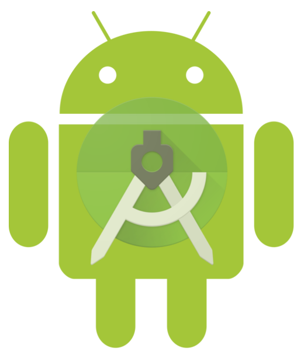

class: split-40 nopadding
background-image: url( bkgs/dauncoklat2.jpg )

.column_t2.center[.vmiddle.pushfront[
.figplaint-maxh550.opacity7[

]
]]
.column_t2.shadelightdark.add-left-border.pushfront[.vmiddle.nopadding[
.boxtitle4[
### .fonth5[PPTB (ET-4044)]
# .fsize150[.or1[**Android**]] .fsize105[.yellow[Programming] Basics]

### [Eueung Mulyana](https://github.com/eueung)
### https://eueung.github.io/012017/android1
#### CodeLabs | [Attribution-ShareAlike CC BY-SA](https://creativecommons.org/licenses/by-sa/4.0/)
#### 
]
]]
---
class: column_t1 middle

.fonth4[
.tabtype1.fullwidth[
| Outline   |
|:-------------:|
|Android &amp; Android Studio |
|App Development|
|.yellow[**Building Your First App**]|


]]

---
class: column_t1 middle center

.fonth2[.yellow[**Notes**]]<br/><br/>.fonth4[Android Studio .or1[**2.3.3**] (Stable Channel)]<br/><br/>.fonth5[A copy of the latest **OpenJDK** comes bundled with Android Studio **2.2** and **higher**, and this is the JDK version recommended for your Android projects. Ref: [[Configure Android Studio](https://developer.android.com/studio/intro/studio-config.html)]]


---
class: split-30 nopadding
background-image: url( bkgs/dauncoklat2.jpg )

.column_t2.center[.vmiddle[
.figplaint-maxh550.opacity7[

]
]]
.column_t2[.vmiddle.nopadding[
.shadelightdark[.boxtitle1[
### 
# .fsize75[Android &amp; .yellow[Android Studio] ]

### 
### 
#### 
#### 
]]
]]
---
class: split-40 nopadding 

.column_t1[.vmiddle.pushfront.right[


#.bluelight[What is]
#.fsize105.or1[**Android**]
####.fonth4.bluelight[]


]]
.column_t2[.vmiddle.pushfront.defaultalign[


.fonth5[
- Mobile operating system based on **Linux kernel**
- .blue[User Interface] for touch screens
- Used on over **80%** of all .blue[smartphones]
- Powers devices such as .blue[watches], .blue[TVs], and .blue[cars]
- Over **2 Million** Android apps in Google Play store
- Highly .uline[customizable] for devices / by vendors
- **Open source**
]
Ref: [Android Developer Fundamentals](https://developers.google.com/training/courses/android-fundamentals)


]]


---
class: bkgpos_00 nopadding
background-image: url(images/57.jpg)

.shadelightdark.top_abs[.boxtitle1.noborder.center[
# Android .or1[**Versions**]
]]
---
class: split-40 nopadding 

.column_t1[.vmiddle.pushfront.right[


#.fsize105.bluelight[Android] .fsize140.or1[**Studio**]
####.fonth4[\+ Android SDK]


]]
.column_t2[.vmiddle.pushfront.defaultalign[


.fonth4[
- **Official** Android IDE
- Develop, run, debug, test, and package apps
- Monitors and performance tools
- Virtual devices
- Project views
- Visual layout editor
]
Ref: [Android Developer Fundamentals](https://developers.google.com/training/courses/android-fundamentals)


]]


---
class: bkgpos_00 nopadding split-60
background-image: url(images/59.jpg)

.column_t2[.vmiddle[


]]
.column_bt2[.vmiddle.pushfront.defaultalign[


##.fonth5[Logical **Areas**]
.fonth5[
1. Toolbar
1. Navigation Bar
1. Editor Window
1. .yellow[**Tool**] Window Bar (Expand/Collapse)
1. .yellow[**Tool**] Window
1. Status Bar
]


]]


---
class: bkgpos_00 nopadding split-60
background-image: url(images/56.jpg)

.column_t2[.vmiddle[


]]
.column_bt2[.vmiddle.pushfront.defaultalign[


##.fonth5[**Layout** Editor]
.fonth5[
- Project Window .red[(1)]
- Palette of UI Elements .red[(2)]
- Selectors .red[(3)]
- Design Pane .red[(6)]
- Component Tree .red[(7)]
- Design/Text Tabs .red[(8)]
]


]]


---
class: bkgpos_00 nopadding split-60
background-image: url(images/56.jpg)

.column_bt2[.vmiddle.pushfront[
##.fonth5[**Layout** Editor]
.fonth5[
- Properties Pane .red[(4)]
- Text Property of TextView .red[(5)]
]


]]
.column_t2[.vmiddle.pushfront.defaultalign[


]]

---
class: split-30 nopadding
background-image: url( bkgs/dauncoklat2.jpg )

.column_t2.center[.vmiddle[
.figplaint-maxh550.opacity7[

]
]]
.column_t2[.vmiddle.nopadding[
.shadelightdark[.boxtitle1[
### 
# .fsize75[App Development]

### 
### 
#### 
#### 
]]
]]
---
class: split-40 nopadding 

.column_t1[.vmiddle.pushfront.right[


#.fsize105.or1[**Android**]
####.fonth2.bluelight[App]


]]
.column_t2[.vmiddle.pushfront.defaultalign[


.fonth4[
- One or more **interactive** screens
- Written using **Java** Programming Language and **XML** (.red[\*])
- Uses the Android .uline[Software Development Kit] (**SDK**)
- Uses Android .blue[libraries] and Android .blue[Application Framework]
- Executed by .uline[Android Runtime] Virtual machine (**ART**)
]
Ref: [Android Developer Fundamentals](https://developers.google.com/training/courses/android-fundamentals)


]]

---
class: split-40 nopadding 

.column_t1[.vmiddle.pushfront.right[


#.fsize105.or1[**Android**]
####.fonth2.bluelight[Challenges]


]]
.column_t2[.vmiddle.pushfront.defaultalign[


.fonth5[
- **Multiple** screen sizes and resolutions
- **Performance**: make your apps responsive and smooth
- **Security**: keep source code and user data safe
- **Compatibility**: run well on older platform versions
- **Marketing**: understand the market and your users (Hint: It doesn't have to be expensive, but it can be.)
]


]]

---
class: split-40 nopadding 

.column_t1[.vmiddle.pushfront.right[


####.fonth2.bluelight[App]
#.fsize105.or1[**Building Blocks**]


]]
.column_t2[.vmiddle.pushfront.defaultalign[


.fonth5[
- .red[**Resources**]: layouts, images, strings, colors as XML and media files
- .red[**Components**]: activities, services,... and helper classes as Java code
- .red[**Manifest**]: information about app for the runtime
- .blue[**Build configuration**]: APK versions in Gradle config files
]


]]

---
class: split-40 nopadding 

.column_t1[.vmiddle.pushfront.right[


#.fsize95.or1[**Component**]
####.fonth2.bluelight[Types]


]]
.column_t2[.vmiddle.pushfront.defaultalign[


.fonth5[
- **Activity** is a single screen with a user interface
- **Service** performs long-running tasks in background
- **Content provider** manages shared set of data
- **Broadcast receiver** responds to system-wide announcements
]


]]

---
class: split-40 nopadding 

.column_t1[.vmiddle.pushfront.right[


#.fsize75.bluelight[Think of Android as a .or1[**Hotel**]]
####.fonth2.bluelight[]


]]
.column_t2[.vmiddle.pushfront.defaultalign[


.fonth5[
- Your **App** is the guest
- The **Android System** is the hotel manager
- **Services** are available when you request them (.blue[**Intents**])
  - In the foreground (**Activities**) such as registration
  - In the background (**Services**) such as laundry
- Calls you when a package has arrived (**Broadcast Receiver**)
- Access the city's tour companies (**Content Provider**)
]
Ref: [Android Developer Fundamentals](https://developers.google.com/training/courses/android-fundamentals)


]]


---
class: split-30 nopadding
background-image: url( bkgs/dauncoklat2.jpg )

.column_t2.center[.vmiddle[
.figplaint-maxh550.opacity7[

]
]]
.column_t2[.vmiddle.nopadding[
.shadelightdark[.boxtitle1[
### Android Studio
# .fsize75[Building Your First App]

### 
### 
#### 
#### 
]]
]]
---
class: split-40 nopadding 

.column_t1[.vmiddle.pushfront.right[


#.fsize125.or1[**Building**]
#.bluelight[Your First App]
####.fonth4.bluelight[]


]]
.column_t2[.vmiddle.pushfront.defaultalign[


.fonth4[
1. **Create** an Android Project
2. **Run** Your App
3. Build a Simple **User Interface**
4. Start Another **Activity**
]


]]

---
class: column_t1 middle center

#.fsize105[.yellow[**Create**] an Android Project]


---
class: bkgpos_00 nopadding
background-image: url(images/01.jpg)

.shadelightdark.bottom_abs[.boxtitle1.noborder.center[
# Start a New Project
]]

---
class: bkgpos_00 nopadding
background-image: url(images/02.jpg)

.shadelightdark.bottom_abs[.boxtitle1.noborder.center[
#### Adjust .red[**Application name**] (&amp; **Company domain**)
]]
---
class: bkgpos_00 nopadding
background-image: url(images/03.jpg)

.shadelightdark.bottom_abs[.boxtitle1.noborder.center[
####Set .blue[Target Devices]
]]
---
class: bkgpos_00 nopadding
background-image: url(images/04.jpg)

.shadelightdark.bottom_abs[.boxtitle1.noborder.center[
#### Coffee Time ... (.blue[If SDK components not yet locally available])
]]
---
class: bkgpos_00 nopadding
background-image: url(images/05.jpg)

.shadelightdark.bottom_abs[.boxtitle1.noborder.center[
#### Add .red[Empty Activity]
]]
---
class: bkgpos_00 nopadding
background-image: url(images/06.jpg)

.shadelightdark.bottom_abs[.boxtitle1.noborder.center[
#### Adjust .red[Activity Name] (&amp; .blue[Layout Name])
]]

---
class: bkgpos_00 nopadding
background-image: url(images/07.jpg)

.shadelightdark.bottom_abs[.boxtitle1.noborder.center[
#Project Window | .red[app]&gt;.red[java]&gt; ... &gt;.blue[MainActivity.java]
]]

---
class: bkgpos_00 nopadding
background-image: url(images/08.jpg)

.shadelightdark.top_abs[.boxtitle1.noborder.center[
####.red[app]&gt;.red[res]&gt;.red[layout]&gt;.blue[activity_main.xml] (Design View)
]]

---
class: bkgpos_00 nopadding
background-image: url(images/09.jpg)

.shadelightdark.top_abs[.boxtitle1.noborder.center[
####.red[app]&gt;.red[res]&gt;.red[layout]&gt;.blue[activity_main.xml] (Text View)
]]

---
class: bkgpos_00 nopadding
background-image: url(images/10.jpg)

.shadelightdark.bottom_abs[.boxtitle1.noborder.center[
####.red[app]&gt;.red[manifests]&gt;.blue[AndroidManifest.xml]
]]

---
class: bkgpos_00 nopadding
background-image: url(images/11.jpg)

.shadelightdark.bottom_abs[.boxtitle1.noborder.center[
####.yellow[@string/app_name]
]]

---
class: bkgpos_00 nopadding
background-image: url(images/12.jpg)

.shadelightdark.bottom_abs[.boxtitle1.noborder.center[
####.yellow[@string/app_name]
]]
---
class: column_t1 middle center

#.fsize105[.yellow[**Run**] Your App]


# .or1[On an **Emulator**] | .bluelight[On a **Real** Device]
---
class: bkgpos_00 nopadding
background-image: url(images/13.jpg)

.shadelightdark.bottom_abs[.boxtitle1.noborder.center[
# Launch .red[AVD Manager]
]]
---
class: bkgpos_00 nopadding
background-image: url(images/14.jpg)

.shadelightdark.bottom_abs[.boxtitle1.noborder.center[
# Create Virtual Device
]]
---
class: bkgpos_00 nopadding
background-image: url(images/15.jpg)

.shadelightdark.bottom_abs[.boxtitle1.noborder.center[
# .yellow[Select Hardware] | .blue[Phone]
]]
---
class: bkgpos_00 nopadding
background-image: url(images/16.jpg)

.shadelightdark.bottom_abs[.boxtitle1.noborder.center[
# **Download** System Image (If it's not already there)
]]
---
class: bkgpos_00 nopadding
background-image: url(images/17.jpg)

.shadelightdark.bottom_abs[.boxtitle1.noborder.center[
# Coffee Time ...
]]
---
class: bkgpos_00 nopadding
background-image: url(images/18.jpg)

.shadelightdark.bottom_abs[.boxtitle1.noborder.center[
# **Select** System Image
]]
---
class: bkgpos_00 nopadding
background-image: url(images/19.jpg)

.shadelightdark.bottom_abs[.boxtitle1.noborder.center[
# Verify -&gt; Finish
]]
---
class: bkgpos_00 nopadding
background-image: url(images/20.jpg)

.shadelightdark.bottom_abs[.boxtitle1.noborder.center[
# Launch this AVD in the Emulator
]]
---
class: bkgpos_00 nopadding
background-image: url(images/21.jpg)

.shadelightdark.bottom_abs[.boxtitle1.noborder.center[
# AVD Launched 
]]
---
class: bkgpos_00 nopadding
background-image: url(images/22.jpg)

.shadelightdark.bottom_abs[.boxtitle1.noborder.center[
# .red[Run] the App
]]
---
class: bkgpos_00 nopadding
background-image: url(images/23.jpg)

.shadelightdark.bottom_abs[.boxtitle1.noborder.center[
# Select Target
]]
---
class: bkgpos_00 nopadding
background-image: url(images/24.jpg)

.shadelightdark.bottom_abs[.boxtitle1.noborder.center[
#.yellow[Showtime!]
]]
---
class: column_t1 middle center

#.fsize105[.yellow[**Run**] Your App]


# .bluelight[On an **Emulator**] | .or1[On a **Real** Device]
---
class: bkgpos_00 nopadding split-50
background-image: url(images/47.jpg)

.column_wt[.vmiddle.pushfront.right[
##.fonth5[**USB Debugging**]
.fonth5[
Settings&gt;General &gt;About Device
]
Note: Titles may vary!


]]
.column_t2[.vmiddle.pushfront.defaultalign[


]]

---
class: bkgpos_00 nopadding split-50
background-image: url(images/48.jpg)

.column_wt[.vmiddle.pushfront.right[
##.fonth5[**USB Debugging**]
.fonth5[
Build Number
]


]]
.column_t2[.vmiddle.pushfront.defaultalign[


]]

---
class: bkgpos_00 nopadding split-50
background-image: url(images/49.jpg)

.column_wt[.vmiddle.pushfront.right[
##.fonth5[**USB Debugging**]
.fonth5[
Build Number | .red[Tap **7x**!]
]


]]
.column_t2[.vmiddle.pushfront.defaultalign[


]]

---
class: bkgpos_00 nopadding split-50
background-image: url(images/50.jpg)

.column_wt[.vmiddle.pushfront.right[
##.fonth5[**USB Debugging**]
.fonth5[
Settings&gt;Developer Options
]


]]
.column_t2[.vmiddle.pushfront.defaultalign[


]]

---
class: bkgpos_00 nopadding split-50
background-image: url(images/51.jpg)

.column_wt[.vmiddle.pushfront.right[
##.fonth5[**USB Debugging**]
.fonth5[
Settings&gt;Developer Options | .red[**USB Debugging**]
]
Note: Titles may vary!


]]
.column_t2[.vmiddle.pushfront.defaultalign[


]]

---
class: bkgpos_00 nopadding
background-image: url(images/55.jpg)

.shadelightdark.bottom_abs[.boxtitle1.noborder.center[
# Run | .red[Select Target]
]]

---
class: bkgpos_00 nopadding split-50
background-image: url(images/54.jpg)

.column_wt[.vmiddle.pushfront.right[
##.fonth2[**Done**!]
.fonth3[
Installed on the Device
]


]]
.column_t2[.vmiddle.pushfront.defaultalign[


]]


---
class: column_t1 middle center

#.fsize105[Build a Simple .yellow[**User Interface**]]


---
class: bkgpos_00 nopadding
background-image: url(images/25.jpg)

.shadelightdark.bottom_abs[.boxtitle1.noborder.center[
###.red[Show Blueprint], .blue[Show Constraints], .yellow[Autoconnect Off] &amp; .or1[Default Margin 16]
]]
---
class: bkgpos_00 nopadding
background-image: url(images/26.jpg)

.shadelightdark.bottom_abs[.boxtitle1.noborder.center[
####.red[Component Tree] | Replace **TextView** with **EditText** | Adjust/Drag .yellow[Constraint Anchors]
]]
---
class: bkgpos_00 nopadding
background-image: url(images/27.jpg)

.shadelightdark.bottom_abs[.boxtitle1.noborder.center[
####Add Button | Adjust/Drag .yellow[Constraint Anchors] | Note: .blue[Baseline Constraint]
]]
---
class: bkgpos_00 nopadding
background-image: url(images/28.jpg)

.shadelightdark.bottom_abs[.boxtitle1.noborder.center[
####Change the UI Strings | .red[String Resources]
]]
---
class: bkgpos_00 nopadding
background-image: url(images/29.jpg)

.shadelightdark.bottom_abs[.boxtitle1.noborder.center[
####Change the UI Strings | .blue[Translation Editor]
]]
---
class: bkgpos_00 nopadding
background-image: url(images/30.jpg)

.shadelightdark.bottom_abs[.boxtitle1.noborder.center[
####Properties | .red[@string/edit_message] (Remove **text**)
]]
---
class: bkgpos_00 nopadding
background-image: url(images/31.jpg)

.shadelightdark.bottom_abs[.boxtitle1.noborder.center[
####Properties | .red[@string/button_send]
]]
---
class: bkgpos_00 nopadding
background-image: url(images/32.jpg)

.shadelightdark.bottom_abs[.boxtitle1.noborder.center[
####Select Both | .red[Center Horizontally]
]]
---
class: bkgpos_00 nopadding
background-image: url(images/33.jpg)

.shadelightdark.bottom_abs[.boxtitle1.noborder.center[
####A Chain Between the Two Views
]]
---
class: bkgpos_00 nopadding
background-image: url(images/34.jpg)

.shadelightdark.bottom_abs[.boxtitle1.noborder.center[
####Button | .yellow[Left &amp; Right Margin -&gt;16]
]]
---
class: bkgpos_00 nopadding
background-image: url(images/35.jpg)

.shadelightdark.bottom_abs[.boxtitle1.noborder.center[
####Text | .yellow[Left Margin -&gt;16] | Width Indicator -&gt; .red[Match Constraints]
]]
---
class: bkgpos_00 nopadding
background-image: url(images/36.jpg)

.shadelightdark.bottom_abs[.boxtitle1.noborder.center[
####.blue[activity_main.xml] (Text)
]]
---
class: bkgpos_00 nopadding
background-image: url(images/37.jpg)

.shadelightdark.bottom_abs[.boxtitle1.noborder.center[
#.red[Run] &amp; Test
]]

---
class: column_t1 middle center

#.fsize105[Start Another .yellow[**Activity**]]


---
class: bkgpos_00 nopadding
background-image: url(images/38.jpg)

.shadelightdark.bottom_abs[.boxtitle1.noborder.center[
#### .blue[`sendMessage()`] Method Stub | .red[Alt + Enter] -&gt; **Import class**
]]
---
class: bkgpos_00 nopadding
background-image: url(images/39.jpg)

.shadelightdark.bottom_abs[.boxtitle1.noborder.center[
####Connect .blue[`sendMessage()`] to the Button
]]
---
class: bkgpos_00 nopadding
background-image: url(images/40.jpg)

.shadelightdark.bottom_abs[.boxtitle1.noborder.center[
####.yellow[**app**] | Create a New .red[Empty Activity]
]]
---
class: bkgpos_00 nopadding
background-image: url(images/41.jpg)

.shadelightdark.bottom_abs[.boxtitle1.noborder.center[
#.red[DisplayMessageActivity]
]]
---
class: bkgpos_00 nopadding
background-image: url(images/42.jpg)

.shadelightdark.bottom_abs[.boxtitle1.noborder.center[
#.red[DisplayMessageActivity].java
]]
---
class: bkgpos_00 nopadding
background-image: url(images/43.jpg)

.shadelightdark.bottom_abs[.boxtitle1.noborder.center[
#.or1[MainActivity].java
]]
---
class: bkgpos_00 nopadding
background-image: url(images/44.jpg)

.shadelightdark.bottom_abs[.boxtitle1.noborder.center[
####.blue[activity_display_message].xml | .yellow[textAppearance]
]]
---
class: bkgpos_00 nopadding
background-image: url(images/45.jpg)

.shadelightdark.bottom_abs[.boxtitle1.noborder.center[
#.red[Run] &amp; Test
]]
---
class: bkgpos_00 nopadding
background-image: url(images/46.jpg)

.shadelightdark.bottom_abs[.boxtitle1.noborder.center[
#AVD - .yellow[Landscape]
]]
---
class: bkgpos_00 nopadding split-50
background-image: url(images/52.jpg)

.column_wt[.vmiddle.pushfront.right[
##.fonth3[.red[Run] &amp; Test]
.fonth3[
Real Device | **SM-N750**
]


]]
.column_t2[.vmiddle.pushfront.defaultalign[


]]

---
class: bkgpos_00 nopadding split-50
background-image: url(images/53.jpg)

.column_wt[.vmiddle.pushfront.right[
##.fonth3[.red[Run] &amp; Test]
.fonth3[
Real Device | **SM-N750**
]


]]
.column_t2[.vmiddle.pushfront.defaultalign[


]]

---
class: bkgpos_00 nopadding
background-image: url(images/58.jpg)

.shadelightdark.top_abs[.boxtitle1.noborder.center[
# .yellow[MainActivity].java | .red[**Diff**] 
]]

---
class: split-70 nopadding 

.column_t2[.pushfront.defaultalign[


.fullcode[

```java
package com.example.em.exampleapplication01;

*import android.content.Intent;
import android.support.v7.app.AppCompatActivity;
import android.os.Bundle;
*import android.view.View;
*import android.widget.EditText;

public class MainActivity extends AppCompatActivity {
*   public static final String EXTRA_MESSAGE = "com.example.em.exampleapplication01.MESSAGE";

    @Override
    protected void onCreate(Bundle savedInstanceState) {
        super.onCreate(savedInstanceState);
        setContentView(R.layout.activity_main);
    }

*   public void sendMessage(View view) {
*       Intent intent = new Intent(this, DisplayMessageActivity.class);
*       EditText editText = (EditText) findViewById(R.id.editText);
*       String message = editText.getText().toString();
*       intent.putExtra(EXTRA_MESSAGE, message);
*       startActivity(intent);
*   }
}
```
]


]]
.column_t1[.vmiddle.pushfront.defaultalign[


###MainActivity.java
<br/>


]]

---
class: split-70 nopadding 

.column_t2[.pushfront.defaultalign[


.fullcode[

```java
package com.example.em.exampleapplication01;

import android.content.Intent;
import android.support.v7.app.AppCompatActivity;
import android.os.Bundle;
import android.widget.TextView;

public class DisplayMessageActivity extends AppCompatActivity {

    @Override
    protected void onCreate(Bundle savedInstanceState) {
        super.onCreate(savedInstanceState);
        setContentView(R.layout.activity_display_message);

        // Get the Intent that started this activity and extract the string
        Intent intent = getIntent();
        String message = intent.getStringExtra(MainActivity.EXTRA_MESSAGE);

        // Capture the layout's TextView and set the string as its text
        TextView textView = (TextView) findViewById(R.id.textView);
        textView.setText(message);
    }
}
```
]


]]
.column_t1[.vmiddle.pushfront.defaultalign[


####DisplayMessageActivity.java
<br/>


]]

---
class: bkgpos_00 nopadding
background-image: url(images/60.jpg)

.shadelightdark.top_abs[.boxtitle1.noborder.center[
# .yellow[activity\_main].xml | .red[**Diff**] 
]]
---
class: split-70 nopadding 

.column_t2[.pushfront.defaultalign[


.fullcode[

```xml
<?xml version="1.0" encoding="utf-8"?>
<android.support.constraint.ConstraintLayout xmlns:android="http://schemas.android.com/apk/res/android"
    xmlns:app="http://schemas.android.com/apk/res-auto"
    xmlns:tools="http://schemas.android.com/tools"
    android:layout_width="match_parent"
    android:layout_height="match_parent"
    tools:context="com.example.em.exampleapplication01.MainActivity">

*   <EditText
*        android:id="@+id/editText"
*        android:layout_width="0dp"
*        android:layout_height="wrap_content"
*        android:layout_marginTop="16dp"
*        android:ems="10"
*        android:hint="@string/edit_message"
*        android:inputType="textPersonName"
*        app:layout_constraintLeft_toLeftOf="parent"
*        app:layout_constraintTop_toTopOf="parent"
*        app:layout_constraintRight_toLeftOf="@+id/button"
*        android:layout_marginLeft="16dp" />

*   <Button
*        android:id="@+id/button"
*        android:layout_width="wrap_content"
*        android:layout_height="wrap_content"
*        android:layout_marginLeft="16dp"
*        android:layout_marginRight="16dp"
*        android:onClick="sendMessage"
*        android:text="@string/button_send"
*        app:layout_constraintBaseline_toBaselineOf="@+id/editText"
*        app:layout_constraintLeft_toRightOf="@+id/editText"
*        app:layout_constraintRight_toRightOf="parent" />
</android.support.constraint.ConstraintLayout>

```
]


]]
.column_t1[.vmiddle.pushfront.defaultalign[


###activity\_main.xml
<br/>


]]

---
class: split-70 nopadding 

.column_t2[.pushfront.defaultalign[


.fullcode[

```xml
<?xml version="1.0" encoding="utf-8"?>
<android.support.constraint.ConstraintLayout xmlns:android="http://schemas.android.com/apk/res/android"
    xmlns:app="http://schemas.android.com/apk/res-auto"
    xmlns:tools="http://schemas.android.com/tools"
    android:layout_width="match_parent"
    android:layout_height="match_parent"
    tools:context="com.example.em.exampleapplication01.DisplayMessageActivity">

    <TextView
        android:id="@+id/textView"
        android:layout_width="wrap_content"
        android:layout_height="wrap_content"
        android:layout_marginTop="16dp"
        android:text="TextView"
        android:textAppearance="@style/TextAppearance.AppCompat.Display1"
        app:layout_constraintLeft_toLeftOf="parent"
        app:layout_constraintRight_toRightOf="parent"
        app:layout_constraintTop_toTopOf="parent" />
</android.support.constraint.ConstraintLayout>
```
]


]]
.column_t1[.vmiddle.pushfront.defaultalign[


####activity\_display\_message.xml
<br/>


]]

---
class: bkgpos_00 nopadding
background-image: url(images/61.jpg)

.shadelightdark.top_abs[.boxtitle1.noborder.center[
# .yellow[AndroidManifest].xml | .red[**Diff**] 
]]
---
class: split-70 nopadding 

.column_t2[.pushfront.defaultalign[


.fullcode[

```xml
<?xml version="1.0" encoding="utf-8"?>
<manifest xmlns:android="http://schemas.android.com/apk/res/android"
    package="com.example.em.exampleapplication01">

    <application
        android:allowBackup="true"
        android:icon="@mipmap/ic_launcher"
        android:label="@string/app_name"
        android:roundIcon="@mipmap/ic_launcher_round"
        android:supportsRtl="true"
        android:theme="@style/AppTheme">
        <activity android:name=".MainActivity">
            <intent-filter>
                <action android:name="android.intent.action.MAIN" />

                <category android:name="android.intent.category.LAUNCHER" />
            </intent-filter>
        </activity>
*       <activity android:name=".DisplayMessageActivity" android:parentActivityName=".MainActivity"></activity>
    </application>

</manifest>
```
]


]]
.column_t1[.vmiddle.pushfront.defaultalign[


###AndroidManifest.xml
<br/>


]]


---
class: split-30 nopadding
background-image: url( bkgs/dauncoklat2.jpg )

.column_t2.center[.vmiddle[
.figplaint-maxh550.opacity7[

]
]]
.column_t2[.vmiddle.nopadding[
.shadelightdark[.boxtitle1[
### 
# .fsize95[Refs/Resources]

### 
### 
#### 
#### 
]]
]]
---
# Refs/Resources

.fonth5[
1. [Getting Started](https://developer.android.com/training/index.html) | Android Developers
1. [Dashboards](https://developer.android.com/about/dashboards/index.html) | Android Developers
1. [Android Developer Fundamentals](https://developers.google.com/training/courses/android-fundamentals) |  Google Developers Training  |  Google Developers
1. [Introduction - Android Developer Fundamentals Course - Practicals](https://google-developer-training.gitbooks.io/android-developer-fundamentals-course-practicals/content/en/)
1. [Meet Android Studio](https://developer.android.com/studio/intro/index.html) | Android Studio
]


---
class: split-40 nopadding
background-image: url( bkgs/dauncoklat2.jpg )

.column_t2.center[.vmiddle.pushfront[
.figplaint-maxh550.opacity7[

]
]]
.column_t2.shadelightdark.add-left-border.pushfront[.vmiddle.nopadding[
.boxtitle4[
### 
# .fsize175.yellow[END]

### [Eueung Mulyana](https://github.com/eueung)
### https://eueung.github.io/012017/android1
#### CodeLabs | [Attribution-ShareAlike CC BY-SA](https://creativecommons.org/licenses/by-sa/4.0/)
#### 
]
]]


