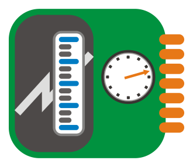

class: split-40 nopadding
background-image: url( bkgs/biru.jpg )

.column_t2.center[.vmiddle.pushfront[
.figplaint-maxh550.opacity7[

]
]]
.column_t2.shadelightdark.add-left-border.pushfront[.vmiddle.nopadding[
.boxtitle4[
### Sensors &amp; Actuators
# .fsize125[.yellow[Selected]] .fsize175[.yellow[**I/O**s]]

### [Eueung Mulyana](https://github.com/eueung)
### https://eueung.github.io/012017/inout
#### CodeLabs | [Attribution-ShareAlike CC BY-SA](https://creativecommons.org/licenses/by-sa/4.0/)
#### 
]
]]
---
class: column_t1 middle

.fonth4[
.tabtype1.fullwidth[
| Outline   |
|:-------------:|
|Preparation|
|Light/Laser Sensor|
|PIR Sensor|
|LM35 &amp; DHT11|
|.yellow[**Processing &amp; Local Visualization**]|
|Ultrasonic Sensor|


]]

---
class: split-30 nopadding
background-image: url( bkgs/biru.jpg )

.column_t2.center[.vmiddle[
.figplaint-maxh550.opacity7[

]
]]
.column_t2[.vmiddle.nopadding[
.shadelightdark[.boxtitle1[
### 
# .fsize95[Preparation]

### 
### 
#### 
#### 
]]
]]
---
class: column_t1 middle center

.fonth2[.yellow[**Preparation**] **Notes**]<br/><br/>.fonth5[We reuse the previous nRF24L01+ example (.bluelight[**Simple Remote Control**]) with some changes i.e.: for simplicity both nodes are now Nano-based, an LCD is attached to Node-2 for a better communication and debugging experience.]<br/><br/>.fonth4[In the next examples, the switch will be replaced with laser and PIR sensors.]


---
class: split-40 nopadding 

.column_t1[.vmiddle.pushfront.right[


#.fonth5[I2C .bluelight[**LCD1602**]]
.fonth5[
An LCD display that can display a max of 16x2 characters.
]


]]
.column_t2[.vmiddle.pushfront.defaultalign[


.fonth5[
As the pin resources of ucontroller is limited, your project may be not able to use normal LCD shield after connected with a certain quantity of sensors/actuators i.e. if you are doing more than a simple project, you may be out of pins using a normal LCD shield. With this I2C interface LCD module, you only need 2 lines (I2C) to display information.

Interface: connect the I2C LCD1602 to the I2C port of Arduino (.red[**SDA**] - .blue[**A4**] and .red[**SCL**] - .blue[**A5**]) and power this module with 5V.
]

Ref: [arduino-info](https://arduino-info.wikispaces.com/LCD-Blue-I2C), [elecrow](https://www.elecrow.com/wiki/index.php?title=I2C_LCD1602(Blue)


]]

---
class: bkgpos_00 nopadding
background-image: url(images/nrf17.jpg)

.shadelightdark.bottom_abs[.boxtitle1.noborder.center[
# .red[Node-1] &amp; .blue[Node-2] (Both with nRF24L01+)
]]
---
class: bkgpos_00 nopadding
background-image: url(images/inout02.jpg)

.shadelightdark.bottom_abs[.boxtitle1.noborder.center[
# .red[Node-1] (Remote Switch / Sensor Node)
]]
---
class: bkgpos_00 nopadding
background-image: url(images/inout01.jpg)

.shadelightdark.bottom_abs[.boxtitle1.noborder.center[
# .blue[Node-2] (Display Node)
]]
---
class: bkgpos_00 nopadding
background-image: url(images/inout03a.jpg)

.shadelightdark.bottom_abs[.boxtitle1.noborder.center[
# .red[Node-1]
]]
---
class: bkgpos_00 nopadding
background-image: url(images/inout04.jpg)

.shadelightdark.bottom_abs[.boxtitle1.noborder.center[
# .blue[Node-2]
]]
---
class: bkgpos_00 nopadding
background-image: url(images/inout07.jpg)

.shadelightdark.bottom_abs[.boxtitle1.noborder.center[
# Install .yellow[I2C LiquidCrystal] Library
]]
---
class: split-70 nopadding 

.column_t2[.pushfront.defaultalign[


.fullcode[

```c
#include <SPI.h>   
#include "nRF24L01.h"
#include "RF24.h"  

RF24 myRadio (7, 8); 

*const int SW1 = 5;
*const int SW2 = 6;

byte addresses[][6] = {"1Node"}; 
int dataTransmitted;  

*int button1;
*int button2;

void setup()   
{
* pinMode(SW1, INPUT);
* pinMode(SW2, INPUT);
* button1 = 0;
* button2 = 1;
  dataTransmitted = 10;  
  
  Serial.begin(115200);
  delay(1000);
  
  myRadio.begin();  
  myRadio.setRetries(0,15);
  myRadio.setChannel(108);  
  myRadio.setPALevel(RF24_PA_MAX);

  myRadio.openWritingPipe( addresses[0]); 
  delay(1000);
}

void loop()   
{
* int newButton = digitalRead(SW1);
  if (newButton != button1) {
    button1 = newButton;
  
*   if (button1 == HIGH){
*     dataTransmitted = 20;
    }
    else {
      dataTransmitted = 10;
    }
    myRadio.write( &dataTransmitted, sizeof(dataTransmitted) );
    Serial.print(F("Data Transmitted = "));
    Serial.println(dataTransmitted);
  }  

* newButton = digitalRead(SW2);
  if (newButton != button2) {
    button2 = newButton;
  
*   if (button2 == HIGH){
*     dataTransmitted = 10;
    }
    else {
      dataTransmitted = 20;
    }
    myRadio.write( &dataTransmitted, sizeof(dataTransmitted) );
    Serial.print(F("Data Transmitted = "));
    Serial.println(dataTransmitted);
  }  

  delay(500);
}
```
]


]]
.column_t1[.vmiddle.pushfront.defaultalign[


#.fonth5[Node-1]
<br/>


]]

---
class: split-70 nopadding 

.column_t2[.pushfront.defaultalign[


.fullcode[

```c
#include <SPI.h>   
#include "nRF24L01.h"
#include "RF24.h"  

RF24 myRadio (7, 8); 

byte addresses[][6] = {"1Node"}; 
int dataReceived;  

const int LED = 2;

*#include <Wire.h>
*#include <LiquidCrystal_PCF8574.h>

*LiquidCrystal_PCF8574 lcd(0x27);  

*int lcdexist;
*unsigned long started_waiting_at = 0;
*bool bklight = false;

void setup()   
{
  pinMode(LED, OUTPUT);
  
  Serial.begin(115200);
  delay(1000);

  myRadio.begin();  
  myRadio.setAutoAck(1);
  myRadio.setChannel(108);  
  myRadio.setPALevel(RF24_PA_MAX);

  myRadio.openReadingPipe(1, addresses[0]); 
  myRadio.startListening();

* Wire.begin();
* Wire.beginTransmission(0x27);
* lcdexist = Wire.endTransmission();

* lcd.begin(16, 2);
}

void loop()   
{
  if ( myRadio.available()) 
  {
    while (myRadio.available())  
    {
      myRadio.read( &dataReceived, sizeof(dataReceived) ); 
    }
    
    Serial.print("Data received = ");
    Serial.println(dataReceived);

*   if (lcdexist == 0) {
*     lcd.setBacklight(128);
*     lcd.home(); lcd.clear();
*     lcd.print("Data rcvd = ");
*     lcd.print(dataReceived);
*     started_waiting_at = micros();
*     bklight = true;
*   }
    
    if (dataReceived == 10) {
      digitalWrite(LED, LOW);
    } else {
      digitalWrite(LED, HIGH);      
    }
  } 
  else {
*   if ( (lcdexist == 0) && bklight ){
*     if (micros() - started_waiting_at > 2000000 ) {
*       lcd.setBacklight(0);
*       bklight = false;      
*     }
*   }
  }
}

```
]


]]
.column_t1[.vmiddle.pushfront.defaultalign[


#.fonth5[Node-2]
<br/>


]]

---
class: bkgpos_00 nopadding
background-image: url(images/inout05.jpg)

.shadelightdark.bottom_abs[.boxtitle1.noborder.center[
# Switch **ON**
]]
---
class: bkgpos_00 nopadding
background-image: url(images/inout06.jpg)

.shadelightdark.bottom_abs[.boxtitle1.noborder.center[
# Switch **OFF**
]]
---
class: split-30 nopadding
background-image: url( bkgs/biru.jpg )

.column_t2.center[.vmiddle[
.figplaint-maxh550.opacity7[

]
]]
.column_t2[.vmiddle.nopadding[
.shadelightdark[.boxtitle1[
### 
# .fsize95[Light/Laser Sensor]

### 
### 
#### 
#### 
]]
]]
---
class: bkgpos_00 nopadding
background-image: url(images/inout08.jpg)

.shadelightdark.bottom_abs[.boxtitle1.noborder.center[
# Laser Mini Transmitter &amp; Receiver Module
]]
---
class: bkgpos_00 nopadding
background-image: url(images/inout13.jpg)

.shadelightdark.top_abs[.boxtitle1.noborder.center[
# Light/Laser Receiver Module
#### Utilizing LDR and Voltage Comparator for Digital Output
]]
---
class: bkgpos_00 nopadding split-50
background-image: url(images/inout13.jpg)

.column_t2[.vmiddle[


]]
.column_wt[.vmiddle.pushfront.defaultalign[


##.fonth5[**LDR**]
.fonth5[
LDR or Light Dependent Resistor (sometimes
called a photoresistor or photocell) is a two-terminal, resistive component that increases or decreases its resistance depending on the light it senses. An LDR initially has a very high
resistance. But, as light falls on it, the resistance will drop, allowing more current through.
]
Ref: [Earthshine Design](http://math.hws.edu/vaughn/cpsc/226/docs/askmanual.pdf)


]]

---
class: bkgpos_00 nopadding split-50
background-image: url(images/inout13.jpg)

.column_wt[.vmiddle.pushfront[
##.fonth5[**LDR** Sensor Module]
.fonth5[
LDR sensor module is used to detect the intensity of light. It might have both analog output pin and digital output pin labelled as AO and DO respectively on the board. When there is light, the resistance of LDR will become low according to the intensity of light. The greater the intensity of light, the lower the resistance of LDR. The sensor has a potentiometer knob that can be adjusted to change the sensitivity of LDR towards light.
]
Ref: [LDR Sensor Module](http://www.instructables.com/id/LDR-Sensor-Module-Users-Manual-V10/)


]]
.column_t2[.vmiddle.pushfront.defaultalign[


]]

---
class: bkgpos_00 nopadding
background-image: url(images/inout09.jpg)

.shadelightdark.bottom_abs[.boxtitle1.noborder.center[
# Switch Replacement with a Laser Receiver
]]
---
class: bkgpos_00 nopadding
background-image: url(images/inout10.jpg)

.shadelightdark.bottom_abs[.boxtitle1.noborder.center[
# Switch Replacement with a Laser Receiver
]]
---
class: split-30 nopadding
background-image: url( bkgs/biru.jpg )

.column_t2.center[.vmiddle[
.figplaint-maxh550.opacity7[

]
]]
.column_t2[.vmiddle.nopadding[
.shadelightdark[.boxtitle1[
### 
# .fsize95[PIR Sensor]

### 
### 
#### 
#### 
]]
]]
---
class: bkgpos_00 nopadding split-50
background-image: url(images/inout11.jpg)

.column_t2[.vmiddle[


]]
.column_wt[.vmiddle.pushfront.defaultalign[


##.fonth5[**PIR** Sensor]
.fonth5[
A PIR (Passive Infra-Red) sensor is an electronic sensor that measures infrared light radiating from objects in its field of view. Normally this type of sensor would be used as a motion or proximity sensor. 
Quite often they are referred to as: PIR, Motion, Proximity, or Pyroelectric sensor.
]

The sensor in the PIR detects or "reads" infrared radiation "emitted" from objects all around us.
Each object with a temperature above absolute zero will radiate infrared, even us humans, and even though we mere humans cannot see this. Note that the PIR just uses a relatively simple sensor - it is most definitely not an IR camera!

Ref: [Testing and Playing with PIR sensors](https://www.tweaking4all.com/hardware/pir-sensor/) @Tweaking4All


]]

---
class: bkgpos_00 nopadding
background-image: url(images/inout12.jpg)

.shadelightdark.bottom_abs[.boxtitle1.noborder.center[
# Switch Replacement with a PIR Sensor
]]
---
class: split-30 nopadding
background-image: url( bkgs/biru.jpg )

.column_t2.center[.vmiddle[
.figplaint-maxh550.opacity7[

]
]]
.column_t2[.vmiddle.nopadding[
.shadelightdark[.boxtitle1[
### 
# .fsize95[LM35 &amp; DHT11]

### 
### 
#### 
#### 
]]
]]
---
class: bkgpos_00 nopadding
background-image: url(images/inout15.jpg)

.shadelightdark.bottom_abs[.boxtitle1.noborder.center[
# LM35 &amp; DHT11
]]
---
class: bkgpos_00 nopadding split-50
background-image: url(images/inout15.jpg)

.column_t2[.vmiddle[


]]
.column_bt2[.vmiddle.pushfront.defaultalign[


##.fonth5[**LM35**]
.fonth5[
LM35 is a linear temperature sensor with the output voltage calibrated in centigrade celsius. **1** degree celsius makes an output voltage of **10mV**. So when you have room temperature at 22C the LM35 gives you a voltage of 220mV = 0.22V. 
]

The sensor has only 3 pins: **VCC** which can be between +4V and +20V, **GND** and **Vout**. Vout has to be connected to one of the analog inputs and that's all - in most cases.

Ref: [connecting an arduino with a LM35 temperature sensor](https://heliosoph.wordpress.com/2012/03/21/connecting-an-arduino-with-a-lm35-temperature-sensor-special-issues/) @heliosoph


]]

---
class: bkgpos_00 nopadding split-50
background-image: url(images/inout15.jpg)

.column_t2[.vmiddle[


]]
.column_bt2[.vmiddle.pushfront.defaultalign[


##.fonth5[**DHT11**]
.fonth5[
DHT11 is a temperature and humidity sensor with a calibrated digital signal output. 
]

The DHT11 sensor has four pins. Connect the first pin on left of sensor ('VCC') to  5V of your board, the second pin ('Data') to a digital pin and the fourth pin ('GND') to ground. When the connecting cable is shorter than 20m, a 5K pull-up resistor between the second Pin of sensor and 5V is recommended.

Ref: [DHT11 Temperature and Humidity Sensor Example](http://www.arduino.org/learning/tutorials/boards-tutorials/dht11-temperature-and-humidity-sensor-example) @arduino.org


]]


---
class: bkgpos_00 nopadding
background-image: url(images/inout14.jpg)

.shadelightdark.bottom_abs[.boxtitle1.noborder.center[
# Install Library for DHTxx Sensors
]]
---
class: split-70 nopadding 

.column_t2[.pushfront.defaultalign[


.fullcode[

```c
float tlm35;

void setup() {
  Serial.begin(9600);

  //analogReference(INTERNAL);
}

void loop() {
  tlm35 = 0.0;
  for(int j = 0; j < 10; j++) { 
     tlm35 += analogRead(A0); 
     delay(20);
  }
  tlm35 = tlm35 * 5.0 * 10.0 / 1023.0;

  //tlm35 = tlm35 * 1.1 * 10.0 / 1023.0;
  
  Serial.println(tlm35);
}
```
]


]]
.column_t1[.vmiddle.pushfront.defaultalign[


#.fonth5[LM35]
<br/>


]]

---
class: split-70 nopadding 

.column_t2[.pushfront.defaultalign[


.fullcode[

```c
#include "DHT.h"

*#define DHTPIN 3     
*#define DHTTYPE DHT11   

*DHT dht(DHTPIN, DHTTYPE);

void setup() {
  Serial.begin(9600);

* dht.begin();
}

void loop() {
  delay(2000);

* // Reading temperature or humidity takes about 250 milliseconds!
* // Sensor readings may also be up to 2 seconds 'old' (its a very slow sensor)
  float h = dht.readHumidity();
* float t = dht.readTemperature();

  if (isnan(h) || isnan(t)) {
    Serial.println("Failed to read from DHT sensor!");
    return;
  }

  Serial.println(t);
}
```
]


]]
.column_t1[.vmiddle.pushfront.defaultalign[


#.fonth5[DHT11]
<br/>


]]


---
class: split-30 nopadding
background-image: url( bkgs/biru.jpg )

.column_t2.center[.vmiddle[
.figplaint-maxh550.opacity7[

]
]]
.column_t2[.vmiddle.nopadding[
.shadelightdark[.boxtitle1[
### Local Visualization &amp; UI
# .fsize95[Processing]

### 
### 
#### 
#### 
]]
]]
---
class: bkgpos_00 nopadding split-50
background-image: url(images/inout16.jpg)

.column_t2[.vmiddle.pushfront[


]]
.column_wt[.vmiddle.pushfront.defaultalign[


##.fonth5[Processing]
.fonth5[
Processing is a flexible software sketchbook and a language for learning how to code within the context of the visual arts. 
]

Since 2001, Processing has promoted software literacy within the visual arts and visual literacy within technology. There are tens of thousands of students, artists, designers, researchers, and hobbyists who use Processing for learning and prototyping.

Ref: [Processing.org](https://processing.org/)


]]

---
class: bkgpos_00 nopadding split-50
background-image: url(images/inout16.jpg)

.column_t2[.vmiddle.pushfront[


]]
.column_bt[.vmiddle.pushfront.defaultalign[


.fonth5[
Processing is an open source language/ development tool for writing programs in other computers. Useful when you want those other computers to .uline[talk] with an Arduino, for instance to **display** or save some data collected by the Arduino.
]

.fonth4[How to Work with Processing?]
- Write Arduino sketch as usual, except for input/output intended to be retrieved from or sent to Processing
- Write Processing program that receives/sends data from/to Arduino

If you just want to control an Arduino board from a Processing program, you may want to use the .yellow[Arduino Library for Processing].

Ref: [Arduino Playground - Processing](http://playground.arduino.cc/Interfacing/Processing)


]]

---
class: bkgpos_00 nopadding
background-image: url(images/inout20.jpg)

.shadelightdark.bottom_abs[.boxtitle1.noborder.center[
# Switch Example
#### Ref: [Electronics](https://processing.org/tutorials/electronics/) @Processing.org
]]
---
class: split-70 nopadding 

.column_t2[.pushfront.defaultalign[


.fullcode[

```c
int switchPin = 5;  
 
void setup() { 
  pinMode(switchPin, INPUT);  
  Serial.begin(9600);         
  delay(1000);
} 
 
void loop() { 
  if (digitalRead(switchPin) == HIGH) {   
*   //Serial.println(1);                     
*   Serial.write(1);                     
  } else {                               
*   //Serial.println(0);                     
*   Serial.write(0);                     
  } 
  delay(100);                            
} 
```
]


]]
.column_t1[.vmiddle.pushfront.defaultalign[


#.fonth5[Arduino]
<br/>


]]

---
class: split-70 nopadding 

.column_t2[.pushfront.defaultalign[


.fullcode[

```java
import processing.serial.*; 
 
Serial port;                             
int val;                                 
String stext;

void setup() { 
  size(200, 200); 
  frameRate(10); 
  port = new Serial(this, "/dev/ttyUSB0", 9600);
} 

void draw() { 
  if (0 < port.available()) {         
    val = port.read();                  
  } 
  background(255);                       
  if (val == 0)  {                       
    fill(0);                             
*   stext = "OFF";
  } else {                               
    fill(255,0,0);                           
*   stext = "ON";
  } 
  rect(50, 50, 100, 100);
  
* textAlign(CENTER);
* textSize(30);
* fill(255);
* text(stext, 100, 112);
} 
```
]


]]
.column_t1[.vmiddle.pushfront.defaultalign[


# Processing
<br/>


]]

---
class: bkgpos_00 nopadding
background-image: url(images/inout24.jpg)

.shadelightdark.bottom_abs[.boxtitle1.noborder.center[
# Using Arduino IDE .red[**Serial Plotter**]
]]
---
class: bkgpos_00 nopadding
background-image: url(images/inout19.jpg)

.shadelightdark.bottom_abs[.boxtitle1.noborder.center[
# Using Arduino IDE .red[**Serial Plotter**]
]]
---
class: bkgpos_00 nopadding
background-image: url(images/inout21.jpg)

.shadelightdark.bottom_abs[.boxtitle1.noborder.center[
# Controlling a Servo
#### Ref: [Electronics](https://processing.org/tutorials/electronics/) @Processing.org
]]
---
class: bkgpos_00 nopadding
background-image: url(images/inout28.jpg)

.shadelightdark.bottom_abs[.boxtitle1.noborder.center[
# Micro Servo
#### Tower Pro SG90
]]
---
class: split-70 nopadding 

.column_t2[.pushfront.defaultalign[


.fullcode[

```c
#include <Servo.h>

Servo myservo;                   
int servoPin = 4;                
int val = 0;                     

void setup() {
  myservo.attach(servoPin);      
  Serial.begin(9600);           
}

void loop() {
  if (Serial.available()) {      
*   val = Serial.read();         
  } 
* myservo.write(val);            
  delay(15);                     
}
```
]


]]
.column_t1[.vmiddle.pushfront.defaultalign[


#.fonth5[Arduino]
<br/>


]]

---
class: split-70 nopadding 

.column_t2[.pushfront.defaultalign[


.fullcode[

```java
import processing.serial.*;
 
Serial port;                      
float mx = 0.0;

void setup() { 
  size(200, 200); 
  noStroke(); 
  frameRate(10); 
  port = new Serial(this, "/dev/ttyUSB0", 9600);
} 

void draw() {   
  background(0);  
  fill(204);    
* rect(40, height/2-15, 120, 25);      

  float dif = mouseX - mx;
  if (abs(dif) > 1.0) {
    mx += dif/4.0;
  }
  mx = constrain(mx, 50, 149);                

  noStroke();
  fill(255);
* rect(50, (height/2)-5, 100, 5);  
  fill(204, 102, 0);
  
* rect(mx-2, height/2-5, 4, 5);               
  int angle = int(map(mx, 50, 149, 0, 180));  
  port.write(angle);                        
}
```
]


]]
.column_t1[.vmiddle.pushfront.defaultalign[


# Processing
<br/>


]]

---
class: bkgpos_00 nopadding
background-image: url(images/inout22.jpg)

.shadelightdark.bottom_abs[.boxtitle1.noborder.center[
# Arduino Built-In Example - .red[**Graph**]
]]
---
class: split-70 nopadding 

.column_t2[.pushfront.defaultalign[


.fullcode[

```c
void setup() {
  Serial.begin(9600);
}

void loop() {
  Serial.println(analogRead(A0));

* // wait a bit for the analog-to-digital converter
* // to stabilize after the last reading:
  delay(2);
}
```
]


]]
.column_t1[.vmiddle.pushfront.defaultalign[


#.fonth5[Arduino]
<br/>


]]

---
class: split-70 nopadding 

.column_t2[.pushfront.defaultalign[


.fullcode[

```java
import processing.serial.*;

Serial myPort;        // The serial port
int xPos = 1;         // horizontal position of the graph
float inByte = 0;

void setup () {
  size(400, 300);
  myPort = new Serial(this, "/dev/ttyUSB0", 9600);

  myPort.bufferUntil('\n');
  background(0);
}

void draw () {
  stroke(127, 34, 255);
  line(xPos, height, xPos, height - inByte);

  if (xPos >= width) {
    xPos = 0;
    background(0);
  } else {
    xPos++;
  }
}

*void serialEvent (Serial myPort) {
* String inString = myPort.readStringUntil('\n');

  if (inString != null) {
    inString = trim(inString);
    inByte = float(inString);
    println(inByte);

*   inByte = map(inByte, 0, 1023, 0, height);
    //inByte = map(inByte, 0, 100, 0, height);
  }
*}
```
]


]]
.column_t1[.vmiddle.pushfront.defaultalign[


# Processing
<br/>


]]

---
class: bkgpos_00 nopadding
background-image: url(images/inout23.jpg)

.shadelightdark.bottom_abs[.boxtitle1.noborder.center[
# Circuit &amp; Processing Plot
]]

---
class: split-30 nopadding
background-image: url( bkgs/biru.jpg )

.column_t2.center[.vmiddle[
.figplaint-maxh550.opacity7[

]
]]
.column_t2[.vmiddle.nopadding[
.shadelightdark[.boxtitle1[
### HC-SR04
# .fsize95[Ultrasonic Sensor]

### 
### 
#### 
#### 
]]
]]
---
class: bkgpos_00 nopadding split-50
background-image: url(images/inout11.jpg)

.column_wt[.vmiddle.pushfront[
##.fonth5[**Ultrasonic** Sensor]
.fonth5[
HC-SR04 ultrasonic ranging sensor provides 2cm to 400cm of non-contact measurement functionality with a ranging accuracy that can reach up to 3mm. It is a very affordable proximity/distance sensor that has been used mainly for object avoidance in various robotics projects. 
]

Each HC-SR04 module includes an ultrasonic transmitter, a receiver and a control circuit. It has 4 pins: VCC, GND, Trigger and Echo pin.


]]
.column_t2[.vmiddle.pushfront.defaultalign[


]]

---
class: bkgpos_00 nopadding
background-image: url(images/inout18.jpg)

.shadelightdark.bottom_abs[.boxtitle1.noborder.center[
# Install Arduino .yellow[**NewPing**] Library
]]
---
class: bkgpos_00 nopadding
background-image: url(images/inout17.jpg)

.shadelightdark.bottom_abs[.boxtitle1.noborder.center[
# Install Processing .yellow[**grafica**] Library
]]
---
class: bkgpos_00 nopadding
background-image: url(images/inout25.jpg)

.shadelightdark.bottom_abs[.boxtitle1.noborder.center[
# .red[**NewPing**] Example
]]
---
class: split-70 nopadding 

.column_t2[.pushfront.defaultalign[


.fullcode[

```c
#include <NewPing.h>

*#define TRIGGER_PIN  3  
*#define ECHO_PIN     4  
*#define MAX_DISTANCE 300 

NewPing sonar(TRIGGER_PIN, ECHO_PIN, MAX_DISTANCE); 

void setup() {
  Serial.begin(9600); 
}

void loop() {
  delay(500);                     
* Serial.println(sonar.ping_cm()); 
}
```
]


]]
.column_t1[.vmiddle.pushfront.defaultalign[


#.fonth5[Arduino]
<br/>


]]

---
class: split-70 nopadding 

.column_t2[.pushfront.defaultalign[


.fullcode[

```java
import grafica.*;
import processing.serial.*;

GPlot plot;

int i = 0; 
int points = 100; 
public float[] values;

Serial myPort; 
float inByte = 0;

void setup(){
  size (900,450);

  myPort = new Serial(this, "/dev/ttyUSB0", 9600);

  GPointsArray points1 = new GPointsArray(points);

  values = new float[points];
  for (i = 0; i < points; i++) {
    points1.add(i,0);
    values[i]=0;
  }

  plot = new GPlot(this);
  plot.setPos(25, 20); 
  plot.setDim(750, 310); 

  plot.setXLim(0, points); 
  plot.setYLim(0, 310); 

  plot.setTitleText("Distance"); 
  plot.getXAxis().setAxisLabelText("Sample Time"); 
  plot.getYAxis().setAxisLabelText("cm"); 

  plot.setPoints(points1);  
}

void draw() {
  background(150);

* GPointsArray points1 = new GPointsArray(points);

* for (i = 0; i < values.length; i++) {
*   points1.add(i,values[i]);
* }
* plot.setPoints(points1);
  
  plot.beginDraw();
  plot.drawBackground();
  plot.drawBox();
  plot.drawXAxis();
  plot.drawYAxis();
  plot.drawTopAxis();
  plot.drawRightAxis();
  plot.drawTitle();
  plot.drawLines();
  plot.drawPoints();
  plot.endDraw();
}

void serialEvent (Serial myPort) {
  String inString = myPort.readStringUntil('\n');

  if (inString != null) {
    inString = trim(inString);
    inByte = float(inString);
    println(inByte);
*   for (i = 0; i < points-1; i++) {
*     values[i]=values[i+1];
*   }
*   values[points-1] = inByte;
    println(values[points-1]);
  }
}
```
]


]]
.column_t1[.vmiddle.pushfront.defaultalign[


# Processing
<br/>


]]

---
class: bkgpos_00 nopadding
background-image: url(images/inout26.jpg)

.shadelightdark.bottom_abs[.boxtitle1.noborder.center[
# Processing Plot with .yellow[**grafica**] Library
]]
---
class: split-70 nopadding 

.column_t2[.pushfront.defaultalign[


.fullcode[

```c
#include <NewPing.h>
#include <Servo.h>

*#define TRIGGER_PIN  3  
*#define ECHO_PIN     4  
#define MAX_DISTANCE 300 

Servo myservo;                   
*int servoPin = 5;                
int val = 0; 

NewPing sonar(TRIGGER_PIN, ECHO_PIN, MAX_DISTANCE); 

void setup() {
  myservo.attach(servoPin);
  Serial.begin(9600); 
}

void loop() {
* val = analogRead(A0);
  val = map(val, 0, 1023, 0, 180);
  myservo.write(val); 
  //delay(15); 
  
  delay(500);                     
  Serial.println(sonar.ping_cm()); 
}
```
]


]]
.column_t1[.vmiddle.pushfront.defaultalign[


#.fonth5[Arduino]
<br/>


]]

.shadelightdark.bottom_abs[.boxtitle1.noborder.center[
####.fonth5[.yellow[Rotating SR04 with a Servo] - Manually via a Potentiometer]
]] 
---
class: split-70 nopadding 

.column_t2[.pushfront.defaultalign[


.fullcode[

```c
#include <NewPing.h>
#include <Servo.h>

#define TRIGGER_PIN  3  
#define ECHO_PIN     4  
#define MAX_DISTANCE 300 

Servo myservo;                   
int servoPin = 5;                
int val = 0; 
int lastval = 0; 
unsigned long timer;

NewPing sonar(TRIGGER_PIN, ECHO_PIN, MAX_DISTANCE); 

void setup() {
  myservo.attach(servoPin);
  Serial.begin(9600); 
* timer = millis();
}

void loop() {
  val = analogRead(A0);
  val = map(val, 0, 1023, 0, 180);

* int dif = val - lastval;
  
* if(abs(dif)>1) {
*   val = lastval + dif/4;
* }
  myservo.write(val); 
* lastval = val;
  delay(15);
  
* if((millis()-timer)>500) {
*    Serial.println(sonar.ping_cm());
*    timer = millis();
* }
}
```
]


]]
.column_t1[.vmiddle.pushfront.defaultalign[


#.fonth5[Arduino]
<br/>


]]

.shadelightdark.bottom_abs[.boxtitle1.noborder.center[
####.fonth5[.yellow[Rotating SR04 with a Servo] - Try this too!]
]] 
---
class: bkgpos_00 nopadding
background-image: url(images/inout27.jpg)

.shadelightdark.bottom_abs[.boxtitle1.noborder.center[
# HC-SR04 + SG90
]]
---
class: column_t1 middle center

#.fonth4[.yellow[**SR04**] **Sonar**]


.fonth4[Our previous case can be rearranged to make a simple DIY **Sonar** (.yellow[SOund Navigation And Ranging]) system.]<br/><br/>The following example was modified from [Dejan Nedelkovski](http://howtomechatronics.com/projects/arduino-radar-project/)'s code.
---
class: bkgpos_00 nopadding
background-image: url(images/inout29.jpg)
---
class: split-70 nopadding 

.column_t2[.pushfront.defaultalign[


.fullcode[

```c
#include <NewPing.h>
#include <Servo.h>

#define TRIGGER_PIN  3  
#define ECHO_PIN     4  
#define MAX_DISTANCE 300 

Servo myservo;                   
int servoPin = 5;                

const int angle_start = 5; 
const int angle_end = 175; 
const int delaytime = 20;

NewPing sonar(TRIGGER_PIN, ECHO_PIN, MAX_DISTANCE); 

void setup() {
  myservo.attach(servoPin);
  Serial.begin(9600);
}

void loop() {
* for(int i=angle_start;i<=angle_end;i++){  
*   myservo.write(i);
*   delay(delaytime);
    
*   Serial.print(i); 
*   Serial.print(","); 
*   Serial.print(sonar.ping_cm()); 
*   Serial.print("."); 
* }
  
* for(int i=angle_end;i>angle_start;i--){  
*   myservo.write(i);
*   delay(delaytime);
    
*   Serial.print(i);
*   Serial.print(",");
*   Serial.print(sonar.ping_cm());
*   Serial.print("."); 
* }
}
```
]


]]
.column_t1[.vmiddle.pushfront.defaultalign[


#.fonth5[Arduino]
<br/>


]]

---
class: split-70 nopadding 

.column_t2[.pushfront.defaultalign[


.fullcode[

```java
import processing.serial.*; 

Serial myPort; 
PFont orcFont;

String angle="";
String distance="";
String data="";
String noObject;

float pixsDistance;
int iAngle, iDistance;
int index1=0;
int index2=0;

final float MAX_DIST = 300; 
*//-------------------------------------------------
void setup() {  
 size(1200, 700); 
 smooth();

 myPort = new Serial(this, "/dev/ttyUSB0", 9600);
 myPort.bufferUntil('.'); 
 orcFont = loadFont("OCRAExtended-30.vlw");
}
*//-------------------------------------------------
void draw() {
  float covered_height = height*0.935;
  noStroke();
  fill(0,4); 
  rect(0, 0, width, covered_height); 
  
  fill(98,245,31);
  textFont(orcFont);

* drawRadar(); 
* drawLine();
* drawObject();
* drawText();
}
*//-------------------------------------------------
void serialEvent (Serial myPort) { 
  data = myPort.readStringUntil('.');
  data = data.substring(0,data.length()-1);
  
  index1 = data.indexOf(","); 
  angle= data.substring(0, index1); 
  distance= data.substring(index1+1, data.length()); 
  
  iAngle = int(angle);
  iDistance = int(distance);
}
*//-------------------------------------------------
*void drawRadar() {
  float center_posx = width/2 ;
  float center_posy = height*0.926;
  
  pushMatrix();
  translate(center_posx,center_posy); 
  noFill();
  strokeWeight(2);
  stroke(98,245,31);

  float[] markdist = {1.0, 0.75, 0.5, 0.25};
  for (int i=0; i < markdist.length ; i++) {
    float cdiameter = 2*0.46872*width*markdist[i];
    arc(0,0,cdiameter,cdiameter,PI,TWO_PI);
  }

  float[] markangle = {0, 30, 60, 90, 120, 150, 180};
  for (int i=0; i < markangle.length ; i++) {
    float cradius = 0.5*width;
    float xpos = cradius*cos(radians(markangle[i]));
    float ypos = -1.0*cradius*sin(radians(markangle[i]));
    line(0,0,xpos,ypos);
  }
    
  popMatrix();
}
*//-------------------------------------------------
*void drawLine() {
  float center_posx = width/2 ;
  float center_posy = height*0.926;
  
  pushMatrix();
  strokeWeight(9);
  stroke(30,250,60);
  translate(center_posx,center_posy); 

  float wiperlength = 0.48*width;
  float xpos = wiperlength*cos(radians(iAngle));
  float ypos = -1.0*wiperlength*sin(radians(iAngle));
  line(0,0,xpos,ypos);

  popMatrix();
}
*//-------------------------------------------------
*void drawObject() {
  float center_posx = width/2 ;
  float center_posy = height*0.926;

  pushMatrix();
  translate(center_posx,center_posy); 
  strokeWeight(9);
  stroke(255,10,10); 
  
  float convfactor = 0.46872*width/MAX_DIST;
  pixsDistance = iDistance * convfactor; 

  if((iDistance<MAX_DIST)&&(iDistance>0)) {
    float wiperlength = 0.48*width;
    float xpos = wiperlength*cos(radians(iAngle));
    float ypos = -1.0*wiperlength*sin(radians(iAngle));

    line(pixsDistance*cos(radians(iAngle)),-pixsDistance*sin(radians(iAngle)),xpos,ypos);
  }
  popMatrix();
}
*//-------------------------------------------------
*void drawText() { 
  pushMatrix();
  if((iDistance>MAX_DIST)||(iDistance<1)) noObject = "CLEAR";
  else noObject = "OBJ Detected";
  //--------------
  float covered_height = height*0.935;
  fill(0,0,0);
  noStroke();
  rect(0, covered_height, width, height-covered_height);
  //--------------
  fill(98,245,31);
  textSize(20);
  
  float center_posx = width/2 ;
  float center_posy = height*0.926;
  translate(center_posx,center_posy); 
  
  float[] markdist = {1.0, 0.75, 0.5, 0.25};
  String[] markstr = new String[markdist.length];
  for (int i=0; i < markdist.length ; i++) {
    int vdist = int(markdist[i]*MAX_DIST);
    markstr[i] = String.valueOf(vdist) +"cm";
    float l_markstr =  textWidth(markstr[i]) + 5;
    float cradius = 0.46872*width*markdist[i];
    text(markstr[i], cradius - l_markstr,-10);
  }
  //--------------  
  textSize(30);
  float textposy  = 40;
  float textposx1 = -width*0.5 + 5;
  float textposx2 = -width*0.1;
  float textposx3 =  width*0.25;
  
  text("Object: " + noObject,textposx1, textposy);
  text("Angle: "  + iAngle +"*",textposx2, textposy);
  text("Distance: ",textposx3, textposy);
  float vlength =  textWidth("Distance: ");
  if((iDistance<MAX_DIST)&&(iDistance>0)) text(""+iDistance +"cm", textposx3+vlength, textposy);
  resetMatrix();
  //--------------
  textSize(25);
  fill(98,245,60);
  
  float[] markangle = {0, 30, 60, 90, 120, 150, 180};
  for (int i=1; i < markangle.length-1 ; i++) {
    translate(center_posx,center_posy); 
    float cradius = 0.51*width;
    float xpos = cradius*cos(radians(markangle[i]));
    float ypos = -1.0*cradius*sin(radians(markangle[i]));
    translate(xpos,ypos);
    
    rotate(radians(90-markangle[i]));
    vlength =  textWidth(int(markangle[i])+"*");
    text(int(markangle[i])+"*",-vlength/2+5,0);
    resetMatrix();
  }  
  popMatrix(); 
}
*//-------------------------------------------------
```
]


]]
.column_t1[.vmiddle.pushfront.defaultalign[


# Processing
<br/>


]]

---
class: bkgpos_00 nopadding
background-image: url(images/inout35.jpg)

.shadelightdark.bottom_abs[.boxtitle1.noborder.center[
# Tools | .red[**Create Font**]
]]
---
class: bkgpos_00 nopadding
background-image: url(images/inout36.jpg)

.shadelightdark.bottom_abs[.boxtitle1.noborder.center[
# Tools | .red[**Create Font**]
]]
---
class: bkgpos_00 nopadding split-30
background-image: url(images/inout30.jpg)

.column_bt[.vmiddle.pushfront.right[
##.fonth5.red[**drawRadar()**]


]]
.column_t2[.vmiddle.pushfront.defaultalign[


]]

---
class: bkgpos_00 nopadding split-30
background-image: url(images/inout31.jpg)

.column_bt[.vmiddle.pushfront.right[
##.fonth5.blue[**drawText()**]


]]
.column_t2[.vmiddle.pushfront.defaultalign[


]]

---
class: bkgpos_00 nopadding split-30
background-image: url(images/inout32.jpg)

.column_bt[.vmiddle.pushfront.right[
##.fonth5.red[**drawRadar()**]
##.fonth5.blue[**drawText()**]


]]
.column_t2[.vmiddle.pushfront.defaultalign[


]]

---
class: bkgpos_00 nopadding split-30
background-image: url(images/inout33.jpg)

.column_bt[.vmiddle.pushfront.right[
##.fonth5.or1[**drawLine()**]


]]
.column_t2[.vmiddle.pushfront.defaultalign[


]]

---
class: bkgpos_00 nopadding split-30
background-image: url(images/inout34.jpg)

.column_bt[.vmiddle.pushfront.right[
.fonth3.or1[**drawObject()**]


]]
.column_t2[.vmiddle.pushfront.defaultalign[


]]

---
class: bkgpos_00 nopadding
background-image: url(images/inout29.jpg)
---
class: split-30 nopadding
background-image: url( bkgs/biru.jpg )

.column_t2.center[.vmiddle[
.figplaint-maxh550.opacity7[

]
]]
.column_t2[.vmiddle.nopadding[
.shadelightdark[.boxtitle1[
### 
# .fsize95[Refs/Resources]

### 
### 
#### 
#### 
]]
]]
---
# Refs/Resources

.fonth5[
1. [LDR Sensor Module Interface With Arduino](http://www.instructables.com/id/LDR-Sensor-Module-Users-Manual-V10/)
1. [Using a Photocell](https://learn.adafruit.com/photocells/using-a-photocell) @Adafruit
1. [Photoresistor](http://www.electroschematics.com/6355/ldr-light-dependent-resistor-photoresistor/) @ElectroSchematics
1. [Testing and Playing with PIR sensors](https://www.tweaking4all.com/hardware/pir-sensor/) @Tweaking4All
1. [Arduino Playground - Processing](http://playground.arduino.cc/Interfacing/Processing)
1. [Processing Foundation](https://github.com/processing)
1. [Electronics - Processing.org](https://processing.org/tutorials/electronics/)
1. [Typography](https://processing.org/tutorials/typography/), [Strings and Drawing Text](https://processing.org/tutorials/text/)
1. [Arduino library for DHT11DHT22, etc Temp & Humidity Sensors](https://github.com/adafruit/DHT-sensor-library)
1. [A simple and configurable plotting library for Processing](https://github.com/jagracar/grafica)
1. [Clipart - Strain Gauge](https://openclipart.org/detail/100933/strain-gauge)
]
---
class: split-40 nopadding
background-image: url( bkgs/biru.jpg )

.column_t2.center[.vmiddle.pushfront[
.figplaint-maxh550.opacity7[

]
]]
.column_t2.shadelightdark.add-left-border.pushfront[.vmiddle.nopadding[
.boxtitle4[
### 
# .fsize175.yellow[END]

### [Eueung Mulyana](https://github.com/eueung)
### https://eueung.github.io/012017/inout
#### CodeLabs | [Attribution-ShareAlike CC BY-SA](https://creativecommons.org/licenses/by-sa/4.0/)
#### 
]
]]

