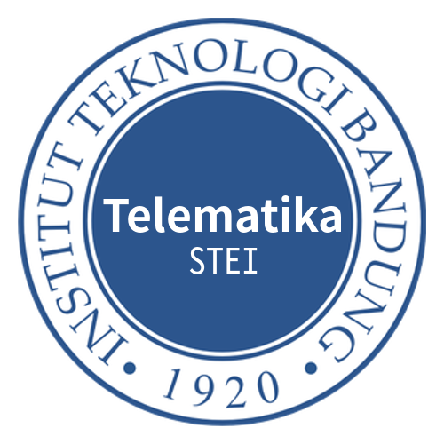

class: split-40 nopadding
background-image: url( bkgs/batu3.jpg )

.column_t2.center[.vmiddle.pushfront[
.figplaint-maxh350.opacity7[

]
]]
.column_t2.shadelightdark.add-left-border.pushfront[.vmiddle.nopadding[
.boxtitle4[
### .fonth5[Introductory Document]
# .fsize105[.or1[Telematics Labs]]

### 
### 
#### Dr.-Ing. Eueung Mulyana | .blue[eueung@stei.itb.ac.id] | Date: 05.11.2017
#### 
]
]]
---
class: column_t1 middle

.fonth4[
.tabtype1.fullwidth[
| Outline   |
|:-------------:|
|Short Intro|
|.or1[**Executive Summary**]|
|Highlight - Facilities & Activities|

]]

---
class: column_t1 middle center

.fonth2[.yellow[Short **Intro**]]  .fonth4[We were part of the EE Department since 1961 as the Lab of Electrical Telecommunication and reborn as the **Telematics** Lab in 1979. Since 2006 we are under the School of EE and Informatics.]  .fonth5[We currently are a group of 10 University Lecturers and manage common facilities supporting research, academic and non-academic activities of the SEEI, mostly in the area of communication .uline[networks] and .uline[services].]

---
class: split-40 nopadding
background-image: url( bkgs/batu3.jpg )

.column_t2.center[.vmiddle[
.figplaint-maxh350.opacity7[

]
]]
.column_t2[.vmiddle.nopadding[
.shadelightdark[.boxtitle1[
### 
# .fsize75[Executive Summary]

### 
### 
#### 
#### 
]]
]]
---
class: split-40 nopadding 

.column_t1[.vmiddle.pushfront.right[

#.fsize105.or1[Activities] 
#.fsize75.bluelight[Facilities]
#.fsize75.bluelight[Partners] 

]]
.column_t2[.vmiddle.pushfront.defaultalign[

.fonth4[
- **Academic** Matters (Undergrad,Postgrad)
- **Non-Academic** & .blue[Community] Programmes
- .red[Research]
]

]]

---
class: split-40 nopadding 

.column_t1[.vmiddle.pushfront.right[

#.fsize75.bluelight[Activities] 
#.fsize105.or1[Facilities]
#.fsize75.bluelight[Partners] 

]]
.column_t2[.vmiddle.pushfront.defaultalign[

.fonth4[
- General Purpose Rooms
- Lecturer Rooms (w/wh Coworking Space)
- Dedicated (Academic) Coworking Space for Students
- **Laboratories**
]

]]

---
class: split-40 nopadding 

.column_t1[.vmiddle.pushfront.right[

#.fsize75.bluelight[Activities] 
#.fsize105.or1[Facilities]
#.fsize75.bluelight[Partners] 

]]
.column_t2[.vmiddle.pushfront.defaultalign[

#.fsize105[**Laboratories**] 
.fonth4[
- IP Networking / Datacomm (Huawei)
- Advanced IP NetLab (Cisco/Compnet)
- General Computer-Based & Simulation Facility (Orlansoft)
- Digital System Lab (\\*)
]
(\*) Currently in the process to support IoT-related activities.

]]

---
class: split-40 nopadding 

.column_t1[.vmiddle.pushfront.right[

#.fsize75.bluelight[Activities] 
#.fsize75.bluelight[Facilities]
#.fsize105.or1[Partners] 

]]
.column_t2[.vmiddle.pushfront.defaultalign[

.fonth4[
- **Industrial** Partners: Huawei, Cisco, Compnet, Telkom Indonesia, Orlansoft, Indonesian Cloud (TRG), ...
- **Educational** & **Research** Partners: many domestic universities, OF@TEIN Initiative (GIST Korea), ...
]

]]

---
class: split-40 nopadding
background-image: url( bkgs/batu3.jpg )

.column_t2.center[.vmiddle[
.figplaint-maxh350.opacity7[

]
]]
.column_t2[.vmiddle.nopadding[
.shadelightdark[.boxtitle1[
### 
# .fsize75[.yellow[Highlight] - Facilities & Activities]

### 
### 
#### 
#### 
]]
]]
---
class: column_t1 middle center

#.fsize75[Highlight]

# .fsize105[.or1[**Facilities**] | .bluelight[Activities]]
---
class: split-40 nopadding bkgpos_00
background-image: url( images/01-trg.jpg )

.column_t2.center[.vmiddle[

]]
.column_t2[.vmiddle.nopadding[
.shadelightdark[.boxtitle1.noborder[
### 
# .yellow[Student Coworking Space]

### 
### 
#### 
#### 
]]
]]
---
class: bkgpos_00 nopadding
background-image: url(images/02-hw.jpg)

.shadelightdark.bottom_abs[.boxtitle1.noborder.center[
### .yellow[IP Networking & Datacomm Lab (Huawei)]
]]
---
class: bkgpos_00 nopadding
background-image: url(images/03-orlansoft.jpg)

.shadelightdark.bottom_abs[.boxtitle1.noborder.center[
### .yellow[General Computer-Based & Simulation Lab (Orlansoft)]
]]
---
class: bkgpos_00 nopadding
background-image: url(images/04-compnet.jpg)

.shadelightdark.top_abs[.boxtitle1.noborder.center[
# .yellow[Advanced IP NetLab (Compnet)]
]]
---
class: split-40 nopadding bkgpos_00
background-image: url( images/05-dosen.jpg )

.column_t2.center[.vmiddle[

]]
.column_t2[.vmiddle.nopadding[
.shadelightdark[.boxtitle1.noborder[
### 
# .yellow[Lecturer Room]

### 
### 
#### 
#### 
]]
]]
---
class: split-40 nopadding bkgpos_00
background-image: url( images/06-meeting.jpg )

.column_t2.center[.vmiddle[

]]
.column_t2[.vmiddle.nopadding[
.shadelightdark[.boxtitle1.noborder[
### 
# .yellow[Meeting Room]

### 
### 
#### 
#### 
]]
]]
---
class: column_t1 middle center

#.fsize75[Highlight]

# .fsize105[.bluelight[Facilities] | .or1[**Activities**]]
---
class: bkgpos_00 nopadding
background-image: url(images/13-hw.jpg)

.shadelightdark.bottom_abs[.boxtitle1.noborder.center[
### .yellow[IP Networking - Practice & Handons]
]]
---
class: bkgpos_00 nopadding
background-image: url(images/14-hw.jpg)

.shadelightdark.bottom_abs[.boxtitle1.noborder.center[
### .yellow[IP Networking - Practice & Handons]
]]
---
class: bkgpos_00 nopadding
background-image: url(images/15-hw.jpg)

.shadelightdark.bottom_abs[.boxtitle1.noborder.center[
### .yellow[IP Networking - Practice & Handons]
]]
---
class: bkgpos_00 nopadding
background-image: url(images/16-hw.jpg)

.shadelightdark.bottom_abs[.boxtitle1.noborder.center[
### .yellow[IP Networking - Practice & Handons]
]]
---
class: bkgpos_00 nopadding
background-image: url(images/07-tos-tsd.jpg)

.shadelightdark.bottom_abs[.boxtitle1.noborder.center[
### .yellow[Telematika] .red[Open.Session] & .yellow[Telematika] .blue[Skill.Dev]
]]
---
class: bkgpos_00 nopadding
background-image: url(images/10-tos-tsd.jpg)

.shadelightdark.bottom_abs[.boxtitle1.noborder.center[
### .yellow[Telematika] .red[Open.Session] & .yellow[Telematika] .blue[Skill.Dev]
]]
---
class: bkgpos_00 nopadding
background-image: url(images/08-tos-tsd.jpg)

.shadelightdark.bottom_abs[.boxtitle1.noborder.center[
### .yellow[Telematika] .red[Open.Session] & .yellow[Telematika] .blue[Skill.Dev]
]]
---
class: bkgpos_00 nopadding
background-image: url(images/09-tos-tsd.jpg)

.shadelightdark.bottom_abs[.boxtitle1.noborder.center[
### .yellow[Telematika] .red[Open.Session] & .yellow[Telematika] .blue[Skill.Dev]
]]
---
class: bkgpos_00 nopadding
background-image: url(images/11-tos-tsd.jpg)

.shadelightdark.bottom_abs[.boxtitle1.noborder.center[
### .yellow[External Sharing Session - Alumnus]
]]
---
class: bkgpos_00 nopadding
background-image: url(images/12-tos-tsd.jpg)

.shadelightdark.bottom_abs[.boxtitle1.noborder.center[
### .yellow[External Sharing Session - Partner (Indonesian Cloud)]
]]
---
class: split-40 nopadding bkgpos_00
background-image: url( images/act-01.jpg )

.column_t2.center[.vmiddle[

]]
.column_t2[.vmiddle.nopadding[
.shadelightdark[.boxtitle1.noborder[
### 
# .yellow[Project Work & Presentation]

### 
### 
#### 
#### 
]]
]]
---
class: split-40 nopadding bkgpos_00
background-image: url( images/g-06.jpg )

.column_t2.center[.vmiddle[

]]
.column_t2[.vmiddle.nopadding[
.shadelightdark[.boxtitle1.noborder[
### 
# .yellow[Project Work & Presentation]

### 
### 
#### 
#### 
]]
]]
---
class: split-40 nopadding bkgpos_00
background-image: url( images/g-01.jpg )

.column_t2.center[.vmiddle[

]]
.column_t2[.vmiddle.nopadding[
.shadelightdark[.boxtitle1.noborder[
### 
# .yellow[Project Work & Presentation]

### 
### 
#### 
#### 
]]
]]
---
class: split-40 nopadding bkgpos_00
background-image: url( images/act-02a.jpg )

.column_t2.center[.vmiddle[

]]
.column_t2[.vmiddle.nopadding[
.shadelightdark[.boxtitle1.noborder[
### 
# .yellow[Project Work @ Telemotion]

### 
### 
#### 
#### 
]]
]]
---

class: split-40 nopadding
background-image: url( bkgs/batu3.jpg )

.column_t2.center[.vmiddle.pushfront[
.figplaint-maxh350.opacity7[

]
]]
.column_t2.shadelightdark.add-left-border.pushfront[.vmiddle.nopadding[
.boxtitle4[
### .fonth5[End of Document]
# .fsize105.or1[Telematics Labs]

### 
### 
#### Dr.-Ing. Eueung Mulyana | .blue[eueung@stei.itb.ac.id]
#### 
]
]]

