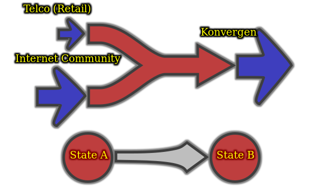
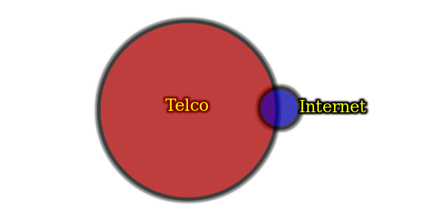
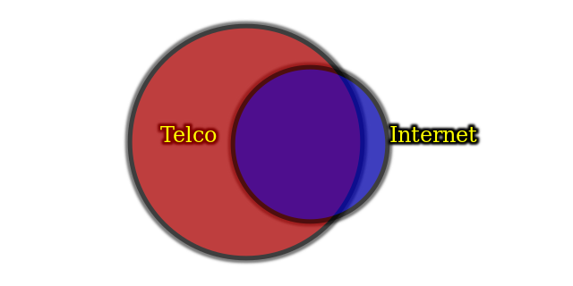
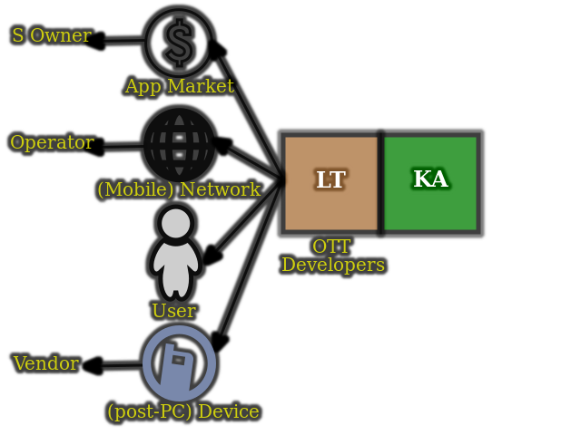
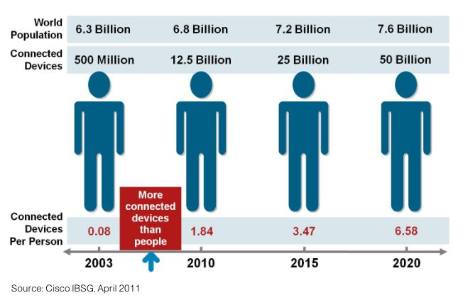
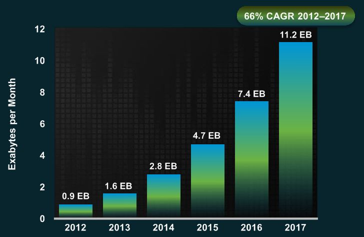
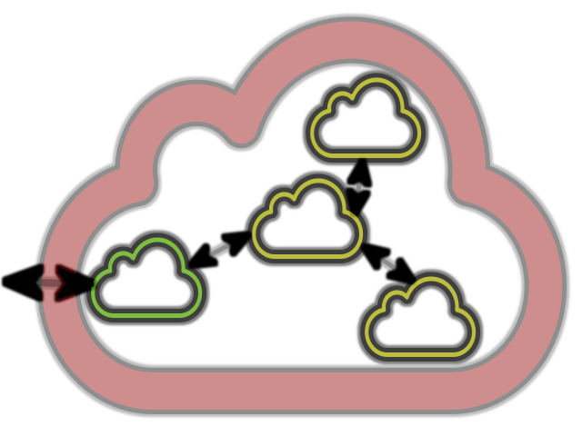

name: bkgtri-1
class: split-40 nopadding bkgpos_00

.column_t2.center[.vmiddle[
.fgtransparent[
# .fonth5[.fa-2x.fa-stack[<i class="fa fa-mixcloud fa-stack-2x fa-rotate-270"></i><i class="fa fa-code-fork fa-stack-2x fa-rotate-90"></i>]]
]
]]
.column_t2.shadelightdark.add-left-border.pushfront[.vmiddle.nopadding[
.boxtitle4[
### Connected Services &amp; Cloud Computing
# .fsize95[.yellow[Introduction &amp; Overview]]

### [Dr.-Ing. Eueung Mulyana](https://github.com/eueung)
### https://eueung.github.io/ET3010
#### ET-3010 | [Attribution-ShareAlike CC BY-SA](https://creativecommons.org/licenses/by-sa/4.0/)
#### 
]
]]
---
class: split-50 nopadding 

.column_t2[.vmiddle.pushfront.right[

# .red[C]onnected .red[S]ervices
### &amp;
# .red[C]loud .red[C]omputing
#### &nbsp;
### .red[**CS**] (&amp;) .red[**CC**]

]]
.column_t1[.vmiddle.pushfront.defaultalign[

# .bluelight[L]ayanan .bluelight[T]ersambung
### &amp;
# .bluelight[K]omputasi .bluelight[A]wan
#### &nbsp;
### .bluelight[**LT**] (&amp;) .bluelight[**KA**]

]]

---
class: split-50 nopadding 

.column_t2[.vmiddle.pushfront.right[

# .red[C]onnected .red[S]ervices
### &amp;
# .red[C]loud .red[C]omputing
#### &nbsp;
### .red[**CS**] (&amp;) .red[**CC**]

]]
.column_t1[.vmiddle.pushfront.defaultalign[

.fonth4[
- Modern Communication .yellow[**Services**]
- Technology &amp; .yellow[**Infrastructure**] 
]

]]

.shadelightdark.bottom_abs[.boxtitle1.noborder.center[
# Emerging &amp; State-of-the-Art ...
]]
---
class: column_t1 middle

.fonth4[
.tabtype1.fullwidth[
| Outline   |
|:-------------:|
|CS - What &amp; Why|
|CS - Landscape &amp; Roles|
|CC - What, Why &amp; Roles|
|Remarks &amp; Notes|

]]

---
name: bkgtri-2
class: split-40 nopadding bkgpos_00

.column_t2.center[.vmiddle[
.fgtransparent[
# .fonth5[.fa-2x.fa-stack[<i class="fa fa-mixcloud fa-stack-2x fa-rotate-270"></i><i class="fa fa-code-fork fa-stack-2x fa-rotate-90"></i>]]
]
]]
.column_t2[.vmiddle.nopadding[
.shadelightdark[.boxtitle1[
### .yellow[Connected Services]
# .fsize85[What &amp; Why]

### 
### 
#### 
#### 
]]
]]
---
class: split-60 nopadding 

.column_t2[.vmiddle.pushfront.right[

.fonth4[Any .red[**Digital Service**] that brings people together in any .red[**Meaningful**] way - to **engage**, **transact**, **share**, etc. - is a .blue[**Connected Service**].] (cf. Golding,2011)

.fonth3[.red[**Services**] + .red[**Connections**]]

.gray[
This plus: that need, that can not properly be used without, ...

### What does it **technically** mean??
]

]]
.column_t1[.vmiddle.pushfront.defaultalign[

# .fonth5[Connected Services]

.fonth5[
- .yellow[**Definition**]
- Examples
- Facts (Micro)
- Triggers &amp; Enablers
]

]]

---
class: split-60 nopadding 

.column_t2[.vmiddle.pushfront.center[

# Legacy .blue[**Telco**] Services
.fonth5[
Voice Services, Text Services, Data Services ]

# Services with .red[Internet-Origin]
.fonth5[
Twitter, Facebook, Google Search, ...]

# .red[New] Services
.fonth5[
Uber, Airbnb, ...]

]]
.column_t1[.vmiddle.pushfront.defaultalign[

# .fonth5[Connected Services]

.fonth5[
- .bluelight[**Definition**]
- .yellow[**Examples**]
- Facts (Micro)
- Triggers &amp; Enablers
]

]]

---
class: bkgpos_00 nopadding
background-image: url(images/pic01-nytimes.jpg)

.shadelightdark.bottom_abs[.boxtitle1.noborder.center[
# Facts - CS Around Us - User Perspective
#### Image Credit: nytimes.com 
]]
---
class: split-60 nopadding 

.column_t2[.vmiddle.pushfront.center[

.fonth4[
.blue[**Everyday**] Life

To .red[**Ease**] Things, to .red[**Entertain**], to ...

For some, those become **primary** needs ...
]
[<i class="fa fa-play fa-5x"></i>](reveal/ltka-01-facts-micro.html)

]]
.column_t1[.vmiddle.pushfront.defaultalign[

# .fonth5[Connected Services]

.fonth5[
- .bluelight[**Definition**]
- .bluelight[**Examples**]
- .yellow[**Facts**] (Micro)
- Triggers &amp; Enablers
]

]]

---
class: split-60 nopadding 

.column_t2[.vmiddle.pushfront.center[

.figplaint[

]
.fonth3[
Lifestyle 
**Technology Advances** 
Economical Feasibility
]

]]
.column_t1[.vmiddle.pushfront.defaultalign[

# .fonth5[Connected Services]

.fonth5[
- .bluelight[**Definition**]
- .bluelight[**Examples**]
- .bluelight[**Facts**] (Micro)
- .yellow[**Triggers**] &amp; .yellow[**Enablers**]
]

]]

---
class: split-60 nopadding 

.column_t2[.vmiddle.pushfront.center[

.figplaint[

]
.fonth4[A lot has happened ...]

]]
.column_t1[.vmiddle.pushfront.defaultalign[

.fonth5[
- Timespan +/- 10 yr 

&nbsp;
- Evolved from .yellow[**IC**] and (legacy) **Telco**
- **Regional** vs. .yellow[**Global**]
- Telco: Fixed- & Mobile-Broadband, Growth via Cust. Base

&nbsp;
- Others: Media, ...
- Enter **Change** ... [<i class="fa fa-play fa-1x"></i>](reveal/ltka-01-change.html)
]

]]

---
name: bkgtri-3
class: split-40 nopadding bkgpos_00

.column_t2.center[.vmiddle[
.fgtransparent[
# .fonth5[.fa-2x.fa-stack[<i class="fa fa-mixcloud fa-stack-2x fa-rotate-270"></i><i class="fa fa-code-fork fa-stack-2x fa-rotate-90"></i>]]
]
]]
.column_t2[.vmiddle.nopadding[
.shadelightdark[.boxtitle1[
### .yellow[Connected Services]
# .fsize85[Landscape &amp; Roles]

### 
### 
#### 
#### 
]]
]]
---
class: split-60 nopadding 

.column_t2[.vmiddle.pushfront.right[

.fonth4[
New .red[Demands], .red[Opportunities], but also **Threats**!]

.blue[
*Ada gula ada semut*... Demands = $$ 
$$ comes either from **new** or from **existing**, **acquired** Markets ]

.fonth5[
.gray[Serious **threats** for existing players (incumbents)]  
Right **strategy** and business **agility** badly needed to survive and win!
]

]]
.column_t1[.vmiddle.pushfront.defaultalign[

# .fonth5[Connected Services]

.fonth5[
- .yellow[**Impacts**]
- Market
- .black[\#nowhappening &amp; the Future]
- .black[Remarks]
- .black[Numbers &amp; Stats]
- Model, Relationship &amp; Facts to Consider
]

]]

---
class: split-60 nopadding 

.column_t2[.vmiddle.pushfront.center[

.figplaint[

]
.fonth5[
Case ID +/- Y2000  Relative to Market Size   1:8 to 1:10
]

]]
.column_t1[.vmiddle.pushfront.defaultalign[

# .fonth5[Connected Services]

.fonth5[
- .bluelight[**Impacts**]
- .yellow[**Market**]
- .black[\#nowhappening &amp; the Future]
- .black[Remarks]
- .black[Numbers &amp; Stats]
- Model, Relationship &amp; Facts to Consider
]

]]

---
class: split-60 nopadding 

.column_t2[.vmiddle.pushfront.center[

.figplaint[

]
.fonth5[
Y2010+ Size Comparison 1:2 to 1:3    Now?
]

]]
.column_t1[.vmiddle.pushfront.defaultalign[

# .fonth5[Connected Services]

.fonth5[
- .bluelight[**Impacts**]
- .yellow[**Market**]
- .black[\#nowhappening &amp; the Future]
- .black[Remarks]
- .black[Numbers &amp; Stats]
- Model, Relationship &amp; Facts to Consider
]

]]

---
class: split-60 nopadding 

.column_t2[.vmiddle.pushfront.center[

.fonth4[
[<i class="fa fa-play fa-5x"></i>](reveal/ltka-01-now-future.html)
]

]]
.column_t1[.vmiddle.pushfront.defaultalign[

# .fonth5[Connected Services]

.fonth5[
- .bluelight[**Impacts**]
- .bluelight[**Market**]
- .yellow[\#nowhappening &amp; the Future]
- .black[Remarks]
- .black[Numbers &amp; Stats]
- Model, Relationship &amp; Facts to Consider
]

]]

---
class: split-60 nopadding 

.column_t2[.vmiddle.pushfront.center[

.fonth4[
[<i class="fa fa-play fa-5x"></i>](reveal/ltka-01-remarks.html)
]

]]
.column_t1[.vmiddle.pushfront.defaultalign[

# .fonth5[Connected Services]

.fonth5[
- .bluelight[**Impacts**]
- .bluelight[**Market**]
- .black[\#nowhappening &amp; the Future]
- .yellow[Remarks]
- .black[Numbers &amp; Stats]
- Model, Relationship &amp; Facts to Consider
]

]]

---
class: split-60 nopadding 

.column_t2[.vmiddle.pushfront.center[

.fonth4[
[<i class="fa fa-play fa-5x"></i>](reveal/ltka-01-numbers-stats.html)
]

]]
.column_t1[.vmiddle.pushfront.defaultalign[

# .fonth5[Connected Services]

.fonth5[
- .bluelight[**Impacts**]
- .bluelight[**Market**]
- .black[\#nowhappening &amp; the Future]
- .black[Remarks]
- .yellow[Numbers &amp; Stats]
- Model, Relationship &amp; Facts to Consider
]

]]

---
class: split-60 nopadding 

.column_t2[.vmiddle.pushfront.center[

.figplaint[

]
.fonth3[**Model**]

]]
.column_t1[.vmiddle.pushfront.defaultalign[

# .fonth5[Connected Services]

.fonth5[
- .bluelight[**Impacts**]
- .bluelight[**Market**]
- .black[\#nowhappening &amp; the Future]
- .black[Remarks]
- .black[Numbers &amp; Stats]
- .yellow[**Model**], Relationship &amp; Facts to Consider
]

]]

---

class: split-60 nopadding 

.column_t2[.vmiddle.pushfront.center[

.figplaint[

]
.fonth3[**Model**]

]]
.column_t1[.vmiddle.pushfront.defaultalign[

.fonth5[
- **Induction**: Phone, SMS, Twitter, Facebook, Search, ...

- CS (**System**): .bluelight[UI], .bluelight[Data] (Local+Remote), .bluelight[Process] (Local+Remote)
- CS Data Source: Device **Sensors**, Communication **Channels**
]

- CS **Frontend**: UI, Local Data/Storage, Local Process
- Box/**Backend**: Interface, Storage, Process

]]

---
class: split-60 nopadding 

.column_t2[.vmiddle.pushfront.center[

.figplaint[

]
.fonth5[**Simplified Relationship** CS, CC, Some Involving Parties]

]]
.column_t1[.vmiddle.pushfront.defaultalign[

# .fonth5[Connected Services]

.fonth5[
- .bluelight[**Impacts**]
- .bluelight[**Market**]
- .black[\#nowhappening &amp; the Future]
- .black[Remarks]
- .black[Numbers &amp; Stats]
- .bluelight[**Model**], .yellow[**Relationship**] &amp; Facts to Consider
]

]]

---
class: split-60 nopadding 

.column_t2[.vmiddle.pushfront.center[

.figplaint[

]
.fonth5[**Number of Devices**]

]]
.column_t1[.vmiddle.pushfront.defaultalign[

# .fonth5[Connected Services]

.fonth5[
- .bluelight[**Impacts**]
- .bluelight[**Market**]
- .black[\#nowhappening &amp; the Future]
- .black[Remarks]
- .black[Numbers &amp; Stats]
- .bluelight[**Model**], .bluelight[**Relationship**] &amp; .yellow[**Facts to Consider**]
]

]]

---
class: split-60 nopadding 

.column_t2[.vmiddle.pushfront.center[

.figplaint[

]
.fonth5[**Number of Devices**]

]]
.column_t1[.vmiddle.pushfront.defaultalign[

.fonth5[
Mobile Devices (.yellow[$$$$$]) 
CS/Apps Usage &amp; Purchases (.yellow[$$$$])

&nbsp;

Needs for Infrastructure: Computing/**Backend** (.bluelight[increased]) (.yellow[$$?])

Data **Volume** (.bluelight[steadily increased]) (.yellow[$])

Needs for Infrastructure: **Connectivity** e.g. Coverage, BW (.bluelight[steadily increased]) (.yellow[$])

]

]]

---
class: split-60 nopadding 

.column_t2[.vmiddle.pushfront.center[

.figstyle1[

]
.fonth5[Cisco VNI Global **Mobile Data Traffic** Forecast, 2012-2017]

]]
.column_t1[.vmiddle.pushfront.defaultalign[

# .fonth5[Connected Services]

.fonth5[
- .bluelight[**Impacts**]
- .bluelight[**Market**]
- .black[\#nowhappening &amp; the Future]
- .black[Remarks]
- .black[Numbers &amp; Stats]
- .bluelight[**Model**], .bluelight[**Relationship**] &amp; .yellow[**Facts to Consider**]
]

]]

---
name: bkgtri-4
class: split-40 nopadding bkgpos_00

.column_t2.center[.vmiddle[
.fgtransparent[
# .fonth5[.fa-2x.fa-stack[<i class="fa fa-mixcloud fa-stack-2x fa-rotate-270"></i><i class="fa fa-code-fork fa-stack-2x fa-rotate-90"></i>]]
]
]]
.column_t2[.vmiddle.nopadding[
.shadelightdark[.boxtitle1[
### .yellow[Cloud Computing] - Infrastructure
# .fsize75[What,  Why &amp; Roles]

### 
### 
#### 
#### 
]]
]]
---
class: split-50 nopadding bkgpos_00
background-image: url(bkgs/minion-bubble-right910.jpg)

.column_t2[.vmiddle.center[

]]
.column_t2[.vmiddle.xkcd_font.pushfront.center[
#Errr...

What is actually this **Cloud**?

]]

---
class: split-60 nopadding 

.column_t1[.vmiddle.pushfront.right[

.fonth5[
The interesting thing about **Cloud Computing** is that we've redefined Cloud Computing to include everything that **we already do**.... I don't understand what we would do differently in the light of Cloud Computing other than change the wording of some of our ads.](.bluelight[Larry Ellison]/Oracle, 2008)

.fonth5[
A lot of people are jumping on the **cloud** bandwagon, but I have .uline[**not**] heard two people say the same thing about it. There are multiple definitions out there of "the cloud".](.bluelight[Andy Isherwood]/HP, ZDnet News, 2008)

]]
.column_t2[.vmiddle.pushfront.defaultalign[

# .fonth5[Cloud Computing]

.fonth5[
]

]]

---
class: split-50 nopadding bkgpos_00
background-image: url(bkgs/m2-910.jpg)

.column_t2[.vmiddle.xkcd_font.pushfront.center[
#Ockay...

How about Bananas? **Cloud** = Bananas?

]]
.column_t2[.vmiddle.center[

]]

---
class: split-50 nopadding bkgpos_00
background-image: url(bkgs/jackie-bubble-right910.jpg)

.column_t2[.vmiddle.center[

]]
.column_t2[.vmiddle.xkcd_font.pushfront.center[
#Whhaat??

]]

---
class: split-60 nopadding 

.column_t2[.vmiddle.pushfront.right[

.fonth4[
.fonth5[**Cloud Computing**] is a model for enabling convenient, .blue[**on-demand**] network access to a .blue[**shared pool**] of configurable computing .red[**resources**] (e.g., .uline[networks], .uline[servers], .uline[storage], applications, and services) that can be **rapidly** .blue[**provisioned**] and .blue[**released**] with **minimal** management .blue[**effort**] or service provider interaction. (NIST)]

]]
.column_t1[.vmiddle.pushfront.defaultalign[

# .fonth5[Cloud Computing]

.fonth5[
- .yellow[**Definition**]
- Model &amp; Relationship
- Facts (Macro)
]

]]

---
class: split-60 nopadding 

.column_t2[.vmiddle.pushfront.right[

.fonth2[**Flexible** Infrastructure] 
.fonth4[Abstracted &amp; often **Virtualized**] 
.fonth5[Now with many Variants and Technology]  
.fonth5[**Cloud** (without "Computing") is sometimes used interchangebly with **Networks** or the Internet] 

]]
.column_t1[.vmiddle.pushfront.defaultalign[

# .fonth5[Cloud Computing]

.fonth5[
- .yellow[**Definition**]
- Model &amp; Relationship
- Facts (Macro)
]

]]

---
class: split-60 nopadding 

.column_t2[.vmiddle.pushfront.center[

.figplaint[

]
.fonth4[Connected Services &amp; **Cloud**]

]]
.column_t1[.vmiddle.pushfront.defaultalign[

# .fonth5[Cloud Computing]

.fonth5[
- .bluelight[**Definition**]
- .yellow[**Model**] &amp; .yellow[**Relationship**]
- Facts (Macro)
]

]]

---
class: split-60 nopadding 

.column_t2[.vmiddle.pushfront.center[

.figplaint[

]
.fonth5[System-Boxes inside **Cloud**] Nested **Clouds**

]]
.column_t1[.vmiddle.pushfront.defaultalign[

# .fonth5[Cloud Computing]

.fonth5[
- .bluelight[**Definition**]
- .yellow[**Model**] &amp; .yellow[**Relationship**]
- Facts (Macro)
]

]]

---
class: split-60 nopadding 

.column_t2[.vmiddle.pushfront.center[

.fonth4[
[<i class="fa fa-play fa-5x"></i>](reveal/ltka-01-facts-macro.html)
]

]]
.column_t1[.vmiddle.pushfront.defaultalign[

# .fonth5[Cloud Computing]

.fonth5[
- .bluelight[**Definition**]
- .bluelight[**Model**] &amp; .bluelight[**Relationship**]
- .yellow[**Facts**] (Macro)
]

]]

---
name: bkgtri-5
class: split-40 nopadding bkgpos_00

.column_t2.center[.vmiddle[
.fgtransparent[
# .fonth5[.fa-2x.fa-stack[<i class="fa fa-mixcloud fa-stack-2x fa-rotate-270"></i><i class="fa fa-code-fork fa-stack-2x fa-rotate-90"></i>]]
]
]]
.column_t2[.vmiddle.nopadding[
.shadelightdark[.boxtitle1[
### 
# .fsize85[Remarks &amp; Notes]

### 
### 
#### 
#### 
]]
]]
---
class: split-60 nopadding 

.column_t2[.vmiddle.pushfront.right[

.fonth3[
CS are in .red[**everyday life**] of more-and-more people. CS becomes an attracting .red[**business trend**].
]  
.fonth4[
CS involve many new .red[**emerging technologies**] including **Cloud**.
CS are rapidly .red[**growing**] in terms of **services** and **applications**.
]

]]
.column_t1[.vmiddle.pushfront.defaultalign[

# .fonth5[Notes]

.fonth5[
]

]]

---
class: split-60 nopadding 

.column_t2[.vmiddle.pushfront.center[

.fonth4[
[<i class="fa fa-play fa-5x"></i>](reveal/ltka-01-closing.html)
]

]]
.column_t1[.vmiddle.pushfront.defaultalign[

# .fonth5[Notes]

.fonth5[
Now you live in an .yellow[**agile**] world, may cause **fatigue**.. Tapi don't worry ya, .uline[pasti bisa]! **GT** <i class="fa fa-arrows-h" aria-hidden="true"></i> **ITB**
]

]]

---
name: bkgtri-6
class: split-40 nopadding bkgpos_00

.column_t2.center[.vmiddle[
.fgtransparent[
# .fonth5[.fa-2x.fa-stack[<i class="fa fa-mixcloud fa-stack-2x fa-rotate-270"></i><i class="fa fa-code-fork fa-stack-2x fa-rotate-90"></i>]]
]
]]
.column_t2[.vmiddle.nopadding[
.shadelightdark[.boxtitle1[
### 
# .fsize95[Refs]

### 
### 
#### 
#### 
]]
]]
---
# References/Books

.fonth5[
1. Paul Golding, .blue[Connected Services: A Guide to the Internet Technologies Shaping the Future of Mobile Services and Operators], John Wiley & Sons Ltd., 2011, ISBN 978-0-470-97455-1
1. Dan C. Marinescu, .blue[Cloud Computing Theory and Practice], Morgan Kaufmann, Elsevier Inc., 2013, ISBN: 978-0-12404-627-6
]
---
name: bkgtri-7
class: split-40 nopadding bkgpos_00

.column_t2.center[.vmiddle[
.fgtransparent[
# .fonth5[.fa-2x.fa-stack[<i class="fa fa-mixcloud fa-stack-2x fa-rotate-270"></i><i class="fa fa-code-fork fa-stack-2x fa-rotate-90"></i>]]
]
]]
.column_t2.shadelightdark.add-left-border.pushfront[.vmiddle.nopadding[
.boxtitle4[
### 
# .fsize175.yellow[END]

### [Dr.-Ing. Eueung Mulyana](https://github.com/eueung)
### https://eueung.github.io/ET3010
#### ET-3010 | [Attribution-ShareAlike CC BY-SA](https://creativecommons.org/licenses/by-sa/4.0/)
#### 
]
]]

