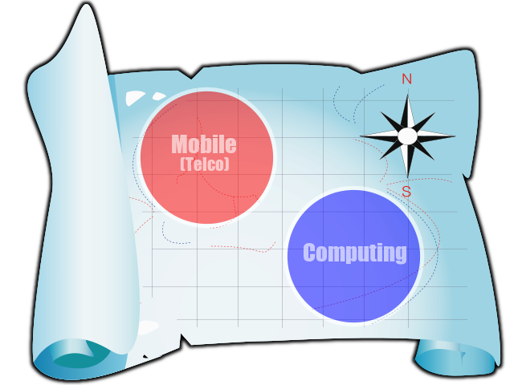
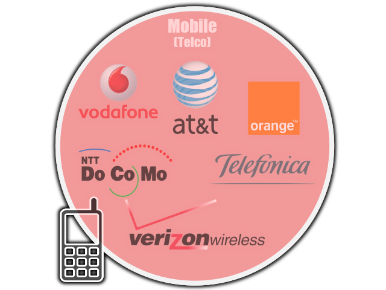
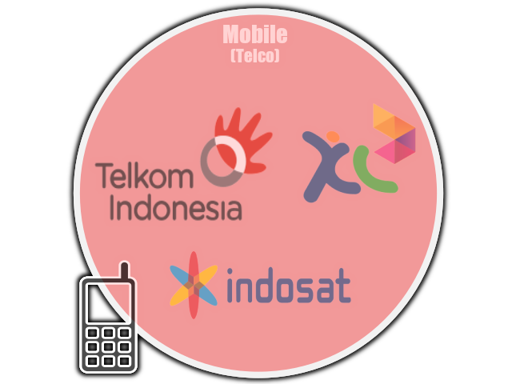
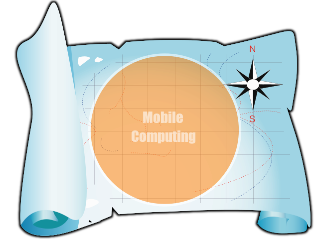
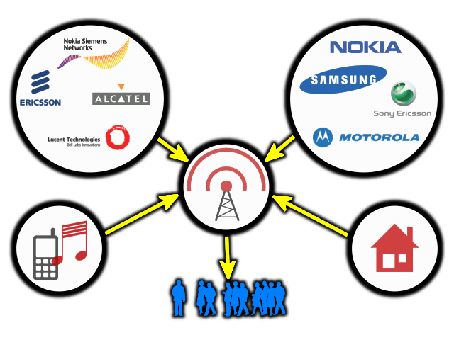
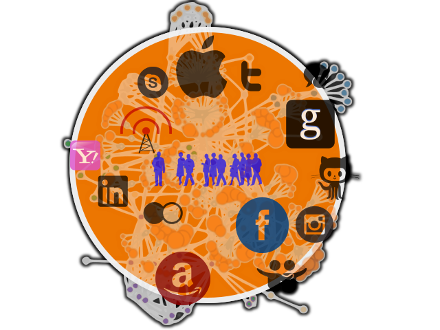

name: bkgtri-1
class: split-40 nopadding bkgpos_00

.column_t2.center[.vmiddle[
.fgtransparent[
# .fonth5[.fa-2x.fa-stack[<i class="fa fa-mixcloud fa-stack-2x fa-rotate-270"></i><i class="fa fa-code-fork fa-stack-2x fa-rotate-90"></i>]]
]
]]
.column_t2.shadelightdark.add-left-border.pushfront[.vmiddle.nopadding[
.boxtitle4[
### Connected Services
# .fsize95[.yellow[Services Convergence] &amp; Digital Ecosystems]

### [Dr.-Ing. Eueung Mulyana](https://github.com/eueung)
### https://eueung.github.io/ET3010
#### ET-3010 | [Attribution-ShareAlike CC BY-SA](https://creativecommons.org/licenses/by-sa/4.0/)
#### 
]
]]
---
class: column_t1 middle

.fonth4[
.tabtype1.fullwidth[
| Outline   |
|:-------------:|
|.yellow[Services Convergence]|
|.yellow[Impacts of Services Convergence]|
|Digital Ecosystem|
|Examples of Digital Ecosystem|

]]

---
name: bkgtri-2
class: split-40 nopadding bkgpos_00

.column_t2.center[.vmiddle[
.fgtransparent[
# .fonth5[.fa-2x.fa-stack[<i class="fa fa-mixcloud fa-stack-2x fa-rotate-270"></i><i class="fa fa-code-fork fa-stack-2x fa-rotate-90"></i>]]
]
]]
.column_t2[.vmiddle.nopadding[
.shadelightdark[.boxtitle1[
### 
# .fsize85[Services Convergence]

### 
### 
#### 
#### 
]]
]]
---
class: split-50 nopadding 

.column_t1[.vmiddle.pushfront.right[

#.fonth5[Communication Services]
####.fonth5.bluelight[A Look Back &amp; Forward - Ericsson]

]]
.column_t2[.vmiddle.pushfront.center[

.fonth4[ 
[<i class="fa fa-play fa-5x"></i>](reveal/ltka-03-services-ericsson.html)
]

]]

---
class: split-60 nopadding 

.column_t2[.vmiddle.pushfront.center[

.figplaint[

]
.fonth5[Pre-Convergence Landscape]

]]
.column_t1[.vmiddle.pushfront.defaultalign[

# .fonth5[Two Separate **Islands**]

.fonth5[
ca. Y2000 (VisionMobile)
]

]]

---
class: split-60 nopadding 

.column_t2[.vmiddle.pushfront.center[

.figplaint[

]
.fonth5[Pre-Convergence @**Telcos**]

]]
.column_t1[.vmiddle.pushfront.defaultalign[

# .fonth5[**Device**]
####.fonth4.bluelight[Dumb + Closed]
  
# .fonth5[**Network**]
####.fonth4.bluelight[Private + Vertically Integrated + Intelligent]

]]

---
class: split-60 nopadding 

.column_t2[.vmiddle.pushfront.center[

.figplaint[

]
.fonth5[Pre-Convergence @**Local Telcos**]

]]
.column_t1[.vmiddle.pushfront.defaultalign[

# .fonth5[]
####.fonth4.bluelight[The Begin of Industry Competitions]

]]

---
class: split-60 nopadding 

.column_t2[.vmiddle.pushfront.center[

.figplaint[

]
.fonth5[Pre-Convergence - **Computing**]

]]
.column_t1[.vmiddle.pushfront.defaultalign[

# .fonth5[**Device**]
####.fonth4.bluelight[Intelligent (SW) + Open]
  
# .fonth5[**Network**]
####.fonth4.bluelight[Public + Horizontally Integrated + Dumb]

]]

---
class: split-60 nopadding 

.column_t2[.vmiddle.pushfront.center[

.figplaint[

]
.fonth5.blue[**Convergence**]

]]
.column_t1[.vmiddle.pushfront.defaultalign[

# .fonth5[One Big **Island**]

.fonth5[
Around 10 Years Later
]

]]

---
class: split-60 nopadding 

.column_t2[.vmiddle.pushfront.center[

.figplaint[

]
.fonth5[Convergence - **Mobile Computing**]

]]
.column_t1[.vmiddle.pushfront.defaultalign[

# .fonth5[**Device**]
####.fonth4.bluelight[Intelligent (SW) + Open]
  
# .fonth5[**Network**]
####.fonth4.bluelight[?]

]]

---
class: split-50 nopadding 

.column_t1[.vmiddle.pushfront.right[

#.fonth5[Communication Services]
####.fonth5.bluelight[Changes - SAP]

]]
.column_t2[.vmiddle.pushfront.center[

.fonth4[ 
[<i class="fa fa-play fa-5x"></i>](reveal/ltka-03-services-sap.html)
]

]]

---
class: column_t2 bkgpos_00 center nopadding

     
.figplaint-75[

]

.shadelightdark.top_abs[.boxtitle1.noborder.center[
# .yellow[Changes] happened & will always be happening
]]
.shadelightdark.bottom_abs[.boxtitle1.noborder.center[
#### Diffused Computing = IoT = PerComp = UbiComp = Everyware = Networked Mesh Computing
#### (Nordkapp + VisionMobile)
]]
---
class: split-40 nopadding 

.column_t1[.vmiddle.pushfront.right[

#.fonth4[Notes]
####.fonth4.bluelight[Equivalent Terms]

]]
.column_t2[.vmiddle.pushfront.defaultalign[

.fonth2[ 
Mobile Computing 
.red[**Mobile 2.0**]  
.blue[**Telco 2.0**] 
]

]]

---
name: bkgtri-3
class: split-40 nopadding bkgpos_00

.column_t2.center[.vmiddle[
.fgtransparent[
# .fonth5[.fa-2x.fa-stack[<i class="fa fa-mixcloud fa-stack-2x fa-rotate-270"></i><i class="fa fa-code-fork fa-stack-2x fa-rotate-90"></i>]]
]
]]
.column_t2[.vmiddle.nopadding[
.shadelightdark[.boxtitle1[
### 
# .fsize85[Impacts of Services Convergence]

### 
### 
#### 
#### 
]]
]]
---
class: split-60 nopadding 

.column_t2[.vmiddle.pushfront.center[

.figplaint[

]
.fonth5[A Deeper Look]

]]
.column_t1[.vmiddle.pushfront.defaultalign[

# From Mobile Telephony to Mobile 2.0
 
####.fonth4.bluelight[What has happened during this change?]

]]

---
class: split-60 nopadding 

.column_t2[.vmiddle.pushfront.center[

.figplaint-75[

]
.fonth5[EU27 Survey - 2011]

]]
.column_t1[.vmiddle.pushfront.defaultalign[

# EU Houshold Spending 2011
####.fonth4.bluelight[via VisionMobile]

]]

---
class: split-60 nopadding 

.column_t2[.vmiddle.pushfront.center[

.figplaint-75[

]
.fonth5[Potentials]

]]
.column_t1[.vmiddle.pushfront.defaultalign[

# .fonth5[**Mobile Telephony**]
# EU Houshold Spending 2011
 
####.fonth4.bluelight[Average Spending for Communications -> 3%]
####.fonth4.bluelight[**Telcos** are Gatekeeper for this need]

]]

---
class: split-60 nopadding 

.column_t2[.vmiddle.pushfront.center[

.figplaint-75[

]
.fonth5[Commodities]

]]
.column_t1[.vmiddle.pushfront.defaultalign[

# .fonth5[**Mobile Telephony**]
# Value Creation
 
####.fonth4.bluelight[Voice, Text, Contacts, & Camera]
####.fonth4.bluelight[Only for Communication Needs]

]]

---
class: split-60 nopadding 

.column_t2[.vmiddle.pushfront.center[

.figplaint-75[

]
.fonth5[Potentials]

]]
.column_t1[.vmiddle.pushfront.defaultalign[

# .fonth5[**Mobile 2.0**]
# EU Houshold Spending 2011
 
####.fonth4.bluelight[Average Spending for the Rest -> 97%]
####.fonth4.bluelight[**Ecosystems** are Gatekeeper for these needs.]

]]

---
class: split-60 nopadding 

.column_t2[.vmiddle.pushfront.center[

.figplaint[

]
.fonth5[Commodities]

]]
.column_t1[.vmiddle.pushfront.defaultalign[

# .fonth5[**Mobile 2.0**]
# Value Creation
 
####.fonth4.bluelight[As of July 2015, around 4M Apps]
####.fonth4.bluelight[For All Needs (incl. Communications)]

]]

---
class: column_t2 bkgpos_00 center nopadding

.figplaint-75[

]

.shadelightdark.bottom_abs[.boxtitle1.noborder.center[
# Mobile Telephony - Value Distribution
#### .yellow[**Telcos**] were the Center of Value Distributions
]]
---
class: column_t2 bkgpos_00 center nopadding

.figplaint-75[

]

.shadelightdark.bottom_abs[.boxtitle1.noborder.center[
# Mobile 2.0 - Value Distribution
#### Uni or Multi-Polar Distributions (Involving Several Parties - .yellow[**Ecosystem**])
]]
---
class: split-40 nopadding 

.column_t1[.vmiddle.pushfront.right[

#.fonth5[Services Convergence]
####.fonth4.bluelight[.yellow[**Direct**] & Indirect Impacts]

]]
.column_t2[.vmiddle.pushfront.defaultalign[

.fonth4[
1. New **Values** &amp; Commodities
1. New Schemes for Values **Distribution**
1. New Business **Players** / Parties
1. New Business **Models**
]

]]

---
class: split-40 nopadding 

.column_t1[.vmiddle.pushfront.right[

#.fonth5[Services Convergence]
####.fonth4.bluelight[.yellow[**Direct**] & Indirect Impacts]

]]
.column_t2[.vmiddle.pushfront.defaultalign[

.fonth4.gray[New **Values** &amp; Commodities]
- Covering almost every aspect of our daily lives

.fonth4.gray[New Schemes for Values **Distribution**]
- Several parties in the ecosystems play their own roles

.fonth4.gray[New Business **Players** / Parties]
- Mobile Telephony -> Telcos + Suppliers
- Mobile Computing -> Ecosystem Owners + Partners / Participants

.fonth4.gray[New Business **Models**]
- Mobile Telephony -> Proven + Predictable
- Mobile Computing -> New + Unpredictable
- New Asymmetric vs. Legacy Business Models

]]

---
class: split-40 nopadding 

.column_t1[.vmiddle.pushfront.right[

#.fonth5[Services Convergence]
####.fonth4.bluelight[Direct & .yellow[**Indirect**] Impacts]

]]
.column_t2[.vmiddle.pushfront.defaultalign[

.fonth4[
1. New Opportunities &amp; Threats
1. The Clash of Business Models
1. New Business Order and Market Leadership
]

]]

---
class: split-50 nopadding 

.column_t1[.vmiddle.pushfront.right[

#.fonth5[Beyond Legacy Services]
####.fonth5.bluelight[Networked Society - Ericsson]

]]
.column_t2[.vmiddle.pushfront.center[

.fonth4[ 
[<i class="fa fa-play fa-5x"></i>](reveal/ltka-03-netsoc-ericsson.html)
]

]]

---
name: bkgtri-8
class: split-40 nopadding bkgpos_00

.column_t2.center[.vmiddle[
.fgtransparent[
# .fonth5[.fa-2x.fa-stack[<i class="fa fa-mixcloud fa-stack-2x fa-rotate-270"></i><i class="fa fa-code-fork fa-stack-2x fa-rotate-90"></i>]]
]
]]
.column_t2[.vmiddle.nopadding[
.shadelightdark[.boxtitle1[
### 
# .fsize95[Refs]

### 
### 
#### 
#### 
]]
]]
---
# References

.fonth5[
1. [VisionMobile](http://www.visionmobile.com/) - Site &amp; Blog
1. [VisionMobile - Business models of mobile ecosystems - Digital Winners](http://www.slideshare.net/andreasc/vision-mobile-digital-winners)
]
---
name: bkgtri-9
class: split-40 nopadding bkgpos_00

.column_t2.center[.vmiddle[
.fgtransparent[
# .fonth5[.fa-2x.fa-stack[<i class="fa fa-mixcloud fa-stack-2x fa-rotate-270"></i><i class="fa fa-code-fork fa-stack-2x fa-rotate-90"></i>]]
]
]]
.column_t2.shadelightdark.add-left-border.pushfront[.vmiddle.nopadding[
.boxtitle4[
### 
# .fsize175.yellow[END]

### [Dr.-Ing. Eueung Mulyana](https://github.com/eueung)
### https://eueung.github.io/ET3010
#### ET-3010 | [Attribution-ShareAlike CC BY-SA](https://creativecommons.org/licenses/by-sa/4.0/)
#### 
]
]]

