name: bkgtri-1
class: split-40 nopadding bkgpos_00

.column_t2.center[.vmiddle[
.fgtransparent[
# .fonth5[.fa-2x.fa-stack[<i class="fa fa-mixcloud fa-stack-2x fa-rotate-270"></i><i class="fa fa-code-fork fa-stack-2x fa-rotate-90"></i>]]
]
]]
.column_t2.shadelightdark.add-left-border.pushfront[.vmiddle.nopadding[
.boxtitle4[
### Connected Services
# .fsize95[Services Convergence &amp; .yellow[Digital Ecosystems]]

### [Dr.-Ing. Eueung Mulyana](https://github.com/eueung)
### https://eueung.github.io/ET3010
#### ET-3010 | [Attribution-ShareAlike CC BY-SA](https://creativecommons.org/licenses/by-sa/4.0/)
#### 
]
]]
---
class: column_t1 middle

.fonth4[
.tabtype1.fullwidth[
| Outline   |
|:-------------:|
|Services Convergence|
|Impacts of Services Convergence|
|.yellow[Digital Ecosystem]|
|.yellow[Examples of Digital Ecosystem]|

]]

---
name: bkgtri-2
class: split-40 nopadding bkgpos_00

.column_t2.center[.vmiddle[
.fgtransparent[
# .fonth5[.fa-2x.fa-stack[<i class="fa fa-mixcloud fa-stack-2x fa-rotate-270"></i><i class="fa fa-code-fork fa-stack-2x fa-rotate-90"></i>]]
]
]]
.column_t2[.vmiddle.nopadding[
.shadelightdark[.boxtitle1[
### 
# .fsize85[Digital Ecosystem]

### 
### 
#### 
#### 
]]
]]
---
class: split-60 nopadding 

.column_t2[.vmiddle.pushfront.center[

.figplaint[

]
.fonth5[Elements of the Simplified CS Model]

]]
.column_t1[.vmiddle.pushfront.defaultalign[

# .fonth5[Simple CS Model]

.fonth5[
User - Device - System
]

]]

---
class: split-60 nopadding 

.column_t2[.vmiddle.pushfront.center[

.figplaint[
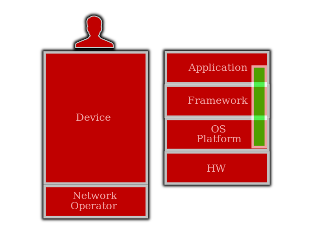
]
.fonth5[]

]]
.column_t1[.vmiddle.pushfront.defaultalign[

# .fonth5[Abstract Device Model]

.fonth5[
]

]]

---
class: split-60 nopadding 

.column_t2[.vmiddle.pushfront.center[

.figplaint[
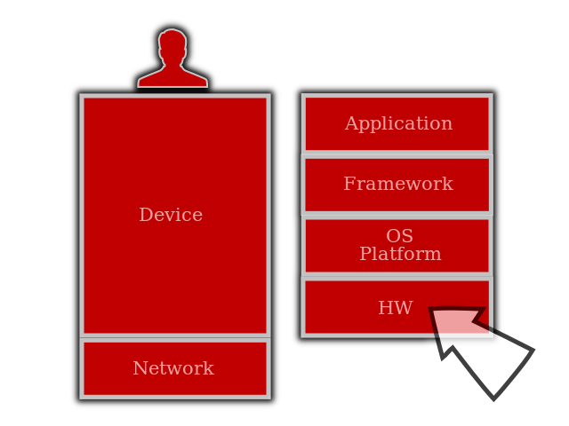
]
.fonth5[Abstract Device Model]

]]
.column_t1[.vmiddle.pushfront.defaultalign[

# .fonth5[Device]

.fonth4.bluelight[
**Hardware**
]

]]

---
class: split-60 nopadding 

.column_t2[.vmiddle.pushfront.center[

.figplaint[
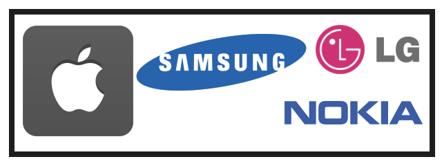
]
.fonth5[]

]]
.column_t1[.vmiddle.pushfront.defaultalign[

# .fonth5[Device]

.fonth4.bluelight[
**Hardware**
]
.fonth5[
.yellow[**OEMs** (HW Vendors)] 
.yellow[**Accessories** Manufacturers]
]

]]

---
class: split-60 nopadding 

.column_t2[.vmiddle.pushfront.center[

.figplaint[
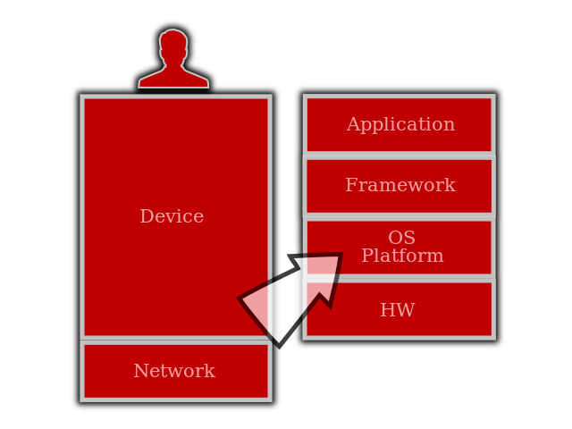
]
.fonth5[Abstract Device Model]

]]
.column_t1[.vmiddle.pushfront.defaultalign[

# .fonth5[Device]

.fonth4.bluelight[
**Platform &amp; Operating System**
]

]]

---
class: split-60 nopadding 

.column_t2[.vmiddle.pushfront.center[

.figplaint[

]
.fonth5[]

]]
.column_t1[.vmiddle.pushfront.defaultalign[

# .fonth5[Device]

.fonth4.bluelight[
**Platform &amp; Operating System**
]
.fonth5[
.yellow[**Platform** / **OS** Vendors]
]

]]

---
class: split-60 nopadding 

.column_t2[.vmiddle.pushfront.center[

.figplaint[
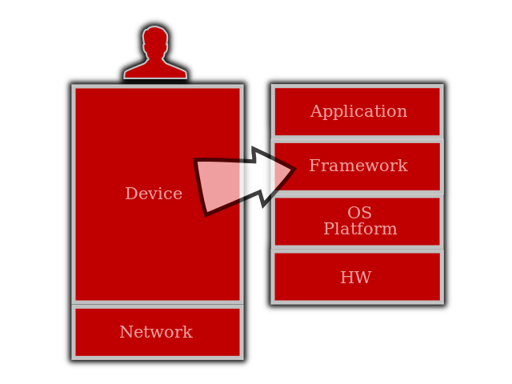
]
.fonth5[Abstract Device Model]

]]
.column_t1[.vmiddle.pushfront.defaultalign[

# .fonth5[Device]

.fonth4.bluelight[
**Application Framework**
]

]]

---
class: split-60 nopadding 

.column_t2[.vmiddle.pushfront.center[

.figplaint[
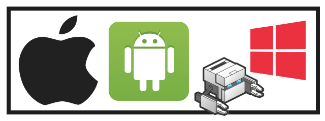
]
.fonth5[]

]]
.column_t1[.vmiddle.pushfront.defaultalign[

# .fonth5[Device]

.fonth4.bluelight[
**Application Framework**
]
.fonth5[
.yellow[**Framework** Owners]
]

]]

---
class: split-60 nopadding 

.column_t2[.vmiddle.pushfront.center[

.figplaint[
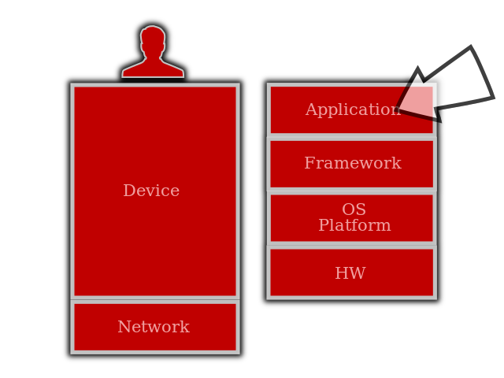
]
.fonth5[Abstract Device Model]

]]
.column_t1[.vmiddle.pushfront.defaultalign[

# .fonth5[Device]

.fonth4.bluelight[
**Application**
]

]]

---
class: split-60 nopadding 

.column_t2[.vmiddle.pushfront.center[

.figplaint[

]
.fonth5[]

]]
.column_t1[.vmiddle.pushfront.defaultalign[

# .fonth5[Device]

.fonth4.bluelight[
**Application**
]
.fonth5[
.yellow[**Market** Owners] 
.yellow[**Developers**]
]

]]

---
class: split-40 nopadding 

.column_t1[.vmiddle.pushfront.right[

#.fonth5[Digital Ecosystems]
####.fonth4.bluelight[.yellow[**Abstract Device**] Model]

]]
.column_t2[.vmiddle.pushfront.defaultalign[

.fonth4[
1. OEMs (HW Vendors)
2. Accessories Manufacturers
3. .blue[Platform/OS Vendors]
4. .blue[Framework Owners]
5. .blue[Market Owners]
6. Developers
]

]]

---
class: split-60 nopadding 

.column_t2[.vmiddle.pushfront.center[

.figplaint[
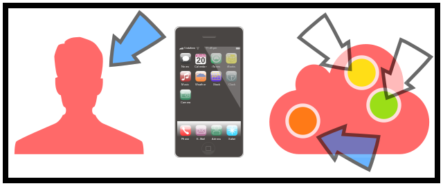
]
.fonth5[Other Elements in the CS Model]

]]
.column_t1[.vmiddle.pushfront.defaultalign[

# .fonth5[CS Model]

.fonth4.bluelight[
]
.fonth5.yellow[
**User** 
**Operator** 
**Advertiser** 
Other Partner
]

]]

---
class: split-40 nopadding 

.column_t1[.vmiddle.pushfront.right[

#.fonth5[Digital Ecosystems]
####.fonth4.bluelight[.yellow[**Connected Services**] Model]

]]
.column_t2[.vmiddle.pushfront.defaultalign[

.fonth4[
1. Users
1. .gray[OEMs (HW Vendors)]
2. .gray[Accessories Manufacturers]
3. .gray[Platform/OS Vendors]
4. .gray[Framework Owners]
5. .gray[Market Owners]
6. .gray[Developers]
8. Operators
9. Advertisers
10. Other Partners
]

]]

---
class: split-60 nopadding 

.column_t2[.vmiddle.pushfront.center[

.figplaint[
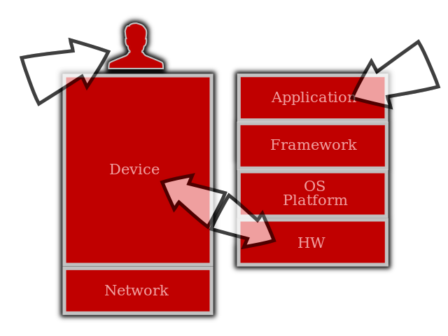
]
.fonth5[]

]]
.column_t1[.vmiddle.pushfront.defaultalign[

# .fonth5[Mobile is Huge!]

.fonth4.bluelight[
]
.fonth5[
Considering the Numbers ...
]

]]

---
class: bkgpos_00 nopadding
background-image: url(images/nokia_timeline2.jpg)

.shadelightdark.bottom_abs[.boxtitle1.noborder.center[
# Devices
]]
---
class: bkgpos_00 nopadding
background-image: url(images/phones.jpg)

.shadelightdark.bottom_abs[.boxtitle1.noborder.center[
# Devices
]]
---
class: bkgpos_00 nopadding
background-image: url(images/post-s3.png)

.shadelightdark.bottom_abs[.boxtitle1.noborder.center[
# Devices
]]
---
class: bkgpos_00 nopadding
background-image: url(images/apps.jpg)

.shadelightdark.bottom_abs[.boxtitle1.noborder.center[
# Apps
]]
---
name: bkgtri-3
class: split-40 nopadding bkgpos_00

.column_t2.center[.vmiddle[
.fgtransparent[
# .fonth5[.fa-2x.fa-stack[<i class="fa fa-mixcloud fa-stack-2x fa-rotate-270"></i><i class="fa fa-code-fork fa-stack-2x fa-rotate-90"></i>]]
]
]]
.column_t2[.vmiddle.nopadding[
.shadelightdark[.boxtitle1[
### 
# .fsize85[Examples of Digital Ecosystem]

### 
### 
#### 
#### 
]]
]]
---
class: bkgpos_00 nopadding
background-image: url(images/gafa-01.jpg)

.shadelightdark.top_abs[.boxtitle1.noborder.center[
# Introducing .yellow[**GAFA**]
]]
---
class: bkgpos_00 nopadding
background-image: url(images/gafa-02.jpg)
---
class: bkgpos_00 nopadding
background-image: url(images/gafa-03.jpg)
---
class: bkgpos_00 nopadding
background-image: url(images/gafa-04.jpg)
---
class: column_t1 bkgpos_00 center nopadding

  
.fonth2[.fonth5[<i class="fa fa-apple fa-5x"></i>]]

.shadelightdark.bottom_abs[.boxtitle1.noborder.center[
#.fonth5[Case **Apple**]
]]
---
class: split-30 nopadding 

.column_t1[.vmiddle.pushfront.right[

#.fonth5[Apple]
####.fonth4.bluelight[.yellow[**Official**] Products [<i class="fa fa-chevron-right"></i>](http://www.apple.com/pr/products/)]

]]
.column_t2[.vmiddle.pushfront.defaultalign[

.fonth4[
1. Apple Watch, iPad, iPhone & iOS
2. Mac
3. **Software**
4. **Apple Music**, Apple TV, iPod & **iTunes**
5. **iCloud** & **Apple Pay**
6. Retail Stores
]

]]

---
class: column_t2 bkgpos_00 center nopadding

.figplaint-maxh450[
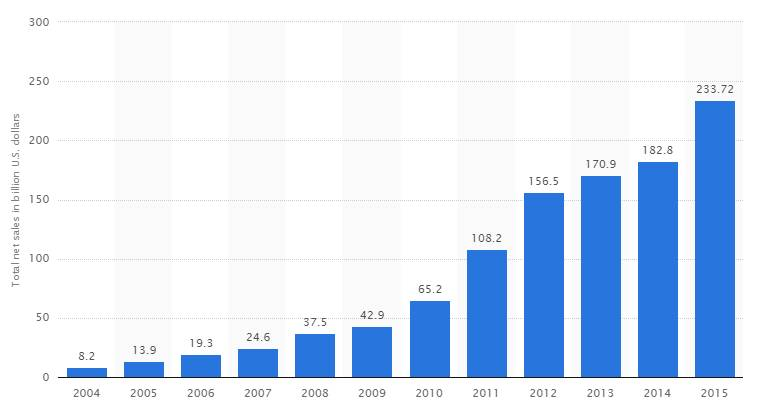
]

.shadelightdark.bottom_abs[.boxtitle1.noborder.center[
#.fonth5[**Apple** Revenue]
####.fonth5[2004-2015 (Statista)]
]]
---
class: column_t2 bkgpos_00 center nopadding

.figplaint-maxh450[
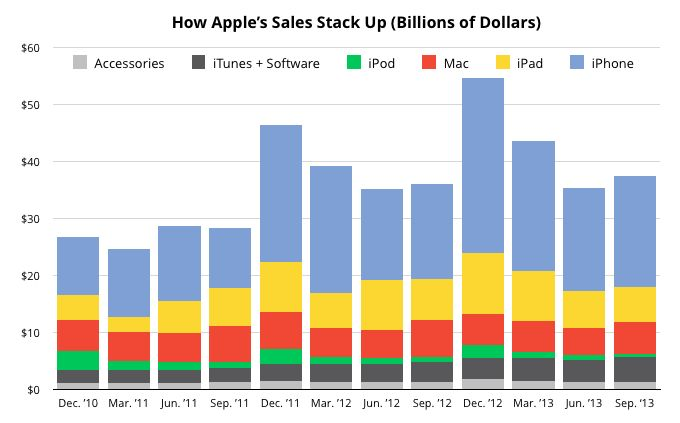
]

.shadelightdark.bottom_abs[.boxtitle1.noborder.center[
#.fonth5[**Apple** Revenue]
####.fonth5[2011-2013 (Dan Frommer, Splatf)]
]]
---
class: column_t1 middle center

#.fonth5[SW/Services vs. iPhone]
#### &nbsp;

.fonth5[
.tabtype1.fullwidth[
| &nbsp;  | 2011 | 2012 | 2013 | 2014 | 2015 |
|:-------:|:----:|:----:|:----:|:----:|:----:|
| Services|  7.9 | 9.0  | 9.4  | 9.9  | .yellow[**8.6**]  |
| iPhone  |  42  |  47  | 56   | .yellow[**54**]   | 63   |
]]
---
class: split-50 nopadding 

.column_t2[.vmiddle.pushfront.right[

.fonth4[
.or1[**2012**]: USD **8.5** B, larger than .blue[The New York Times] + .blue[Warner-Bross] + .blue[Time Inc] + .blue[Simon &amp; Schuster]]<i class="fa fa-chevron-right"></i>
.fonth5[
.or1[**2012**]: Apple CFO, Peter Oppenheimer - .red[We run the AppStore just a .uline[little] over breakeven]  
]

]]
.column_t1[.vmiddle.pushfront.defaultalign[

.fonth5[
.or1[**2016**]: ... the public had spent USD **1.1** B at the App Store in a .blue[two-week] period covering Christmas and New Year's (Ref: [Appleinsider](http://appleinsider.com/articles/16/01/07/app-store-reached-estimated-64-billion-of-apple-revenue-during-2015))]<i class="fa fa-chevron-left"></i>
.fonth4[
.or1[**2016**]: Jan. 1 was reportedly the biggest single day in the App Store's history, with over USD **144** M in traffic 
]

]]

.shadelightdark.top_abs[.boxtitle1.noborder.center[
# **SW** + Services]
]]
.shadelightdark.bottom_abs[.boxtitle1.noborder.center[
# .bluelight[(inc. Media/Content)]
]]
---
class: split-40 nopadding 

.column_t1[.vmiddle.pushfront.right[

#.fonth5[Apple]
####.fonth4.bluelight[Ecosystem Strategy]
GP Morgan via Appleinsider [<i class="fa fa-chevron-right"></i>](http://appleinsider.com/articles/16/01/07/app-store-reached-estimated-64-billion-of-apple-revenue-during-2015)

]]
.column_t2[.vmiddle.pushfront.defaultalign[

.fonth4[
While the App Store is a relatively **minor** source of income for Apple, strong app sales are essential to the company's health. It depends on apps as a reason for people to buy iOS devices.
] 
.fonth5[
People who buy iOS apps are also more likely to be ".red[locked]" into the Apple ecosystem, since they would suddenly lose that content after switching to Android or Windows.
]

]]

---
class: column_t1 bkgpos_00 center nopadding

  
.fonth2[.fonth5[<i class="fa fa-apple fa-5x"></i>]]

.shadelightdark.bottom_abs[.boxtitle1.noborder.center[
####.fonth5[**Apple** Ecosystem Design]
#.fonth5.yellow[**HW**/**Device** Business]
]]
---
class: bkgpos_00 nopadding
background-image: url(images/apple-products-2.jpg)
---
class: bkgpos_00 nopadding
background-image: url(images/apple-products-1a.jpg)
---
class: bkgpos_00 nopadding
background-image: url(images/apple-products-1b.jpg)
---
class: bkgpos_00 nopadding
background-image: url(images/apple-products-1c.jpg)
---
class: split-60 nopadding 

.column_t2[.vmiddle.pushfront.center[

.figplaint[
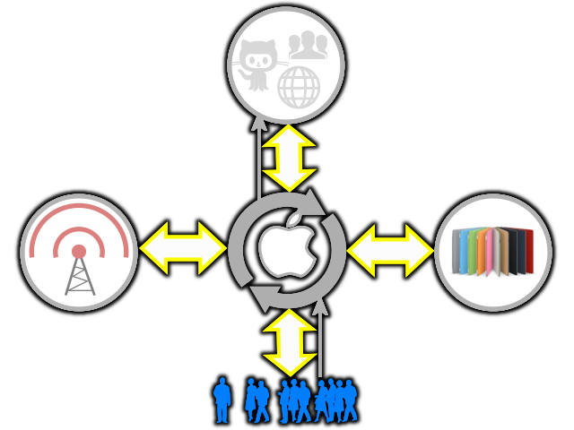
]
# .fonth5[Apple **Ecosystem**]

]]
.column_t1[.vmiddle.pushfront.defaultalign[

##.fonth5[User, .bluelight[Operator], Partner, .bluelight[Accessory Manufacturer] (AM)]
####.bluelight[cf. VisionMobile]

]]

---
class: split-60 nopadding 

.column_t2[.vmiddle.pushfront.center[

.figplaint[
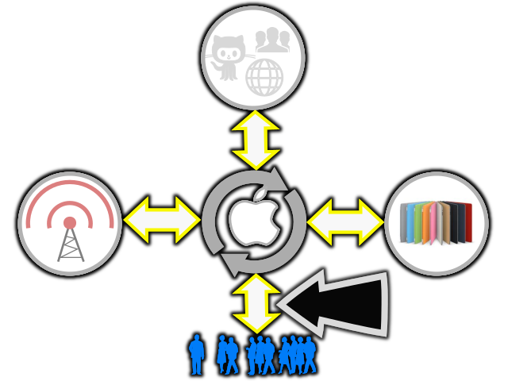
]
# .fonth5[Apple **Ecosystem**]

]]
.column_t1[.vmiddle.pushfront.defaultalign[

# .fonth5[User]
####.fonth4.bluelight[Value Capture - Main Business]
.fonth5[
- .yellow[**Apple to User**] : Premium Product Experience
- .yellow[**User to Apple**] : Premium Money
]

]]

---
class: split-60 nopadding 

.column_t2[.vmiddle.pushfront.center[

.figplaint[
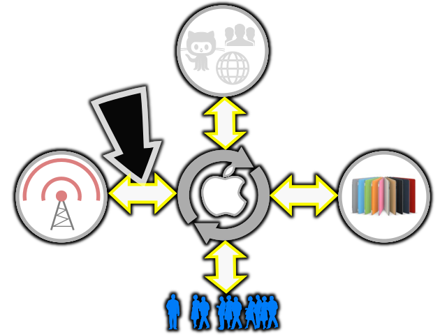
]
# .fonth5[Apple **Ecosystem**]

]]
.column_t1[.vmiddle.pushfront.defaultalign[

# .fonth5[Operator]
####.fonth4.bluelight[Relationship]
.fonth5[
- .yellow[**Apple to Operator**] : Users + Data Plans
- .yellow[**Operator to Apple**] : Subsidies
]
Telcos reduce friction for the iPhone business (VisionMobile)

]]

---
class: split-60 nopadding 

.column_t2[.vmiddle.pushfront.center[

.figplaint[
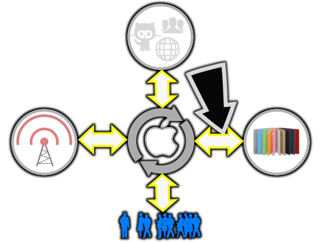
]
# .fonth5[Apple **Ecosystem**]

]]
.column_t1[.vmiddle.pushfront.defaultalign[

# .fonth5[Accessory Manufacturer]
####.fonth4.bluelight[Relationship]
.fonth5[
- .yellow[**Apple to AM**] : Access to Market
- .yellow[**AM to Apple**] : Complements, Revenue Share
]

]]

---
class: split-60 nopadding 

.column_t2[.vmiddle.pushfront.center[

.figplaint[
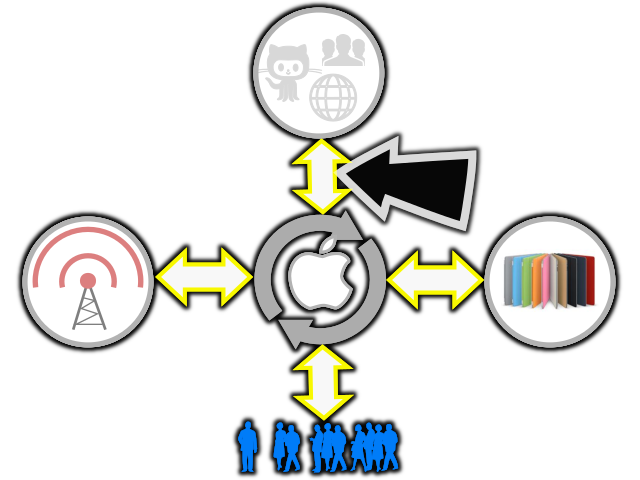
]
# .fonth5[Apple **Ecosystem**]

]]
.column_t1[.vmiddle.pushfront.defaultalign[

# .fonth5[Partner]
####.fonth4.bluelight[Relationship]
.fonth5[
- .yellow[**Apple to Partner**] : Contributes AppStore to Offer Dollars and User Engagement
- .yellow[**Partner to Apple**] : Content, Apps, Services
]
Developers, SW Publishers, Content Retailers, Content Owners, Internet Players, Brands

]]

---
class: split-40 nopadding 

.column_t1[.vmiddle.pushfront.right[

#.fonth5[**Ecosystem** Business Models]
####.fonth4.bluelight[The Formula]

]]
.column_t2[.vmiddle.pushfront.defaultalign[

.fonth4[
1. .red[**Redefine**] Market (Explore/Extend)
1. Identify .red[**Complements**]
1. .red[**Boost**] Demand for Complements (but Ensure Supply)
1. .red[**Bundle**] Product (to Satisfy Demands)
]

]]

---
class: column_t1 middle center

# Apple Ecosystem Recipe
#### &nbsp;

.fonth5[
.tabtype1.fullwidth[
| Recipe  | <i class="fa fa-apple fa-2x"></i> | 
|:-------:|:----:|
| .bluelight[Market Redefinition]|  Communicate, Play, Work &amp; Relax on the Go (Computing on the Go) |
| .bluelight[Complements]  |  Apps &amp; Content  |
| .bluelight[Boost Demand]  |  Ease User Effort to Discover &amp; Obtain Apps  |
| .bluelight[Bundle with Demand] |  Apple Devices |
]]

---
name: bkgtri-8
class: split-40 nopadding bkgpos_00

.column_t2.center[.vmiddle[
.fgtransparent[
# .fonth5[.fa-2x.fa-stack[<i class="fa fa-mixcloud fa-stack-2x fa-rotate-270"></i><i class="fa fa-code-fork fa-stack-2x fa-rotate-90"></i>]]
]
]]
.column_t2[.vmiddle.nopadding[
.shadelightdark[.boxtitle1[
### 
# .fsize95[Refs]

### 
### 
#### 
#### 
]]
]]
---
# References

.fonth5[
1. FABERNOVEL, GAFAnomics, October 2014
1. [VisionMobile - Business Models of Mobile Ecosystems](http://www.slideshare.net/andreasc/vision-mobile-digital-winners)
1. [Appleinsider - App Store reached estimated $6.4 billion ...](http://appleinsider.com/articles/16/01/07/app-store-reached-estimated-64-billion-of-apple-revenue-during-2015)
1. [Apple iPhone Revenue by Quarter 2007-2016 | Statistic](http://www.statista.com/statistics/263402/apples-iphone-revenue-since-3rd-quarter-2007/)
1. [ITU - ICT Facts and Figures 2015](http://www.itu.int/en/ITU-D/Statistics/Documents/facts/ICTFactsFigures2015.pdf)
]
---
name: bkgtri-9
class: split-40 nopadding bkgpos_00

.column_t2.center[.vmiddle[
.fgtransparent[
# .fonth5[.fa-2x.fa-stack[<i class="fa fa-mixcloud fa-stack-2x fa-rotate-270"></i><i class="fa fa-code-fork fa-stack-2x fa-rotate-90"></i>]]
]
]]
.column_t2.shadelightdark.add-left-border.pushfront[.vmiddle.nopadding[
.boxtitle4[
### 
# .fsize175.yellow[END]

### [Dr.-Ing. Eueung Mulyana](https://github.com/eueung)
### https://eueung.github.io/ET3010
#### ET-3010 | [Attribution-ShareAlike CC BY-SA](https://creativecommons.org/licenses/by-sa/4.0/)
#### 
]
]]

