name: bkgtri-1
class: split-40 nopadding bkgpos_00

.column_t2.center[.vmiddle[
.fgtransparent[
# .fonth5[.fa-2x.fa-stack[<i class="fa fa-mixcloud fa-stack-2x fa-rotate-270"></i><i class="fa fa-code-fork fa-stack-2x fa-rotate-90"></i>]]
]
]]
.column_t2.shadelightdark.add-left-border.pushfront[.vmiddle.nopadding[
.boxtitle4[
### Connected Services
# .fsize150[.yellow[**Trends** &amp; Enablers]]

### [Dr.-Ing. Eueung Mulyana](https://github.com/eueung)
### https://eueung.github.io/ET3010
#### ET-3010 | [Attribution-ShareAlike CC BY-SA](https://creativecommons.org/licenses/by-sa/4.0/)
#### 
]
]]
---
class: column_t1 middle

.fonth4[
.tabtype1.fullwidth[
| Outline   |
|:-------------:|
|Ecosystem Trends|
|Devices &amp; Involving Tech|
|Moving Forward|

]]

---
name: bkgtri-2
class: split-40 nopadding bkgpos_00

.column_t2.center[.vmiddle[
.fgtransparent[
# .fonth5[.fa-2x.fa-stack[<i class="fa fa-mixcloud fa-stack-2x fa-rotate-270"></i><i class="fa fa-code-fork fa-stack-2x fa-rotate-90"></i>]]
]
]]
.column_t2[.vmiddle.nopadding[
.shadelightdark[.boxtitle1[
### Past &amp; Present
# .fsize85[Ecosystem Trends]

### 
### 
#### 
#### 
]]
]]
---
class: split-60 nopadding 

.column_t2[.vmiddle.pushfront.center[

.figplaint[
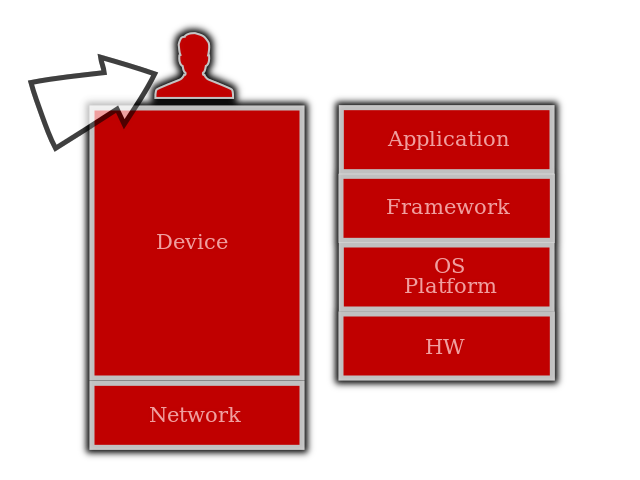
]
.fonth4[]

]]
.column_t1[.vmiddle.pushfront.defaultalign[

# .fonth5[Users]

.fonth4.bluelight[
]

]]

---
class: split-40 nopadding 

.column_t1[.vmiddle.pushfront.right[

#.fonth5[Users]
####.fonth4.bluelight[Perspectives & Facts]

]]
.column_t2[.vmiddle.pushfront.defaultalign[

.fonth4[
1. Reachability
2. Usage & Roles
3. New (Smartphone) Culture
]
.figplaint[
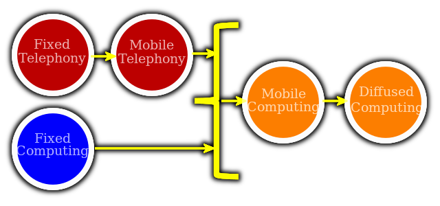
]

]]

---
class: bkgpos_00 nopadding
background-image: url(images/ericsson-01.jpg)

.shadelightdark.bottom_abs[.boxtitle1.noborder.center[
# Subscription .yellow[**Numbers**] (Ericsson)
]]
---
class: bkgpos_00 nopadding
background-image: url(images/ericsson-02.jpg)
---
class: split-50 nopadding 

.column_t1[.vmiddle.pushfront.right[

# Golding's Story
### .bluelight[Mobile 1.0, 2.0, 2.0+]
####&nbsp;
.fonth5[
Not so long ago we didn't **need** mobiles ...
]
.fonth4[
.bluelight[But now, look around you, **mobiles are everywhere**!]
]
.fonth5[
Indoors and outdoors, they consume attention ... 
.bluelight[And we need them **like a fish needs water**!]
]

]]
.column_t2[.vmiddle.pushfront.defaultalign[

# .blue[Mobile 1.0]
## .blue[Early Mobile 2.0]

.fonth4[
A Global Communication Phenomenon 
]
.fonth5[
**6** Billions Global Text Messages (2010) 
**200,000** Messages/Sec  
]
Average teen sends/receives **3,339** messages every month. 
This is equivalent to **14** hours of attention (15 s/msg).  

The rise of social network -> Gen Y 2010: **9** hours/month 

]]

---
class: column_t2 bkgpos_00 center nopadding

.figplaint-maxh550[
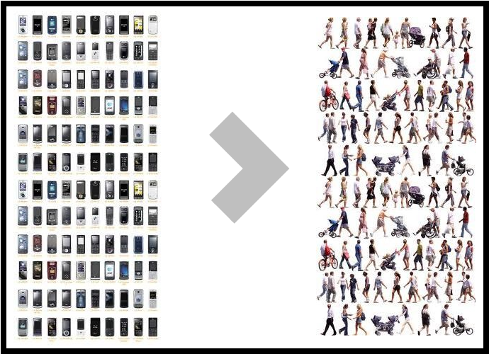
]

.shadelightdark.bottom_abs[.boxtitle1.noborder.center[
#.fonth5[In 59 Countries (2011)]
####.fonth5[A device most of us have most of the time ...]
]]
---
class: bkgpos_00 nopadding
background-image: url(images/pgolding-01.jpg)
---
class: bkgpos_00 nopadding
background-image: url(images/google-01.jpg)
.shadelightdark.top_abs[.boxtitle1.noborder.center[
##.fonth5[A .yellow[**Central**] Part of Our Daily Lives]
]]
---
class: bkgpos_00 nopadding
background-image: url(images/google-02.jpg)
.shadelightdark.top_abs[.boxtitle1.noborder.center[
##.fonth5[.yellow[**Always On**] - Always with You]
]]
---
class: bkgpos_00 nopadding
background-image: url(images/google-03.jpg)
.shadelightdark.top_abs[.boxtitle1.noborder.center[
##.fonth5[Mobiles are Used .yellow[**Everywhere**]]
]]
---
class: bkgpos_00 nopadding
background-image: url(images/google-04.jpg)
---
class: bkgpos_00 nopadding
background-image: url(images/mplaybook-01.jpg)
.shadelightdark.bottom_abs[.boxtitle1.noborder.center[
##.fonth5[Yes.. .yellow[It changes (almost) **everything**]]
]]
---
class: bkgpos_00 nopadding
background-image: url(images/mplaybook-02.jpg)
.shadelightdark.bottom_abs[.boxtitle1.noborder.center[
##.fonth5[Mobile - .yellow[**Consumer**]]
]]
---
class: bkgpos_00 nopadding
background-image: url(images/mplaybook-03.jpg)
.shadelightdark.bottom_abs[.boxtitle1.noborder.center[
##.fonth5[Mobile - .yellow[**Bussiness**]]
]]
---
class: column_t2 bkgpos_00 center nopadding

.figplaint-75[
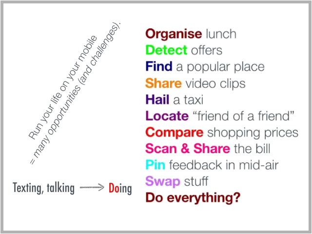
]

.shadelightdark.bottom_abs[.boxtitle1.noborder.center[
#.fonth5[Mobile 2.0]
####.fonth5[Mobiles involve in many real-life aspects ...]
]]
---
class: bkgpos_00 nopadding split-70
background-image: url(images/golding04.jpg)

.column_t2[.vmiddle[

]]
.column_bt[.vmiddle.pushfront.defaultalign[

##.fonth5[**Immersive**]
.fonth4[
Fish don't know water exists... until beached
]
Marshall McLuhan (via Golding)

]]

---
class: bkgpos_00 nopadding split-70
background-image: url(images/achtung01.jpg)

.column_t2[.vmiddle[

]]
.column_wt[.vmiddle.pushfront.defaultalign[

##.fonth5[**Mobiles Become Part of a New Culture**]
.fonth5[
With Every New Opportunity Comes New Threat ... 
]
With Every Good Thing There is A Bad Side ...

]]

---
class: bkgpos_00 nopadding split-70
background-image: url(images/achtung02.jpg)

.column_t2[.vmiddle[

]]
.column_wt[.vmiddle.pushfront.defaultalign[

##.fonth5[**Mobiles Become Part of a New Culture**]
.fonth4[
With Every Fun Thing There Might be A Serious Danger ...
]

]]

---
class: bkgpos_00 nopadding split-70
background-image: url(images/achtung03.jpg)

.column_t2[.vmiddle[

]]
.column_wt[.vmiddle.pushfront.defaultalign[

##.fonth5[**Mobiles Become Part of a New Culture**]
.fonth4[
Please... always be a Human!
]

]]

---
class: split-40 nopadding 

.column_t1[.vmiddle.pushfront.right[

#.fonth5[More..]
####.fonth4.bluelight[Go Google Yourself!]

]]
.column_t2[.vmiddle.pushfront.defaultalign[

.fonth4[
- [smartphone culture](https://www.google.com/search?q=smartphone+culture&tbm=isch)
- [smartphone habits](https://www.google.com/search?q=smartphone+habits&tbm=isch)
- [smartphone negative impacts](https://www.google.com/search?q=smartphone+negative+impacts&tbm=isch)
- [smartphone anti social](https://www.google.com/search?q=smartphone+anti+social&tbm=isch)
- [gadget addiction](https://www.google.com/search?q=gadget+addiction&tbm=isch)
- [selfie culture](https://www.google.com/search?q=selfie+culture&tbm=isch)
- [dangerous selfie](https://www.google.com/search?q=dangerous+selfie&tbm=isch)
]

]]

---
class: split-50 nopadding 

.column_t1[.vmiddle.pushfront.right[

#.fonth5[What Happens in A Minute?]
####.fonth5.bluelight[Ericsson 2012]

]]
.column_t2[.vmiddle.pushfront.center[

.fonth4[ 
[<i class="fa fa-play fa-5x"></i>](reveal/ltka-04-aminute-ericsson.html)
]

]]

---
class: split-60 nopadding 

.column_t2[.vmiddle.pushfront.center[

.figplaint[
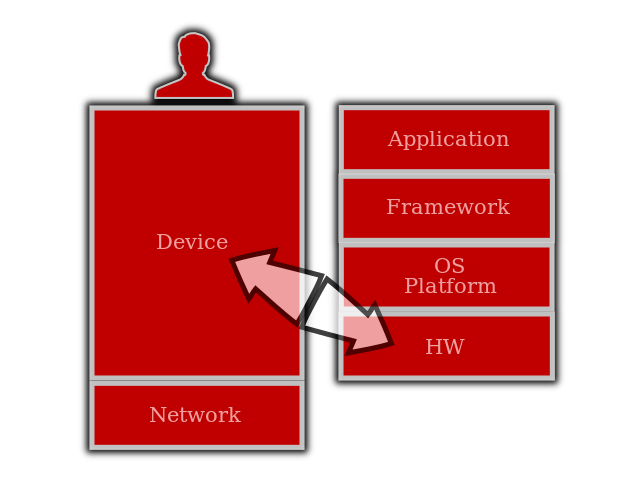
]
.fonth4[]

]]
.column_t1[.vmiddle.pushfront.defaultalign[

# .fonth5[Devices]

.fonth4.bluelight[
]

]]

---
class: split-60 nopadding 

.column_t2[.vmiddle.pushfront.center[

.figplaint[
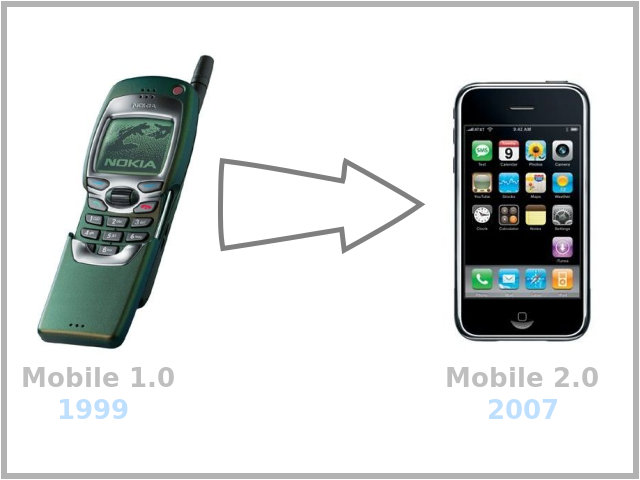
]
.fonth4[]

]]
.column_t1[.vmiddle.pushfront.defaultalign[

# .fonth5[**Smartphone** Era]

.fonth4.bluelight[
Mobile 1.0 
.yellow[Mobile 2.0]
]

]]

---
class: split-60 nopadding 

.column_t2[.vmiddle.pushfront.center[

.figplaint[
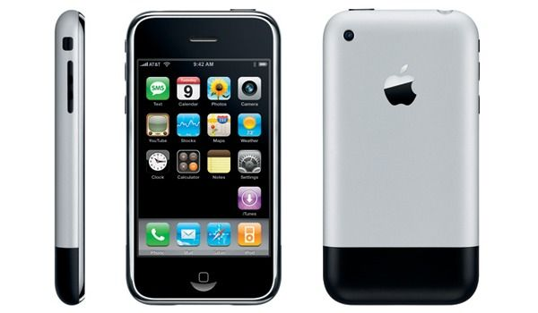
]
.fonth4[2007]

]]
.column_t1[.vmiddle.pushfront.defaultalign[

# .fonth5[iPhone 1]

.fonth4.bluelight[
.yellow[**Mobile 2.0**] Milestone 
Smartphone Era
]

]]

---
class: bkgpos_00 nopadding split-60
background-image: url(images/htc.jpg)

.column_t2[.vmiddle.center[
.figplaint[
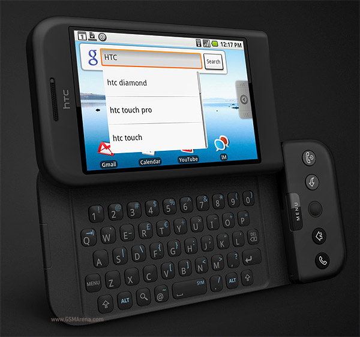
]
.fonth4.yellow[2008]

]]
.column_wt[.vmiddle.pushfront.defaultalign[

##.fonth5[**HTC Dream**]
.fonth4[
T-Mobile G1
]

]]

---
class: bkgpos_00 nopadding
background-image: url(images/apple-ios-evo.jpg)
---
class: bkgpos_00 nopadding
background-image: url(images/android-evo.jpg)
---
class: column_t2 bkgpos_00 center nopadding

.figplaint-95[
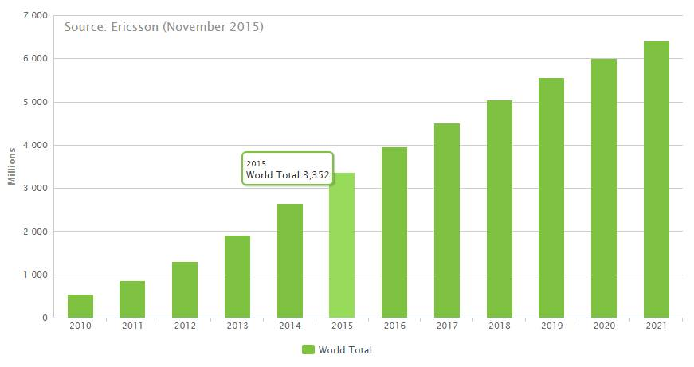
]

.shadelightdark.bottom_abs[.boxtitle1.noborder.center[
#.fonth5[Smartphone Subscriptions]
####.fonth5[Retrieved 2/2016 - Ericsson Traffic Exploration]
]]
---
class: bkgpos_00 nopadding
background-image: url(images/smartphone-smsglobal-15.jpg)
---
class: column_t2 bkgpos_00 center nopadding

.figplaint-95[
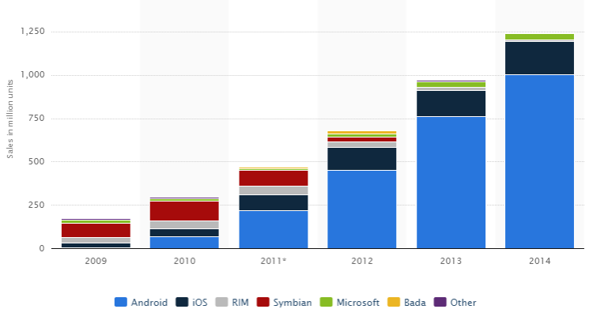
]

.shadelightdark.bottom_abs[.boxtitle1.noborder.center[
#.fonth5[Smartphone Sales]
####.fonth5[As of 2014 - Statista]
]]
---
class: column_t2 bkgpos_00 center nopadding

.figplaint-95[
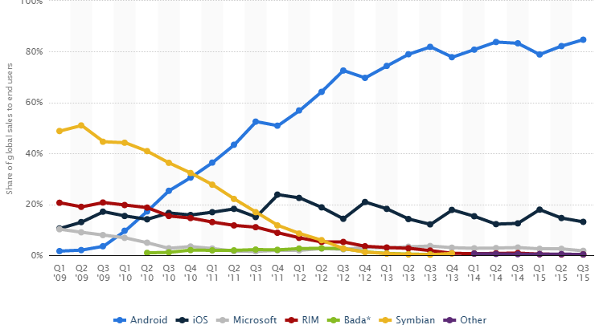
]

.shadelightdark.bottom_abs[.boxtitle1.noborder.center[
#.fonth5[Market Share of Sales]
####.fonth5[As of Q3/2015 - Based on OS/Platform - Statista]
]]
---
class: bkgpos_00 nopadding
background-image: url(images/android-devices.jpg)
---
class: split-60 nopadding 

.column_t2[.vmiddle.pushfront.center[

.figplaint[
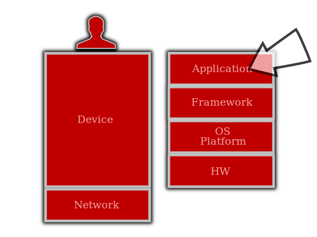
]
.fonth4[]

]]
.column_t1[.vmiddle.pushfront.defaultalign[

# .fonth5[Applications]

.fonth4.bluelight[
]

]]

---
class: column_t2 bkgpos_00 center nopadding

.figplaint-95[
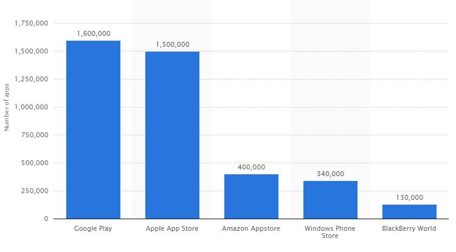
]

.shadelightdark.bottom_abs[.boxtitle1.noborder.center[
#.fonth5[Number of Apps]
####.fonth5[As of July 2015 - Statista]
]]
---
class: column_t2 bkgpos_00 center nopadding

.figplaint-95[
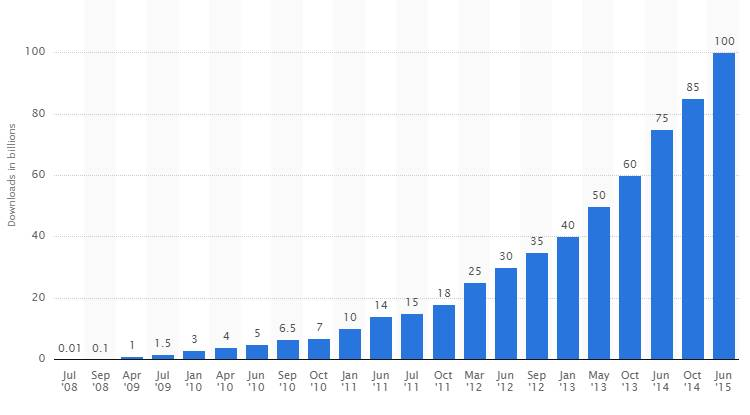
]

.shadelightdark.bottom_abs[.boxtitle1.noborder.center[
#.fonth5[Cummulative Downloads - App Store]
####.fonth5[As of June 2015 - Statista]
]]
---
class: column_t2 bkgpos_00 center nopadding

.figplaint-95[
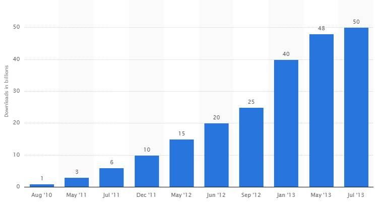
]

.shadelightdark.bottom_abs[.boxtitle1.noborder.center[
##.fonth5[Cummulative Downloads - Google Play]
####.fonth5[As of July 2013 - Statista]
]]
---
class: split-50 nopadding 

.column_t1[.vmiddle.pushfront.right[

##.fonth5[Apps in Numbers]
####.fonth5.bluelight[What do You Want to Do? **There's an App for That**!]

]]
.column_t2[.vmiddle.pushfront.center[

.fonth4[ 
[<i class="fa fa-play fa-5x"></i>](reveal/ltka-04-an-app-apple.html)
]

]]

---
name: bkgtri-3
class: split-40 nopadding bkgpos_00

.column_t2.center[.vmiddle[
.fgtransparent[
# .fonth5[.fa-2x.fa-stack[<i class="fa fa-mixcloud fa-stack-2x fa-rotate-270"></i><i class="fa fa-code-fork fa-stack-2x fa-rotate-90"></i>]]
]
]]
.column_t2[.vmiddle.nopadding[
.shadelightdark[.boxtitle1[
### 
# .fsize85[Devices &amp; Involving Tech]

### 
### 
#### [Golding]
#### 
]]
]]
---
class: split-60 nopadding 

.column_t2[.vmiddle.pushfront.center[

.figplaint[

]
.fonth4[]

]]
.column_t1[.vmiddle.pushfront.defaultalign[

# .fonth5[Devices]

.fonth4.bluelight[
]

]]

---
class: split-60 nopadding 

.column_t2[.vmiddle.pushfront.center[

.figplaint[

]
.fonth4[]

]]
.column_t1[.vmiddle.pushfront.defaultalign[

# .fonth5[**Smartphone** Era]

.fonth5.bluelight[
Mobile 1.0
]
- **Mobile Telephony**
- Network: 2G
- First Internet-Capable Mobile
- Relatively, Poor User Experience

.fonth5.yellow[
Mobile 2.0
]
- **Mobile Computing**
- Network: 3G, 3G+
- First Internet-Centric Mobile
- Usable, Can Do Things
- 100x Processing Power

]]

---
class: split-40 nopadding 

.column_t1[.vmiddle.pushfront.right[

##.fonth5[The Transformation]
####.fonth5.bluelight[From Mobile 1.0 to Mobile 2.0]

]]
.column_t2[.vmiddle.pushfront.defaultalign[

.fonth5[
- More data-friendly **tariffs**
- Increased **device** usability = smartphones/pads
- Faster/fatter **networks** (3G+)
- Greater **Web 2.0**-centricity
- **Social networks** are mobilizing (FB 40%)
- **App stores** -> new consumption habits
- Greater user **participation**
- **Money** - apps goldrush
]

]]

---
class: split-60 nopadding 

.column_t2[.vmiddle.pushfront.center[

.figplaint[
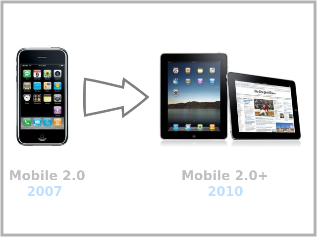
]
.fonth4[]

]]
.column_t1[.vmiddle.pushfront.defaultalign[

# .fonth5[**Smartphone** Era]

.fonth5.or1[
Mobile 2.0+
]
- First Internet-.uline[Friendly] Mobile
- Productive
- Can Do More, Faster

.fonth5.or1[
Mobile 3.0, 3.0+
]
- IoT
- 4G, 4G+, 5G
- .. when most of our digital services will have become mobilized

]]

---
class: split-50 nopadding 

.column_t1[.vmiddle.pushfront.right[

##.fonth5[Telco Transformation]
####.fonth5.bluelight[The Telecoms Transformation is Now - SAP]

]]
.column_t2[.vmiddle.pushfront.center[

.fonth4[ 
[<i class="fa fa-play fa-5x"></i>](reveal/ltka-04-telcotransf-sap.html)
]

]]

---
class: column_t2 bkgpos_00 center nopadding
 
.figplaint-75[
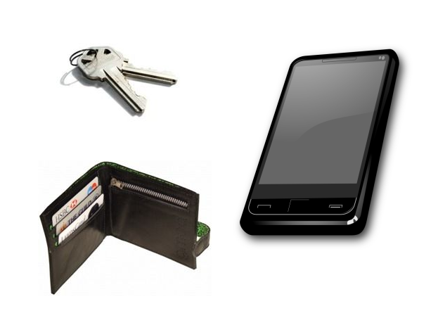
]
.shadewhite.top_abs[.boxtitle1.noborder.center[
##.fonth5[Mobile **1.0** + Early Mobile **2.0**]
]]
.shadelightdark.bottom_abs[.boxtitle1.noborder.center[
####.fonth5[In Our Pockets ...]
]]
---
class: column_t2 bkgpos_00 center nopadding
background-image: url(images/golding12.jpg)
.shadetrans.top_abs[.boxtitle1.noborder.center[
##.fonth5[Hidden **Engine** of the Revolution]
]]
.shadelightdark.bottom_abs[.boxtitle1.noborder.center[
####.fonth5[Millions of Transistors...]
]]
---
class: column_t2 bkgpos_00 center nopadding
background-image: url(images/golding11.jpg)
.shadetrans.top_abs[.boxtitle1.noborder.center[
##.fonth5.bluelight[Two Computers]
]]
.shadelightdark.bottom_abs[.boxtitle1.noborder.center[
####.fonth5[Computers Everywhere]
]]
---
class: column_t2 bkgpos_00 center nopadding
 
.figplaint-70[
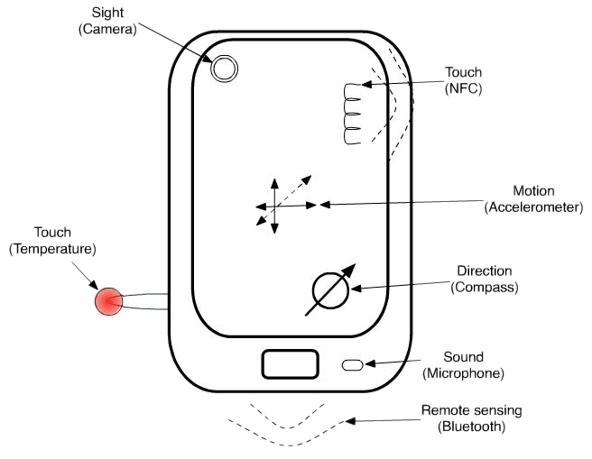
]
.shadewhite.top_abs[.boxtitle1.noborder.center[
##.fonth5[Not Just Computers]
]]
.shadelightdark.bottom_abs[.boxtitle1.noborder.center[
####.fonth5[But Those with Senses ...]
]]
---
class: column_t2 bkgpos_00 center nopadding
 
.figplaint-70[
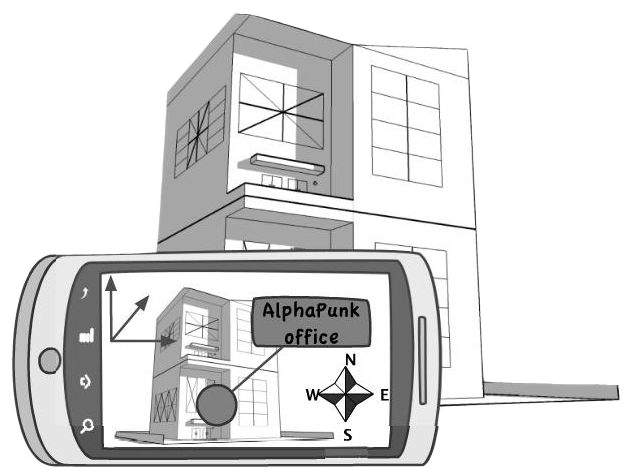
]
.shadewhite.top_abs[.boxtitle1.noborder.center[
##.fonth5[Not Just Computers]
]]
.shadelightdark.bottom_abs[.boxtitle1.noborder.center[
####.fonth5[But Those with Senses ...]
####.fonth5[.yellow[To Augment the Reality ...]]
]]
---
class: column_t2 bkgpos_00 center nopadding
 
.figplaint-70[
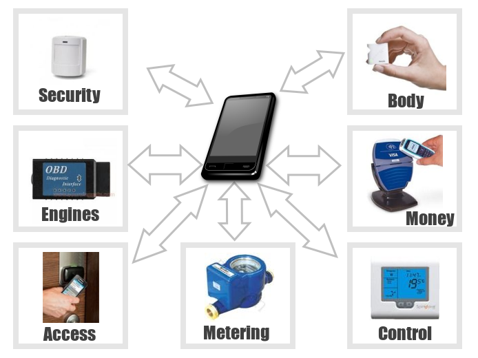
]
.shadewhite.top_abs[.boxtitle1.noborder.center[
##.fonth5[Not Just Computers]
]]
.shadelightdark.bottom_abs[.boxtitle1.noborder.center[
####.fonth5[But Those with Senses ...]
####.fonth5[.yellow[To Interact with the Real World ...]]
]]
---
class: column_t2 bkgpos_00 center nopadding
 
.figplaint-70[
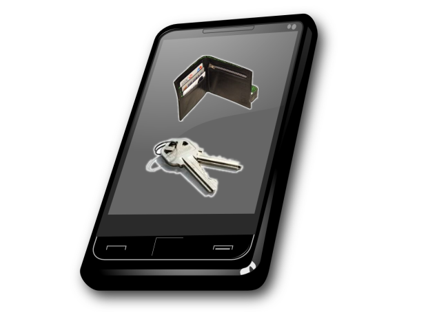
]
.shadewhite.top_abs[.boxtitle1.noborder.center[
##.fonth5[**Mobile 2.0+**]
]]
.shadelightdark.bottom_abs[.boxtitle1.noborder.center[
####.fonth5[In Our Pockets ...]
####.fonth5[.yellow[Everything Included ...]]
]]

---
name: bkgtri-4
class: split-40 nopadding bkgpos_00

.column_t2.center[.vmiddle[
.fgtransparent[
# .fonth5[.fa-2x.fa-stack[<i class="fa fa-mixcloud fa-stack-2x fa-rotate-270"></i><i class="fa fa-code-fork fa-stack-2x fa-rotate-90"></i>]]
]
]]
.column_t2[.vmiddle.nopadding[
.shadelightdark[.boxtitle1[
### 
# .fsize85[Moving Forward]

### 
### 
#### [Golding]
#### 
]]
]]
---
class: column_t2 bkgpos_00 center nopadding
  
.figplaint-75[
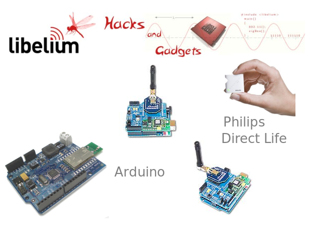
]
.shadewhite.top_abs[.boxtitle1.noborder.center[
##.fonth5[**Internet of Things** - IoT]
]]
.shadelightdark.bottom_abs[.boxtitle1.noborder.center[
####.fonth5[The Rise of Open HW Platform ...]
]]
---
class: column_t2 bkgpos_00 center nopadding
.figplaint-maxh550[
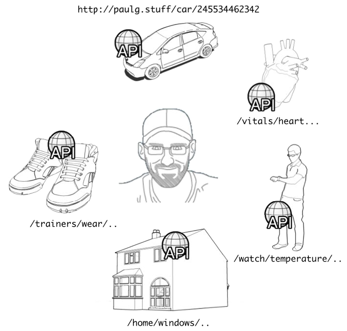
]
.shadewhite.top_abs[.boxtitle1.noborder.center[
##.fonth5[**Internet of Things** - IoT]
]]
.shadelightdark.bottom_abs[.boxtitle1.noborder.center[
####.fonth5[URIs Everywhere ...]
]]
---
class: column_t2 bkgpos_00 center nopadding
.figplaint-maxh550[
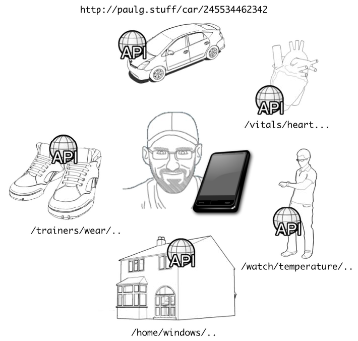
]
.shadelightdark.bottom_abs[.boxtitle1.noborder.center[
####.fonth5[Computer at the Center Hub and Gateway Global Connectivity]
]]
---
class: column_t2 bkgpos_00 center nopadding
  
.figplaint-75[
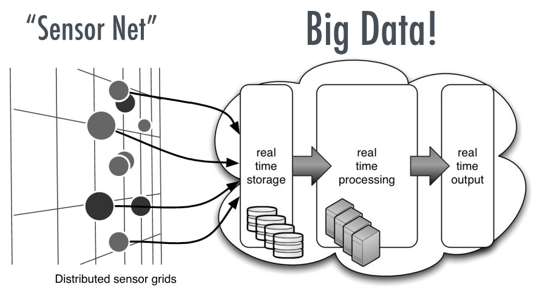
]
.shadewhite.top_abs[.boxtitle1.noborder.center[
##.fonth5[**Big-Data**]
]]
.shadelightdark.bottom_abs[.boxtitle1.noborder.center[
####.fonth5[Streaming Sensor Data to the Cloud]
#### Creating Values from Big-Data
]]
---
class: column_t2 bkgpos_00 center nopadding
 
.figplaint-75[
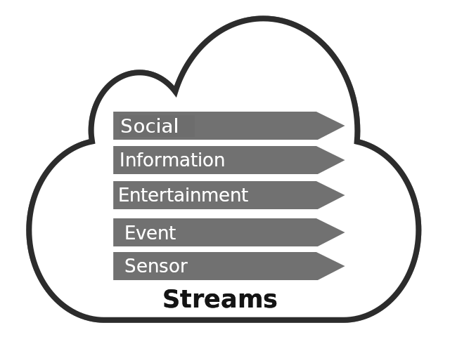
]
.shadewhite.top_abs[.boxtitle1.noborder.center[
##.fonth5[**Right-Time Stream**]
]]
.shadelightdark.bottom_abs[.boxtitle1.noborder.center[
####.fonth5[Right **Info** - Right **Person** - Right **Time** - Right **Place**]
]]
---
class: column_t2 bkgpos_00 center nopadding
background-image: url(images/golding17.jpg)
.shadelightdark.bottom_abs[.boxtitle1.noborder.center[
####.fonth5[.yellow[**Cloud Connectivity**] - Connected to Streams in the Cloud]
]]
---
class: column_t1 bkgpos_00 center nopadding
 
.figplaint-75[
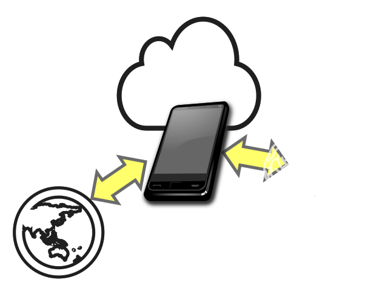
]
.shadetrans.top_abs[.boxtitle1.noborder.center[
##.fonth5.bluelight[**Augmented Cognition**]
]]
.shadelightdark.bottom_abs[.boxtitle1.noborder.center[
####.fonth5[Augmented Human - Smartphone, Smart Devices - Smarter People]
]]
---
class: column_t2 bkgpos_00 center nopadding
.figplaint-75[
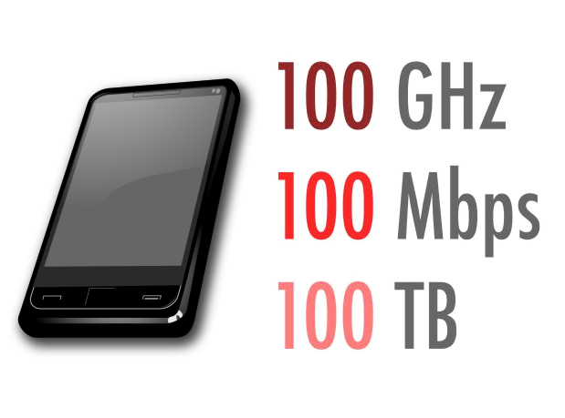
]
.shadewhite.top_abs[.boxtitle1.noborder.center[
##.fonth5[**Where are We Headed?**]
]]
.shadelightdark.bottom_abs[.boxtitle1.noborder.center[
####.fonth5[The Not-So-Distant Future]
####Just Imagine the Possibilities ..
####.fonth5[.yellow[100 GHz] - .yellow[100 GB] - .yellow[100 Mbps] - .yellow[100 Sensors]]
]]
---
class: split-40 nopadding 

.column_t1[.vmiddle.pushfront.right[

##.fonth5[Keywords]
####.fonth5.bluelight[[Golding]]
.fonth4.yellow[
**Right-Time** 
**Augmented Cognition** 
**Digital Immersion**
]

]]
.column_t2[.vmiddle.pushfront.defaultalign[

.fonth4[
.red[Person] + .red[Right-Time Computer] != Personalized Computing   
.red[Person] + .red[Right-Time Computer] = .blue[New Person]
]

]]

---
name: bkgtri-8
class: split-40 nopadding bkgpos_00

.column_t2.center[.vmiddle[
.fgtransparent[
# .fonth5[.fa-2x.fa-stack[<i class="fa fa-mixcloud fa-stack-2x fa-rotate-270"></i><i class="fa fa-code-fork fa-stack-2x fa-rotate-90"></i>]]
]
]]
.column_t2[.vmiddle.nopadding[
.shadelightdark[.boxtitle1[
### 
# .fsize95[Refs]

### 
### 
#### 
#### 
]]
]]
---
# References

.fonth5[
1. [From Apples to Augmented Cognition](http://www.slideshare.net/pgolding/from-apples-to-augmented-cognition-current-and-future-trends-in-mobile)
1. [VisionMobile - Business Models of Mobile Ecosystems](http://www.slideshare.net/andreasc/vision-mobile-digital-winners)
1. Paul Golding, .blue[Connected Services: A Guide to the Internet Technologies Shaping the Future of Mobile Services and Operators], John Wiley & Sons Ltd., 2011, ISBN 978-0-470-97455-1
1. [Apple iPhone Revenue by Quarter 2007-2016 | Statistic](http://www.statista.com/statistics/263402/apples-iphone-revenue-since-3rd-quarter-2007/)
1. [ITU - ICT Facts and Figures 2015](http://www.itu.int/en/ITU-D/Statistics/Documents/facts/ICTFactsFigures2015.pdf)
1. [Ericsson Mobility Report](http://www.ericsson.com/mobility-report)
1. [The Mobile Playbook](http://www.themobileplaybook.com/en-us/)
]
---
name: bkgtri-9
class: split-40 nopadding bkgpos_00

.column_t2.center[.vmiddle[
.fgtransparent[
# .fonth5[.fa-2x.fa-stack[<i class="fa fa-mixcloud fa-stack-2x fa-rotate-270"></i><i class="fa fa-code-fork fa-stack-2x fa-rotate-90"></i>]]
]
]]
.column_t2.shadelightdark.add-left-border.pushfront[.vmiddle.nopadding[
.boxtitle4[
### 
# .fsize175.yellow[END]

### [Dr.-Ing. Eueung Mulyana](https://github.com/eueung)
### https://eueung.github.io/ET3010
#### ET-3010 | [Attribution-ShareAlike CC BY-SA](https://creativecommons.org/licenses/by-sa/4.0/)
#### 
]
]]

