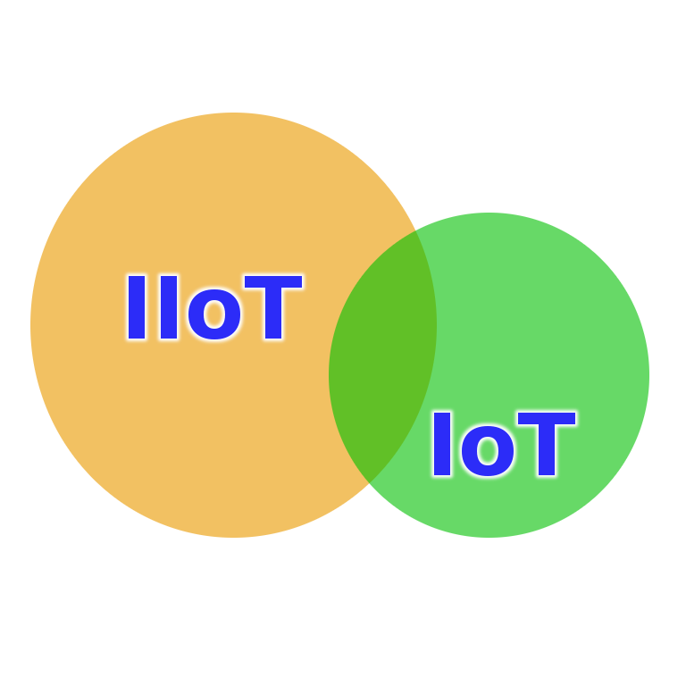

name: bkgtri-1
class: split-40 nopadding bkgpos_00

.column_t2.center[.vmiddle[
.fgtransparent[
# .fonth5[.fa-2x.fa-stack[<i class="fa fa-mixcloud fa-stack-2x fa-rotate-270"></i><i class="fa fa-code-fork fa-stack-2x fa-rotate-90"></i>]]
]
]]
.column_t2.shadelightdark.add-left-border.pushfront[.vmiddle.nopadding[
.boxtitle4[
### System, Architecture &amp; Examples
# .fsize125[.or1[Connected Things], .or1[IoT] &amp; .or1[5G]]

### [Dr.-Ing. Eueung Mulyana](https://github.com/eueung)
### https://eueung.github.io/ET3010
#### ET-3010 | [Attribution-ShareAlike CC BY-SA](https://creativecommons.org/licenses/by-sa/4.0/)
#### 
]
]]
---
class: column_t1 middle

.fonth4[
.tabtype1.fullwidth[
| Outline   |
|:-------------:|
|Connected Things &amp; IoT - Overview|
|Model &amp; Architecture|
|5G Infrastructure|
|Applications &amp; Use-Cases|

]]

---
name: bkgtri-2
class: split-40 nopadding bkgpos_00

.column_t2.center[.vmiddle[
.fgtransparent[
# .fonth5[.fa-2x.fa-stack[<i class="fa fa-mixcloud fa-stack-2x fa-rotate-270"></i><i class="fa fa-code-fork fa-stack-2x fa-rotate-90"></i>]]
]
]]
.column_t2[.vmiddle.nopadding[
.shadelightdark[.boxtitle1[
### Overview
# .fsize85[Connected Things &amp; IoT]

### 
### 
#### 
#### 
]]
]]
---
class: split-40 nopadding 

.column_t1[.vmiddle.pushfront.right[

#Connected Things
#.fsize150[IoT]
####.fonth4.bluelight[]

]]
.column_t2[.vmiddle.pushfront.defaultalign[

.fonth4[
1. Trends &amp; Hype
2. Terms &amp; Definitions
3. Industrial IoT (IIoT)
]

]]

---
class: bkgpos_00 nopadding
background-image: url(images/iot01.jpg)

.shadelightdark.bottom_abs[.boxtitle1.noborder.center[
# Google .yellow[**Trends**] (5 Years)
]]
---
class: bkgpos_00 nopadding
background-image: url(images/iot02.jpg)

.shadelightdark.bottom_abs[.boxtitle1.noborder.center[
.fonth5[.yellow[**Connected Things in Numbers**] (Source: Cisco via NCTA)]
]]
---
class: bkgpos_00 nopadding
background-image: url(images/iot03.jpg)

.shadelightdark.bottom_abs[.boxtitle1.noborder.center[
# .yellow[Emerging Technologies]
]]
---
class: bkgpos_00 nopadding
background-image: url(images/iot04.jpg)

.shadelightdark.bottom_abs[.boxtitle1.noborder.center[
# .yellow[Internet of Things]
]]
---
class: split-40 nopadding 

.column_t1[.vmiddle.pushfront.right[

####.fonth4.bluelight[]
.fonth5[
The **connection** of everyday objects and machines so that they work seamlessly together across modern networks (AT&T, 2015)

IoT is 'adding internet **connectivity** to everyday objects' (Aruba, Survey 2017)
]

]]
.column_t2[.vmiddle.pushfront.defaultalign[

#Connected Things
#.fsize125.blue[IoT]

.fonth5[
If the Internet of Things meant products like these (e.g. Smart-Toaster) -- **little** more than home
appliances with the word '.uline[smart]' added to their names -- the Internet of Things would .red[**not**] be interesting.

The Internet of Things is something else entirely -- something that will .uline[still] be changing
the world after every smart toaster has rusted. (Kevin Asthon, 2017)
]

]]

---
class: split-40 nopadding 

.column_t1[.vmiddle.pushfront.right[

####.fonth4.bluelight[]
.fonth5[
The .yellow[Internet of Things] (IoT) is a term coined in 1999 by Kevin Ashton, a British technology pioneer working on radio-frequency identification (RFID) who conceived a system of ubiquitous sensors connecting the physical world to the Internet. 
]

Although **things**, **Internet**, and **connectivity** are the three core components of IoT, the .uline[value] is in closing the gap between the physical and digital world in self-reinforcing and self-improving systems.

Ref: [AWS](https://aws.amazon.com/iot/what-is-the-internet-of-things/)

]]
.column_t2[.vmiddle.pushfront.defaultalign[

#Connected Things
#.fsize125.blue[IoT]

.fonth5[
What defines the Internet of Things is **data capture**. The IoT means sensors connected to the
Internet and behaving in an Internet-like way by making open,
ad hoc connections, sharing data freely and allowing unexpected
applications, so computers can understand the world around them
and become .uline[humanity's] **nervous system**.
(Kevin Asthon, 2017)
]

]]

---
class: split-40 nopadding 

.column_t1[.vmiddle.pushfront.right[

####.fonth4.bluelight[]
.fonth5[
]

]]
.column_t2[.vmiddle.pushfront.defaultalign[

#Connected Things
#.fsize125.blue[IoT]
.fonth5[
While Ashton's definition provides a better and reasonable meaning for IoT, 
due to the .uline[popularity] of the term, we can not prevent many sources used for this 
course material to refer to different meanings.

Thus we adopt a rather loose condition and might use the terms **IoT** and **Connected Things** interchangeably.  
]

]]

---
class: bkgpos_00 nopadding
background-image: url(images/iot14.jpg)

.shadelightdark.bottom_abs[.boxtitle1.noborder.center[
(Barrette, 2016)
]]
.shadelightdark.top_abs[.boxtitle1.noborder.center[
# .yellow[IoT 2010] 
]]
---
class: bkgpos_00 nopadding
background-image: url(images/iot15.jpg)

.shadelightdark.bottom_abs[.boxtitle1.noborder.center[
(Barrette, 2016)
]]
.shadelightdark.top_abs[.boxtitle1.noborder.center[
# .yellow[IoT 2015]
]]
---
class: bkgpos_00 nopadding split-50
background-image: url(images/iot21.jpg)

.column_bt[.vmiddle.pushfront.right[
# Waves of .yellow[Change]
#### (GE 2012, via Gorinevsky)
.fonth5[
The First .red[**Industrial Revolution**]: Mechanized Production, Water and Steam Power

The Second Industrial Revolution: Mass Production, Electric Power  

.red[**Internet Revolution**]: Automation; Electronics andc Information Technology
]

]]
.column_t2[.vmiddle.pushfront.defaultalign[

]]

---
class: bkgpos_00 nopadding split-50
background-image: url(images/iot21.jpg)

.column_t2[.vmiddle[

]]
.column_bt[.vmiddle.pushfront.defaultalign[

### .red[Industrial Internet]
#.fonth3[IIoT]
.fonth4[
Digital Integration
]

]]

---
class: bkgpos_00 nopadding
background-image: url(images/iot22.jpg)

.shadelightdark.bottom_abs[.boxtitle1.noborder.center[
# .red[**IIoT**] - Google Trends (5 Years)
]]
---
class: split-40 nopadding 

.column_t1[.vmiddle.pushfront.right[

#.fonth5[IIoT]
####.fonth4.bluelight[Enterprise IoT] (EIoT)
Connected Industrial **High-Cost** Assets
  
#.fonth5[IoT]
####.fonth4.bluelight[Consumer IoT] (CIoT)
Connected **Low-Cost** End-Point Devices  
.yellow[This is certainly .uline[NOT] Ashton's IoT]

]]
.column_t2[.vmiddle.pushfront.defaultalign[

.fonth4[
]
.figplaint[

]

]]

---
class: bkgpos_00 nopadding
background-image: url(images/iot35.jpg)

.shadelightdark.top_abs[.boxtitle1.noborder.center[
# .yellow[IT/OT Convergence in the IIoT]
####Ref: Intel
]]
---
class: bkgpos_00 nopadding split-60
background-image: url(images/iot35.jpg)

.column_t2[.vmiddle[

]]
.column_bt[.vmiddle.pushfront.defaultalign[

###.fonth5[IT]
####.fonth5[Enterprise Computing: Data Center, Cloud]
####&nbsp;
###.fonth5[OT - Operational Technology]
####.fonth5[Embedded &amp; Industrial System: Machine to Machine, Secure &amp; Closed Networks]
####&nbsp;
##.fonth5.yellow[IIoT]
.fonth5.yellow[
DC, Cloud, **Fog**, Embedded &amp; Industrial System
]

]]

---
class: bkgpos_00 nopadding split-60
background-image: url(images/iot35.jpg)

.column_t2[.vmiddle[

]]
.column_bt[.vmiddle.pushfront.defaultalign[

##.fonth5.yellow[IIoT]
.fonth5.yellow[
IIoT **IT systems** make use of **OT data**  
OT systems consume and use their raw data on-line, but do not accumulate it  
IIoT accumulates OT data as Persistent Data
]
Ref: Gorinevsky

]]

---
class: split-40 nopadding 

.column_t1[.vmiddle.pushfront.right[

####.fonth4.bluelight[]
#Other Terms
.fonth5[
]

]]
.column_t2[.vmiddle.pushfront.defaultalign[

#.fsize125[.blue[IoE] &amp; .blue[M2M]] 
.fonth5[
**Internet of Everything** (IoE) is introduced by Cisco &amp; covers EIoT + CIoT (+other ingredients).
]
Since the rise of IIoT, this term is adopted by other industry players (e.g. Qualcomm etc.) in a rather loose relationship with Cisco concept.  

.fonth5[
Since a long time, the term **Machine to Machine** (M2M) is used in the Telco industry. While IoT is more generic, they are now often used interchangeably.
]

]]

---
class: split-50 nopadding 

.column_t1[.vmiddle.pushfront.right[

##.fonth5[IoT - Microsoft]
####.fonth5.bluelight[Create The Internet of Your Things]

]]
.column_t2[.vmiddle.pushfront.center[

.fonth4[ 
[<i class="fa fa-play fa-5x"></i>](reveal/ltka-05-ms-iot.html)
]

]]

---

name: bkgtri-9
class: split-40 nopadding bkgpos_00

.column_t2.center[.vmiddle[
.fgtransparent[
# .fonth5[.fa-2x.fa-stack[<i class="fa fa-mixcloud fa-stack-2x fa-rotate-270"></i><i class="fa fa-code-fork fa-stack-2x fa-rotate-90"></i>]]
]
]]
.column_t2[.vmiddle.nopadding[
.shadelightdark[.boxtitle1[
### 
# .fsize85[Model &amp; Architecture]

### 
### 
#### 
#### 
]]
]]
---
class: bkgpos_00 nopadding
background-image: url(images/iot17.jpg)

.shadelightdark.top_abs[.boxtitle1.noborder.center[
# Typical IoT .yellow[Architecture]
]]
.shadelightdark.bottom_abs[.boxtitle1.noborder.center[
####(Cabe, 2017)
]]
---
class: bkgpos_00 nopadding
background-image: url(images/iot16.jpg)

.shadelightdark.top_abs[.boxtitle1.noborder.center[
# Components &amp; .yellow[Functions]
]]
.shadelightdark.bottom_abs[.boxtitle1.noborder.center[
####(Cabe, 2017)
]]
---
class: bkgpos_00 nopadding
background-image: url(images/iot17a.jpg)

.shadelightdark.top_abs[.boxtitle1.noborder.center[
# Typical IoT .yellow[Architecture]
]]
---
class: bkgpos_00 nopadding
background-image: url(images/iot18.jpg)

.shadelightdark.top_abs[.boxtitle1.noborder.center[
# Role &amp; Characteristics .yellow[...]
]]
.shadelightdark.bottom_abs[.boxtitle1.noborder.center[
####(Cabe, 2017)
]]
---
class: bkgpos_00 nopadding
background-image: url(images/iot19.jpg)

.shadelightdark.top_abs[.boxtitle1.noborder.center[
# IoT .yellow[Software Stacks]
]]
.shadelightdark.bottom_abs[.boxtitle1.noborder.center[
####(Cabe, 2017)
]]
---
class: bkgpos_00 nopadding
background-image: url(images/iot23.jpg)

.shadelightdark.bottom_abs[.boxtitle1.noborder.center[
# GCP .yellow[**IoT Cloud**]
####Ref: [Overview of IoT - Google Cloud Platform](https://cloud.google.com/solutions/iot-overview)
]]
---
class: bkgpos_00 nopadding
background-image: url(images/iot24.jpg)

.shadelightdark.bottom_abs[.boxtitle1.noborder.center[
# Azure .yellow[**IoT Cloud**]
####Ref: [Azure solutions for Internet of Things](https://docs.microsoft.com/en-us/azure/iot-hub/iot-hub-what-is-azure-iot)
]]
---
class: bkgpos_00 nopadding
background-image: url(images/iot25.jpg)

.shadelightdark.bottom_abs[.boxtitle1.noborder.center[
# AWS .yellow[**IoT Cloud**]
####Ref: [How the AWS IoT Platform Works](https://aws.amazon.com/iot-platform/how-it-works/)
]]
---
class: split-50 nopadding 

.column_t1[.vmiddle.pushfront.right[

##.fonth5[Google Cloud]
####.fonth5.bluelight[Internet of Things]

]]
.column_t2[.vmiddle.pushfront.center[

.fonth4[ 
[<i class="fa fa-play fa-5x"></i>](reveal/ltka-05-gcp-iot.html)
]

]]

---

name: bkgtri-4
class: split-40 nopadding bkgpos_00

.column_t2.center[.vmiddle[
.fgtransparent[
# .fonth5[.fa-2x.fa-stack[<i class="fa fa-mixcloud fa-stack-2x fa-rotate-270"></i><i class="fa fa-code-fork fa-stack-2x fa-rotate-90"></i>]]
]
]]
.column_t2[.vmiddle.nopadding[
.shadelightdark[.boxtitle1[
### Infrastructure
# .fsize85[5G]

### 
### 
#### 
#### 
]]
]]
---
class: column_t1 middle center

#.fsize125[.yellow[**5G**] &amp; .yellow[**IoT**]]

.fonth5[When **5G**, the fifth generation of wireless communications technology, arrives in 2020, engineers expect that it will be able to handle about 1000 times more mobile data than today's cellular systems. It will also become the backbone of the **Internet of Things** (IoT).]  Ref: [Why IoT Needs 5G - IEEE Spectrum](http://spectrum.ieee.org/tech-talk/computing/networks/5g-taking-stock)

.fonth5[**5G** as the first network designed to be scalable, versatile, and energy smart for the hyper-connected **Internet of Everything** world.] Ref: [The plans for 5G to power the IoT](https://qz.com/179980/the-plans-for-5g-to-power-the-internet-of-things/)
---
class: bkgpos_00 nopadding
background-image: url(images/iot07a.jpg)

.shadelightdark.bottom_abs[.boxtitle1.noborder.center[
# 5G Service Category
#### Ref: Qualcomm
####&nbsp;
]]
---
class: bkgpos_00 nopadding
background-image: url(images/iot06.jpg)

.shadelightdark.top_abs[.boxtitle1.noborder.center[
#&nbsp;
# .yellow[Massive Internet of Things]
####Optimizing to connect anything, anywhere with efficient, low cost communications
#### Ref: Qualcomm
##&nbsp;
####&nbsp;
####&nbsp;
]]
---
class: bkgpos_00 nopadding
background-image: url(images/iot06.jpg)

.shadelightdark.bottom_abs[.boxtitle1.noborder.center[
#&nbsp;
# .yellow[Mission Critical Control]
####Ultra-reliable, ultra-low latency communication links
#### Ref: Qualcomm
#&nbsp;
###&nbsp;
]]
---
class: bkgpos_00 nopadding
background-image: url(images/iot07b.jpg)

.shadelightdark.bottom_abs[.boxtitle1.noborder.center[
#&nbsp;
# .yellow[Enhanced Mobile Broadband]
####Ushering in the next era of immersive experiences and hyper-connectivity
#### Ref: Qualcomm
#&nbsp;
####&nbsp;
]]
---
class: bkgpos_00 nopadding
background-image: url(images/iot05.jpg)

.shadelightdark.bottom_abs[.boxtitle1.noborder.center[
#### Extreme &amp; Diverse Requirements - Qualcomm
]]
---
class: bkgpos_00 nopadding
background-image: url(images/iot26.jpg)

.shadelightdark.bottom_abs[.boxtitle1.noborder.center[
#&nbsp;
# .yellow[Spectrum Types/Bands]
#### Ref: Qualcomm
#&nbsp;
####&nbsp;
]]
---
class: bkgpos_00 nopadding
background-image: url(images/iot27.jpg)

.shadelightdark.bottom_abs[.boxtitle1.noborder.center[
#&nbsp;
# Towards .yellow[5G] Technologies
#### Ref: Qualcomm
#&nbsp;
####&nbsp;
]]
---
class: bkgpos_00 nopadding
background-image: url(images/iot28.jpg)

.shadelightdark.bottom_abs[.boxtitle1.noborder.center[
#&nbsp;
# .yellow[Pre-5G] Use-Cases
#### Ref: Qualcomm
#&nbsp;
]]
---
class: bkgpos_00 nopadding
background-image: url(images/iot29a.jpg)

.shadelightdark.bottom_abs[.boxtitle1.noborder.center[
#&nbsp;
# Pre-5G | .yellow[LTE IoT]
#### Ref: Qualcomm
#&nbsp;
####&nbsp;
]]
---
class: bkgpos_00 nopadding
background-image: url(images/iot30.jpg)

.shadelightdark.bottom_abs[.boxtitle1.noborder.center[
#&nbsp;
# Realizing .yellow[mmWave] Opportunity for Mobile Broadband
#### Ref: Qualcomm
####&nbsp;
]]
---
class: bkgpos_00 nopadding
background-image: url(images/iot32.jpg)

.shadelightdark.bottom_abs[.boxtitle1.noborder.center[
# .yellow[Key] Technologies
#### Ref: IEEE Spectrum
]]
---
class: bkgpos_00 nopadding
background-image: url(images/iot33.jpg)

.shadelightdark.top_abs[.boxtitle1.noborder.center[
# Band .yellow[Expansion]
#### Ref: IEEE Spectrum
]]
---
class: bkgpos_00 nopadding
background-image: url(images/iot34.jpg)

.shadelightdark.top_abs[.boxtitle1.noborder.center[
# Band .yellow[Expansion]
#### Ref: IEEE Spectrum
]]
---
class: split-50 nopadding 

.column_t1[.vmiddle.pushfront.right[

##.fonth5[IEEE Spectrum]
####.fonth5.bluelight[Everything You Need to Know About **5G**]

]]
.column_t2[.vmiddle.pushfront.center[

.fonth4[ 
[<i class="fa fa-play fa-5x"></i>](reveal/ltka-05-5g.html)
]

]]

---

name: bkgtri-3
class: split-40 nopadding bkgpos_00

.column_t2.center[.vmiddle[
.fgtransparent[
# .fonth5[.fa-2x.fa-stack[<i class="fa fa-mixcloud fa-stack-2x fa-rotate-270"></i><i class="fa fa-code-fork fa-stack-2x fa-rotate-90"></i>]]
]
]]
.column_t2[.vmiddle.nopadding[
.shadelightdark[.boxtitle1[
### 
# .fsize85[Applications &amp; Use-Cases]

### 
### 
#### 
#### 
]]
]]
---
class: split-40 nopadding 

.column_t1[.vmiddle.pushfront.right[

###Apps &amp; Examples
#.yellow[Connected Things]
#.fsize150[IoT]
####.fonth4.bluelight[]

]]
.column_t2[.vmiddle.pushfront.defaultalign[

.fonth4[
1. Overview
1. Wearables
1. Smart-Home &amp; Appliances
2. Connected Vehicle
4. Connected Factory
1. Smart-City
3. Robots &amp; Drones
1. Virtual &amp; Mixed-Reality
]

]]

---
class: bkgpos_00 nopadding split-40
background-image: url(images/iot43.jpg)

.column_t2.center[.vmiddle[
]]
.column_t2[.vmiddle.nopadding[
.shadelightdark2[.boxtitle1.noborder[
#.fonth5.yellow[Overview]
#### Ref: Intel
]]
]]
---
class: bkgpos_00 nopadding split-60
background-image: url(images/iot36.jpg)

.column_t2[.vmiddle[

]]
.column_bt[.vmiddle.pushfront.defaultalign[

### .red[AT&T]
#.fonth5[IoT Business]
.fonth4[
Preconfigured vs. Custom Solutions
]

]]

---
class: bkgpos_00 nopadding split-60
background-image: url(images/iot37.jpg)

.column_t2[.vmiddle[

]]
.column_bt2[.vmiddle.pushfront.defaultalign[

### .red[Microsoft]
#.fonth5[IoT Offerings]
.fonth4[
Preconfigured vs. Custom Solutions
]

]]

---
class: bkgpos_00 nopadding
background-image: url(images/iot38.jpg)

.shadelightdark.bottom_abs[.boxtitle1.noborder.center[
#### .red[Preconfigured Solution Examples] - Ref: Microsoft
]]
---
class: bkgpos_00 nopadding
background-image: url(images/iot39.jpg)

.shadelightdark.bottom_abs[.boxtitle1.noborder.center[
#### .red[Preconfigured Solution Examples] - Ref: Microsoft
]]
---
class: bkgpos_00 nopadding
background-image: url(images/iot40.jpg)

.shadelightdark.bottom_abs[.boxtitle1.noborder.center[
#### .red[Preconfigured Solution Examples] - Ref: Microsoft
]]
---
class: bkgpos_00 nopadding
background-image: url(images/iot41.jpg)

.shadelightdark.bottom_abs[.boxtitle1.noborder.center[
#### .red[Preconfigured Solution Examples] - Ref: Microsoft
]]
---
class: bkgpos_00 nopadding
background-image: url(images/iot42.jpg)

.shadelightdark.bottom_abs[.boxtitle1.noborder.center[
#### .red[Preconfigured Solution Examples] - Ref: Microsoft
]]
---
class: bkgpos_00 nopadding split-40
background-image: url(images/iot54.jpg)

.column_t2.center[.vmiddle[
]]
.column_t2[.vmiddle.nopadding[
.shadelightdark[.boxtitle1.noborder[
#.yellow[Smart-Home &amp; Appliances]
#### Ref: Amazon
]]
]]
---
class: bkgpos_00 nopadding split-40
background-image: url(images/iot44.jpg)

.column_t2.center[.vmiddle[
]]
.column_t2[.vmiddle.nopadding[
.shadelightdark[.boxtitle1.noborder[
#.fonth5.yellow[Connected Vehicle]
#### Ref: Intel
]]
]]
---
class: bkgpos_00 nopadding split-40
background-image: url(images/iot48.jpg)

.column_t2.center[.vmiddle[
]]
.column_t2[.vmiddle.nopadding[
.shadelightdark[.boxtitle1.noborder[
#.fonth5.yellow[Connected Vehicle]
#### Ref: AT&T
]]
]]
---
class: bkgpos_00 nopadding split-40
background-image: url(images/iot49.jpg)

.column_t2.center[.vmiddle[
]]
.column_t2[.vmiddle.nopadding[
.shadelightdark[.boxtitle1.noborder[
#.fonth5.yellow[Connected Vehicle]
#### Ref: AT&T
]]
]]
---
class: bkgpos_00 nopadding split-40
background-image: url(images/iot45.jpg)

.column_t2.center[.vmiddle[
]]
.column_t2[.vmiddle.nopadding[
.shadelightdark[.boxtitle1.noborder[
#.fonth5.yellow[Autonomous Robots]
#### Ref: Intel
]]
]]
---
class: bkgpos_00 nopadding split-40
background-image: url(images/iot46.jpg)

.column_t2.center[.vmiddle[
]]
.column_t2[.vmiddle.nopadding[
.shadelightdark[.boxtitle1.noborder[
#.fonth5.yellow[Drones]
#### Ref: Intel
]]
]]
---
class: bkgpos_00 nopadding split-40
background-image: url(images/iot47.jpg)

.column_t2.center[.vmiddle[
]]
.column_t2[.vmiddle.nopadding[
.shadelightdark[.boxtitle1.noborder[
#.fonth5.yellow[Connected Factory]
#### Ref: Intel
]]
]]
---
class: bkgpos_00 nopadding split-40
background-image: url(images/iot55.jpg)

.column_t2.center[.vmiddle[
]]
.column_t2[.vmiddle.nopadding[
.shadelightdark[.boxtitle1.noborder[
#.yellow[Virtual &amp; Mixed-Reality]
#### Ref: Microsoft
]]
]]
---
class: bkgpos_00 nopadding split-40
background-image: url(images/iot50.jpg)

.column_t2.center[.vmiddle[
]]
.column_t2[.vmiddle.nopadding[
.shadelightdark[.boxtitle1.noborder[
#.fonth5.yellow[Smart City]
#### Ref: AT&T
]]
]]
---
class: split-50 nopadding 

.column_t1[.vmiddle.pushfront.right[

##.fonth5[Smart City]
####.fonth5.bluelight[AT&amp;T]

]]
.column_t2[.vmiddle.pushfront.center[

.fonth4[ 
[<i class="fa fa-play fa-5x"></i>](reveal/ltka-05-att-smartcity.html)
]

]]

---

name: bkgtri-8
class: split-40 nopadding bkgpos_00

.column_t2.center[.vmiddle[
.fgtransparent[
# .fonth5[.fa-2x.fa-stack[<i class="fa fa-mixcloud fa-stack-2x fa-rotate-270"></i><i class="fa fa-code-fork fa-stack-2x fa-rotate-90"></i>]]
]
]]
.column_t2[.vmiddle.nopadding[
.shadelightdark[.boxtitle1[
### 
# .fsize95[Refs]

### 
### 
#### 
#### 
]]
]]
---
# References

.fonth5[
1. Kevin Ashton, Making sense of IoT, 2017
1. [What is the Internet of Things (IoT) - Amazon](https://aws.amazon.com/iot/what-is-the-internet-of-things/)
1. Rasmus Hellberg, 5G and Its Applications, Qualcomm, May 2016
1. Qualcomm Technologies Inc., Leading the World to 5G, February 2016
1. AT&T, What you need to know about IoT, 2015
1. Guy Barrette, De l'Internet des Objets a PowerBI en passant par Azure, 2016
1. Dan O'Neill, Dimitry Gorinevsky, Industrial Internet of Things: Applications, March 2016
1. Benjamin Cabe, Implementing IoT Architectures with Open Source, Eclipse Foundation, 2017
1. Smarter with Gartner : [3 Trends in GHC for Emerging Tech](http://www.gartner.com/smarterwithgartner/3-trends-appear-in-the-gartner-hype-cycle-for-emerging-technologies-2016/), [7 Tech Underpin the Hype Cicle for the IoT](http://www.gartner.com/smarterwithgartner/7-technologies-underpin-the-hype-cycle-for-the-internet-of-things-2016/)
1. [IT/OT Convergence for Industrial Automation](http://www.intel.com/content/www/us/en/industrial-automation/topics-and-trends/it-ot-convergence/overview.html)
]
---
name: bkgtri-9
class: split-40 nopadding bkgpos_00

.column_t2.center[.vmiddle[
.fgtransparent[
# .fonth5[.fa-2x.fa-stack[<i class="fa fa-mixcloud fa-stack-2x fa-rotate-270"></i><i class="fa fa-code-fork fa-stack-2x fa-rotate-90"></i>]]
]
]]
.column_t2.shadelightdark.add-left-border.pushfront[.vmiddle.nopadding[
.boxtitle4[
### 
# .fsize175.yellow[END]

### [Dr.-Ing. Eueung Mulyana](https://github.com/eueung)
### https://eueung.github.io/ET3010
#### ET-3010 | [Attribution-ShareAlike CC BY-SA](https://creativecommons.org/licenses/by-sa/4.0/)
#### 
]
]]

